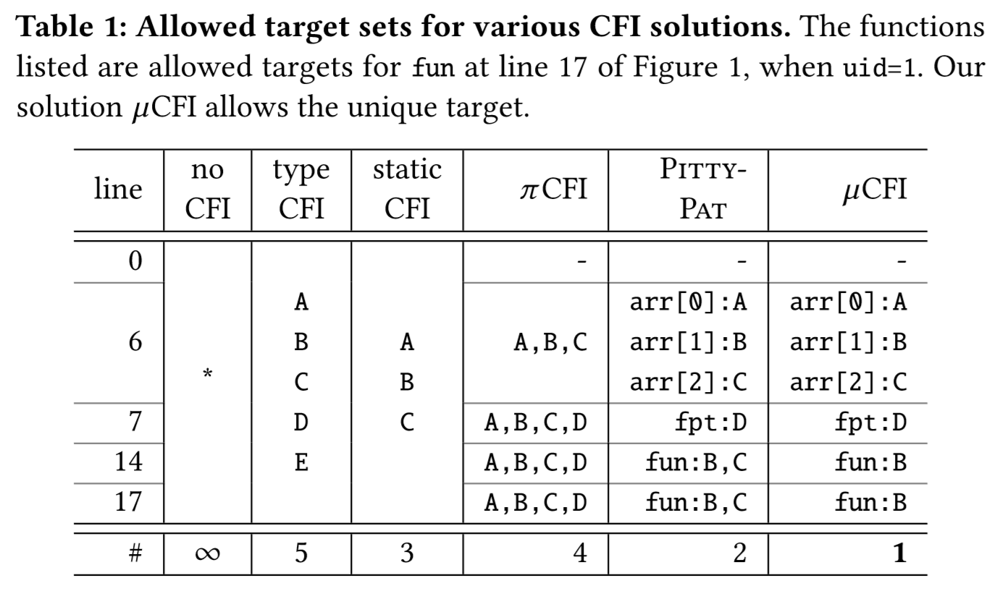
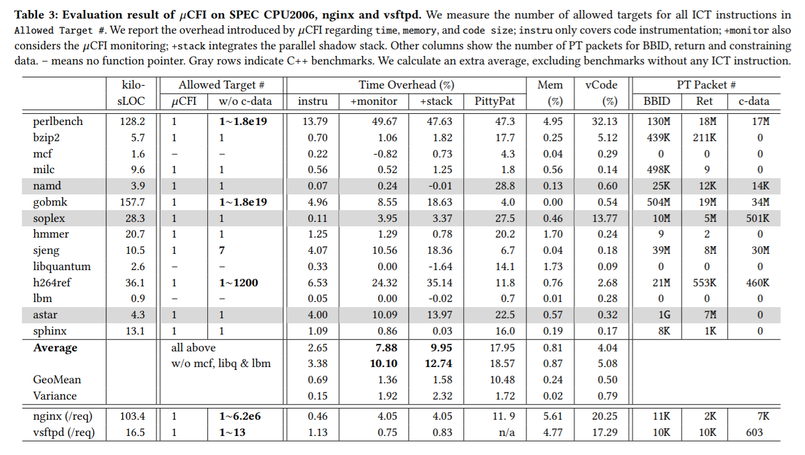
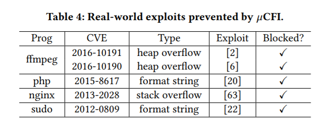

# Abstract

在这篇文章中，作者主要介绍了一种准确率更高的确保CFI的应用方式：Unique Code Target（UCT）。对于每次间接跳转（ICT），作者们设计了一个叫μUCT的系统来确保这一特性的实施。在编译时，μCFI就识别那些可能影响ICT的指令并让程序去记录一些必要的执行环境；在运行时，μCFI在另一个进程中监视程序的运行，并且在一些关键性的指令上使用内存安全地记录着地运行环境来做一些对点分析，判断这些指令的跳转是否符合预期。作者将μCFI这套系统布置到SPEC benchmark和2个服务器程序（nginx和vsftpd）上测试性能和overhead。同时它们还用它来测试了5个真实世界中的案例、1个[COOP](https://csdl.computer.org/csdl/proceedings/sp/2015/6949/00/6949a745.pdf)的poc进行攻击的案例。μCFI在这些测试上表现得都非常好，展现了100%的检测率和仅不到10%的overhead


| relevant information |                                                              |
| -------------------- | ------------------------------------------------------------ |
| *作者*               | Hong Hu, Chenxiong Qian, Carter Yagemann, Simon Pak Ho Chung, Taesoo Kim and Wenke Lee, William R. Harris |
| *单位*               | Georgia Institute of Technology, Galois Inc                  |
| *出处*               | ACM CCS’18                                                   |
| *原文地址*           | https://github.com/wtwofire/database/blob/master/papers/reverse/2018-Enforcing%20Unique%20Code%20Target%20Property%20for%20Control-Flow%20Integrity.pdf |
| *源码地址*           |                                                              |
| *发表时间*           | 2018年                                                       |

# 简介

CFI的健壮性在于它的跳转规则集合：过于严格的规则可能破坏了程序的正常运行，而松散的规则则让攻击者有了可乘之机。一些针对CFI的攻击也体现了普通的静态分析相比于理想CFI的不同：静态分析只是对于每个ICT给出了所有可能的跳转集合；而理想的CFI应是进一步结合当时的context来判断可能的跳转。近年的CFi开始结合了运行时的context来缩小集合范围，但是在一些情况下返回的集合大小仍然过大：如访问一个数组元素，在不知道index的情况下，返回的集合就是数组中的全部元素了。

在本论文中，作者的应用方式可以做到对于一个ICT**只返回唯一确定的跳转可能**。结合之前的CFI工作，本论文只讨论控制数据来劫持控制流的攻击手段。

那么如何实现UCT的呢？作者收集了一些**必要的运行时信息**来对控制的数据进行分析，这些信息被作者命名为**constrained data**。那么收集这些数据有三个问题需要解决： 

1. 如何准确判断constrained data 
2. 如何高效地收集这些data 
3. 收集到这些数据后，如何高效准确地进行对点分析

μCFI对代码进行静态分析，找到其中的constrained data。**分析从函数指针开始，继而迭代地寻找那些在计算这些指针时引用的变量，同时还弄了门arbitrary data collection技术来高效记录运行时的constrained data。与此同时，作者们还对收集到的constrained data进行编码，然后应用Intel的硬件支持Processor Trace（[PT](https://software.intel.com/en-us/blogs/2013/09/18/processor-tracing)）技术来高效记录。μCFI在程序运行时作为一个平行的进程运行，从而来解析记录的constrained data。同时，为了高效的分析，作者还构建了部分执行路径来避免在于安全隐患无关的代码上浪费的时间。****

也就是说，最终设计的系统包括**一个编译器**和**一个执行监视器**。监视器在每次ICT指令之后进行CFI检查，并且为了保证安全，监视器会与内核交互来在ICT指令之后立即block被监视的程序。其原型是用来针对jmp和call指令的，ret指令的CFI交给了之前的解决方案shadow stack来解决。

# Problem

样例代码：

```c
typedef void (*FP)(char *);
void A(char *);
void B(char *);
void C(char *);
void D(char *);
void E(char *);
void handleReq(int uid, char * input) {
  FP arr[3] = {&A, &B, &C};
  FP fpt = &D;
  FP fun = NULL;
  char buf[20];
  if (uid < 0 || uid > 2) return;
  if (uid == 0) {
      fun = arr[0];
  } else { // uid can be 1, 2
      fun = arr[uid];
  }
  strcpy(buf, input); // stack buffer overflow
  (*fun)(buf); // fun is corrupted
}
```

理想情况下，CFI应该保证在`(*fun)(buf)`被执行时，uid为零时fun=A，为1时fun=B…而不应该被bof改写掉去执行别的内容。当CFI检查到不一致时，中止程序来避免任何可能的伤害。

当前各种CFI的运行结果如下：其中typeCFI/staticCFI均为静态分析法，πCFI和PITTYPAT均为动态分析法，可见只有µCFI能返回唯一确定的执行流预测。



这里给出了作者对于constrained data 的精确定义：***它在IDT的跳转目标中有重要作用，但是其既不是一个直接代表函数地址的控制变量，也不是一个会被解引用出函数指针的一个指针。直到IDT真正发生时，它的值甚至才可能从实际的执行路径当中推断出来。而一旦它的值确定，之后的分析就可以在对任何执行路径上都对IDT给出唯一的推断结果。***任何具有如上特性的变量都可以成为constrained data，如示例代码中的uid。

# System Design

在本系统的设计当中，作者将µCFI拆做两部分：静态编译器和动态监视器。在给出源代码的情况下，编译器首先进行静态分析找到constrained data。之后，其将每个基本块编上唯一ID并与constrained data一起记录。

µCFI的静态编译器产生三个结果：**一个是生成的二进制文件，一个是用来对点分析的LLVM IR和LLVM IR基本块到对应唯一ID的一个对应表**。 然后在程序的执行过程中，µCFI的监视器依靠内核驱动解析来自PT的记录，解码出对应的基本块ID和相应的constrained data。那么有了基本块的ID，监视器就可以确定每个在被执行的基本块并对每个间接跳转的执行进行点对点的分析了。 同时，由于有了constrained data，µCFI也可以为每个ICT生成唯一确定的跳转目标。那么再和PT记录的跳转比较一下，就可以发现是否被劫持了。


## constrained data的判断

算法分为两部分： **1. 收集所有和间接跳转目标计算的有关的指令 2. 检查这些指令当中的非常量值，这些值也就成为了constrained data **

那么关于收集这些指令又分为直接相关和间接相关的指令：**直接相关指指令读/写了函数指针；而间接相关指指令为直接相关的指令准备了相关数据。**

作者使用迭代的方式寻找这些指令：算法首先寻找代码中所有的敏感数据类型，这些数据类型包括函数指针和包含函数指针的复合变量类型（这里就有一个迭代）

接下来，算法寻找所有的敏感指令，这些指令要么产生了敏感类型的变量值，要么参与了已被确定的敏感指令计算。

那么最后一步，遍历找到的所有敏感指令，然后遍历这当中涉及到的所有操作数：如果某个操作数既不是敏感数据类型又不是常量，那么它就是一个constrained data

```c
Input: G - program to be protected
Output: constraining data set
TS ← ∅                                           // sensitive type set
repeat
  for typ ∈ Types(G):
      if typ is function-pointer type: TS ← TS ∪ {typ}
      elif typ is composite type:
          for sTyp ∈ allTypes(typ):
              if sTyp ∈ TS: TS ← TS ∪ {typ}
until no new sensitive type is found
IS ← ∅                                           // sensitive instruction set
repeat
  for instr ∈ Instructions(G):
      if instr has type ∈ TS: IS ← IS ∪ {instr}
      elif isLoadInst(instr) or isStoreInst(instr):
          if value ∈ IS: IS ← IS ∪ {pointer}
      elif isCallInst(instr):
          if form-arg ∈ IS: IS ← IS ∪ {act-arg}
          if act-arg ∈ IS: IS ← IS ∪ {form-arg}
      ... ...
until no new sensitive instruction is found
CS ← ∅                                           // constraining data set
for instr ∈ IS:
  for oprnd ∈ Operands(instr):
      if oprnd < IS and ¬isConstant(oprnd):
          CS ← CS ∪ {oprnd}
```

那么经过如上的算法分析后，对之前的样例代码，有如下结果： – sensitive type: – void (char*)* – [3 x void (char*)*] – sensitive instruction: – FP arr[3] = {&A, &B, &C}; – FP fpt = &D; – FP fun = NULL; – fun = arr[0]; – fun = arr[uid]; – (*fun)(buf); – constraining data: – uid

## 对Arbitrary Data的收集

作者们设计了一套新方法来高效传递执行当中的信息到监视器的方法，来解决朴素PT缺乏non-control信息的缺陷。

在这一步中，µCFI设置了两个函数：write_data(设置在被保护的程序中，用来生成编码的任意数据并dump到PT trace里)和read_data(设置在监视器中，用来恢复出数据用以分析)

那么write_data(av)到底是如何让PT记录任意数据的呢？对于任意数据av，首先将其拆成几个block，每个block占N bits，然后对于每个block中的值，将其加上一个BASE_ADDR，然后call这个值做一个函数调用，就可以让PT记录下这个值了。BASE_ADDR指向一个设计的特殊函数allRet，其中2N个指令全部是ret(0xC3 for Intel CPU)。作者也考虑了这个函数的安全问题，然后给出了证明其安全的两个方面（corrupt av只会导致记录的值变化，同时调用call后面的值也是一直保存在寄存器而不是内存中）

然后编译器就可以在需要audit的constrained data前插入write_data()这个函数来记录当前data的值，就可以对之后的间接跳转合法性进行检查了。

## 高效的控制流构建

µCFI之后就可以在LLVM的IR层上构建动态分析的控制流。然而这还面临两方面的额挑战： 1. 从高度压缩的PT trace当中重建完整的执行路径解析耗时 2. 实际生成的二进制文件指令由于编译器优化可能和LLVM IR层的执行流有很大区别。

作者们所设计的高效准确的IR层控制流重建基于以下他们观察到的三个现象： 1. 不管如何优化，编译总是保持函数本身的高阶功能，这其中就包括如一些内存访问、函数调用这类side-effecting的指令的执行顺序。那么只要IR层和执行代码有相同的这类指令的顺序，那么对其的分析从功能上而言是一样的。 2. 相同基本块中的执行执行顺序是一样的。因此作者们只需要知道IR基本块层面上的控制流就行了 3. 本论文中设计的对点分析不需要完整的控制流，而仅仅需要敏感指令的执行顺序即可。而这些指令占整个程序中的小部分，也因此对局部的敏感指令的控制流就足够了。

那么这部分的构建流程如下：µCFI编译器首先识别LLVM的IR基本块中含有敏感指令的块并标上BBID，然后在编译过程中在这些块的开头插入write_data(BBID)来让PT能够记录当前执行到了哪个基本块。那么监视器通过编译器编译时输出的ID2BB的map就可以判断出当前在执行哪个IR的基本块了。

然后，作者使用一个变量表PTS来记录每个sensitive data的变化，并且当IDT发生时，将当前存在变量fun中的跳转目标和当前存在PTS中的fun进行比较，如果b不一致就abort

那么对之前的样例代码进行添加后如下：

```c
void handleReq(int uid,char *input) {
  write_data(ID1); // BBID ID1
  FP arr[3] = {&A,&B,&C}; // s-instr
  FP fpt = &D; // s-instr
  FP fun = NULL; // s-instr
  char buf[20];
  if (uid < 0 || uid > 2) return;
  if (uid == 0) { === TRACE ===>>
      write_data(ID2); // BBID ID2
      fun = arr[0]; // s-instr
  } else {
      write_data(ID3); // BBID ID3
      write_data(uid); // c-data
      fun = arr[uid]; // s-instr
  }
  write_data(ID4); // BBID ID4
  strcpy(buf, input);
  (*fun)(buf); // s-instr
}
```

相应的，在监视器的内部有如下的处理逻辑：

```c
// PTS: global points-to table, initialized with NULL
while (true) {
int BBID = read_data();
switch(BBID) {
  case ID1:
      PTS[arr[0]] = A; PTS[arr[1]] = B;
      PTS[arr[2]] = C; PTS[fpt] = D;
      break;
  case ID2:
      PTS[fun] = PTS[arr[0]];
      break;
  case ID3:
      int uid = read_data();
      PTS[fun] = PTS[arr[uid]];
      break;
  case ID4:
      int real_target = getPTPacket();
      if (real_target != PTS[fun])
          abort();
          else continue;
}}
```

但是如果按上述代码这样进行的话需要承担每次ICT进行检查的过高执行overhead，因此µCFI的监视只是随着执行平行地进行CFI的判断，并且在执行敏感地系统调用的时候才会挂起被监视的进程。作者们选择的敏感系统调用包括: **mmap, mremap, remap_file_pages, mprotect, execve, execveat, sendmsg, sendmmsg, sendto, and write。**

# Implementation

编译器构建在LLVM 3.6之上。 LLVM进行constrained data的识别和编码，以及BBID编码。作者将监视器实现为一个root用户进程，这使其适用于保护非root进程。 它使用两个线程，一个用于PT跟踪解析，另一个用于点分析和CFI验证。作者使用来自[Griffin](https://github.com/TJAndHisStudents/Griffin-Trace)的PT驱动程序的修改版本进行跟踪管理，其中作者将跟踪写入每个线程的伪代码文件，并为作者的用户空间μCFI监视器设置适当的权限以读取它。

接下来，作者将介绍μCFI系统的几个实现细节，包括减少PT的trace量，与shadow stack整合以及针对lazy type的分析。

## 减少trace

PT允许对trace的函数进行定制，因此作者利用编译器将所有的间接调用转化为了对一个特定函数iCall的直接调用，通过传参进去再跳转来实现间接跳转功能；同理还对所有需要调查的ret指令替换为oneRet函数，其中填充ret指令。那么这样做就可以将PT的trace限定在这两个函数中，从而减少了对特定程序进行trace所需要cover的代码量

## 整合Shadow Stack

Shadow Stack技术可以在栈上保存当前函数返回地址处的一个固定（或随机）偏移处保存一个返回地址的副本（也就是在栈上保存了两个返回地址值），然后在返回时比较二者是否仍然一致并且（或）将副本的值复制到该函数的返回地址保存处。

那么µCFI就将其整合进自己的系统中，在原有的基础上对LLVM X86的后端和ELF构建函数进行了修改。对后端的修改使得在编译时能在函数开头和末尾添加两条汇编指令，用来保存和恢复返回地址值； 而对构建函数的修改使得在binary loader调用该执行文件时先执行构建函数(ELF constructor functions)，进行shadow stack和两个栈之间的保护页的构建后再将控制权交给原来的程序

## Lazy-type的分析技术

为了构建变量表PTS，通常需要对复合类型进行扁平化，即将其中的复合类型迭代的代入直至其中不再包含复合类型。但是由于LLVM IR的高度优化特性，这一方法需要的对对象分配的准确定义信息可能不是很容易获得。那么作者在尽可能获得的基础上，设计了Lazy-type：在运行时对对象进行分配的时候，首先置其所含的变量类型为空，那么当这个对象被一个指针所引用时，作者就可以根据其偏移来确定成员的类型了

# Evaluation

环境设置 64-bit Ubuntu 16.04 system 8-core Intel i7-7740X CPU (4.30GHz frequency) 32 GB RAM 作者分两步编译每个程序。 首先使用[wllvm](https://github.com/travitch/%20whole-program-llvm.) 生成base binary和LLVM IR表示。其次，作者使用μCFI编译器来检测IR并生成受保护的可执行文件。两种编译都采用默认的优化级别和选项，例如，针对SPEC的O2和针对nginx和vsftpd的O1。 作者使用提供的训练数据集来评估SPEC基准。 对于nginx和vsftpd，作者在评估环境中设置服务器，并从同一本地网络中的另一台机器请求不同大小的文件。 作者执行每个文件1000次，以避免意外偏差。 为了测量开销，作者将监视器与受保护的执行文件一起启动，并计算所有进程退出的时间，包括受保护的执行文件，监视器及其子进程。 





表3和表4总结了作者的评估结果。 μCFI成功地为测试程序实现了UCT属性，因为它只允许一个有效目标用于所有间接控制流传输（Q1）。 μCFI平均为评估的SPEC基准测试引入7.88％的运行时开销，nginx的运行时开销为4.05％，vsftpd（Q2）的开销不到1％。 这意味着μCFI可以通过强大的安全保障有效地保护这些程序。 所有攻击，包括现实中的攻击，COOP概念证明攻击和synthesized攻击，都会在运行时被阻止（Q3）。 使用μCFI和shadow stack编译的程序运行良好。 组合保护为SPEC基准测试带来了额外的2.07％开销，对nginx和vsftpd（Q4）的额外开销可忽略不计。

## Enforcing UCT Property

在table 3 中可以看到，µCFI对于SPEC中的所有对象中的ICT均只给出了唯一确定的跳转对象(Allowed Target)，而这应归功于constrained data的作用

## Preventing Attack

作者还应用μCFI来保护PittyPat [21]中引入的易受COOP攻击的程序[55]。 COOP是一种通过构造C++的对象来利用其虚函数表的图灵完备攻击方法，COOP对粗粒度CFI构成了巨大挑战。 μCFI通过保护所有constrained data来防止COOP攻击，从而允许它准确地跟踪内存中的函数指针。当程序被输入恶意输入时，μCFI成功区分合法和伪造对象以检测攻击。

## Overhead Measurement

Performance Overhead Optimization Possibility  PT的PTWrite指令可以直接打印用户数据到PT的TIP包中，μCFI可以利用其来记录BBID和constrained data，进一步提升效率。 Memory Overhead Code Overhead

## Shadow Stack Integration

作者测量μCFI与parallel shadow stack（PSS）保护的兼容性。 作者使用μCFI编译器和PSS编译每个程序，并测量执行的正确性和性能开销。 所有测试程序（包括SPEC基准测试，nginx和vsftpd）都可以很好地与良性输入一起使用，证明了μCFI的强大兼容性。 集成PSS的开销显示在表3中的+stack列中。平均而言，PSS引入2.07％的开销来评估SPEC基准测试，且在对nginx和vsftpd的开销中可忽略不计。 通过展示μCFI与影子堆栈的兼容性，作者澄清了具有各种安全保证的任何替代解决方案如基于随机化的SafeStack [36]和基于硬件的Intel CET技术[33]，可以与μCFI集成以提供未来继续实现更好UCT属性的两个方向。

# Discussion

在关于未来的工作中，作者提到两点： 1. 验证signal或exception中的CFI，这些与OS有关，在Intel PT中以FUP包形式记载 2. 验证动态加载的代码中的CFI