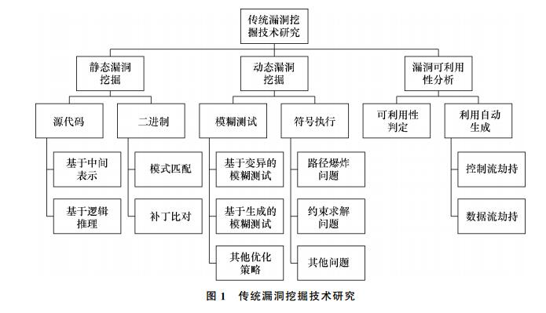
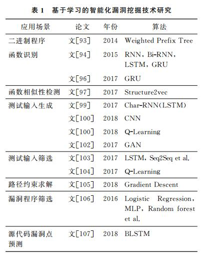

# Abstract

近年来，随着软件规模和复杂度的日益增加，软件漏洞挖掘技术正逐渐向高度自动化和智能化演变，该文从传统漏洞挖掘技术和基于学习的智能化漏洞挖掘技术两方面深入调研和分析了相关的研究进展。首先，从静态和动态挖掘技术2方面详细介绍了传统漏洞挖掘技术的研究现状，涉及的技术包括模型检测、二进制比对、模糊测试、符号执行以及漏洞可利用性分析等，并分析了各项技术存在的问题，提出当前的研究难点是实现漏洞挖掘全自动化。然后，介绍了机器学习和深度学习技术在漏洞挖掘领域的应用，具体应用场景包括二进制函数识别、函数相似性检测、测试输入生成、路径约束求解等，并提出了其存在的机器学习算法不够健壮安全、算法选择依靠经验、数据样本不足、特征选择依赖专家知识等问题。最后，对未来研究工作进行了展望，提出应该围绕提高漏洞挖掘的精度和效率、提高自动化和智能化的程度这2方面展开工作。

| relevant information |                                                              |
| -------------------- | ------------------------------------------------------------ |
| *作者*               | 邹权臣，张涛，吴润浦, 马金鑫, 李美聪, 陈晨,侯长玉            |
| *单位*               | 中国信息安全测评中心,空军工程大学 信息与导航学院,北京邮电大学 网络空间安全学院,北京中测安华科技有限公司 |
| *出处*               | 清华大学学报                                                 |
| *原文地址*           | http://jst.tsinghuajournals.com/CN/rhhtml/20181206.htm#outline_anchor_17 |
| *源码地址*           |                                                              |
| *发表时间*           | 2018年                                                       |

# 1. 简介

漏洞信息的不对称性已经成为导致网络战争中的实力对比悬殊的关键因素。从早年爆发的蠕虫王、冲击波、震荡波病毒，到近年来爆发的WannaCry病毒，都借助了软件或系统的安全漏洞进行传播。另外，高级的网络攻击(如APT攻击)甚至会基于多个漏洞交叉、组合使用，目的是绕过防火墙、杀毒软件、入侵检测系统等，摧毁隔离网的安全性，突破核心网络节点而进入内网，进行后续的渗透攻击(如窃取、修改、加密重要数据，摧毁核心设施等)。特别是未公开的0day漏洞常常被当成秘密的终极武器使用，有时候甚至能起到决定性的作用。

鉴于软件漏洞在网络攻防中的重要性，各大软件厂商及高校、科研院所的研究人员对漏洞挖掘技术展开了大量的研究。当前，常用的漏洞挖掘技术包括模型检测、模糊测试、符号执行、二进制比对等，这些传统的漏洞挖掘技术在理论研究上已经比较成熟，并已从各类软件中挖掘出大量漏洞。其中大部分的技术如模糊测试、符号执行等都已基本实现自动化，可以在不需要或较少的人工干预的前提下，针对被测试程序和输入数据的不同特点，借助各种程序动、静态分析技术，寻找分析深度和分析效率之间的平衡点，缓解代码覆盖率低、扩展性差等问题；目的是提高漏洞挖掘的效率，实现在更短的时间内发现更多或更深层次的漏洞。

机器学习、深度学习的研究进展带动了其在软件漏洞挖掘领域的应用，目前已经开展了一些探索性的工作，如二进制函数相似性识别、函数相似性检测、测试输入生成、路径约束求解等，这些应用为解决传统漏洞挖掘技术的瓶颈问题提供了新的思路，也使得软件漏洞挖掘逐渐变得智能化。随着机器学习、深度学习研究的爆炸式发展，以及这方面研究积累的数据集的增多，将可能成为软件漏洞挖掘技术发展的关键点之一。

本文以近年来软件漏洞挖掘技术所呈现出的自动化和智能化的趋势作为切入点，介绍了传统漏洞挖掘技术和基于学习的智能化漏洞挖掘技术的研究进展。首先，本文从静态和动态漏洞挖掘两方面对传统的漏洞挖掘技术进行了分类分析，指出了各自的优势和面临的问题；并介绍了漏洞可利用性分析以及自动化漏洞挖掘(如CGC大赛)的研究进展，指出漏洞挖掘的全自动化是当前研究的难点问题。然后，对基于学习的智能化软件漏洞挖掘技术进行了分类，并深入分析了二进制函数识别、函数相似性检测等不同应用场景的研究工作，归纳总结了其面临的机器学习算法不够健壮安全、算法选择依靠经验、数据样本不足、特征选择依赖专家知识等四大问题。最后进行了总结和展望，指出未来应在提高漏洞挖掘的精度和效率，以及自动化和智能化方面展开研究。

# 2.传统漏洞挖掘技术

传统的漏洞挖掘技术主要可分为静态和动态漏洞挖掘技术，漏洞可利用性分析也已经成为漏洞挖掘的重要环节，如[图 1]所示

## 2.1 静态漏洞挖掘

静态漏洞挖掘是指在不运行目标程序的前提下分析目标程序(源代码或二进制)的词法、语法和语义等，并结合程序的数据流、控制流信息，通过类型推导、安全规则检查、模型检测等技术挖掘程序中的漏洞。静态漏洞挖掘是常用的软件测试技术，在软件测试中占有非常重要的地位。具有代表性的静态漏洞挖掘工具有面向C/C++源码的Cppcheck[[1](http://jst.tsinghuajournals.com/CN/rhhtml/20181206.htm#b1)]、FlawFinder[[2](http://jst.tsinghuajournals.com/CN/rhhtml/20181206.htm#b2)], 面向PHP源码的RIPS[[3](http://jst.tsinghuajournals.com/CN/rhhtml/20181206.htm#b3)], 面向JAVA源码的FindBugs[[4](http://jst.tsinghuajournals.com/CN/rhhtml/20181206.htm#b4)]，以及能支持多种类型目标对象的著名商业化漏洞检测工具VeraCode[[5](http://jst.tsinghuajournals.com/CN/rhhtml/20181206.htm#b5)]、Fortify[[6](http://jst.tsinghuajournals.com/CN/rhhtml/20181206.htm#b6)]、Coverity[[7](http://jst.tsinghuajournals.com/CN/rhhtml/20181206.htm#b7)]、Checkmarx[[8](http://jst.tsinghuajournals.com/CN/rhhtml/20181206.htm#b8)]等。另外，LLVM[[9](http://jst.tsinghuajournals.com/CN/rhhtml/20181206.htm#b9)]、Clang[[10](http://jst.tsinghuajournals.com/CN/rhhtml/20181206.htm#b10)]等编译器也提供了大量的静态检测功能，能在编译阶段实现对源代码的安全性检查。

针对目标程序的不同形式，采用的静态分析技术也不尽相同。本节将按源代码和二进制2种目标程序分别介绍静态漏洞挖掘技术的研究现状。

面向源代码的漏洞挖掘主要采用基于中间表示的分析和基于逻辑推理的分析技术[[11](http://jst.tsinghuajournals.com/CN/rhhtml/20181206.htm#b11)]。其中，基于中间表示的分析技术主要包括数据流分析、控制流分析、污点分析、符号执行等。Pixy[[12](http://jst.tsinghuajournals.com/CN/rhhtml/20181206.htm#b12)]采用了取值分析、污点分析、指针别名分析等静态分析技术实现对PHP源码中的SQL注入和跨站脚本等漏洞的检测。Prefix[[13](http://jst.tsinghuajournals.com/CN/rhhtml/20181206.htm#b13)]采用了静态符号执行技术模拟执行C/C++源码程序，并采用约束求解对程序中的部分路径进行检测。Melange[[14](http://jst.tsinghuajournals.com/CN/rhhtml/20181206.htm#b14)]采用数据流分析的框架，通过对程序进行数据流、控制流等复杂分析检测安全相关的漏洞，并支持对大型C/C++源码程序的分析。K-Miner[[15](http://jst.tsinghuajournals.com/CN/rhhtml/20181206.htm#b15)]利用内核代码中高度标准化的接口实现了可扩展性良好的指针分析以及全局的上下文敏感的分析技术，支持对空指针引用、指针释放后重引用(use-after-free, UAF)、指针重释放(double free)、双重检查锁定(double-checked lock)等内存崩溃漏洞的检测。基于逻辑推理的分析技术主要是指模型检测，如MOPS[[16](http://jst.tsinghuajournals.com/CN/rhhtml/20181206.htm#b16)]、BLAST[[17](http://jst.tsinghuajournals.com/CN/rhhtml/20181206.htm#b17)]、SLAM[[18](http://jst.tsinghuajournals.com/CN/rhhtml/20181206.htm#b18)]是典型的面向C程序的模型检测工具，其基本思路是将程序结构抽象为状态机(布尔程序)，然后基于归纳的安全属性对状态机进行遍历，检测其中存在的漏洞。

面向二进制程序的静态漏洞的挖掘技术由于缺少源代码中的结构化信息，面临着值集分析(vaule-set analysis，VSA)[[19](http://jst.tsinghuajournals.com/CN/rhhtml/20181206.htm#b19)]与控制流恢复[[20](http://jst.tsinghuajournals.com/CN/rhhtml/20181206.htm#b20)-[25](http://jst.tsinghuajournals.com/CN/rhhtml/20181206.htm#b25)]不精确的问题。当前，二进制静态漏洞挖掘技术主要包括基于模式匹配和基于补丁比对的技术。其中，在基于模式匹配的漏洞挖掘技术方面，GUEB[[26](http://jst.tsinghuajournals.com/CN/rhhtml/20181206.htm#b26)]提出了二进制程序中UAF漏洞模式，并基于此模式挖掘出了ProFTPD程序中的漏洞。具体而言，首先抽象出二进制函数中的内存模型，然后采用VSA分析技术追踪堆分配和释放指令相关的操作变量，并基于此建立UAF模式。LoongChecker[[27](http://jst.tsinghuajournals.com/CN/rhhtml/20181206.htm#b27)]使用了称为半仿真的二进制静态漏洞挖掘技术。通过VSA分析和数据依赖分析(data dependence analysis，DDA)技术实现对变量地址的追踪和数据流依赖分析，并采用污点分析技术检测潜在的漏洞。Saluki[[28](http://jst.tsinghuajournals.com/CN/rhhtml/20181206.htm#b28)]使用了路径敏感和上下文敏感的数据依赖分析，并采用完备的逻辑系统推理检测程序中的漏洞。在基于补丁比对的漏洞挖掘技术方面，PVDF[[29](http://jst.tsinghuajournals.com/CN/rhhtml/20181206.htm#b29)]以二进制漏洞程序(带有权限提升漏洞)和补丁作为输入，从比对中提取多维属性描述的漏洞语义信息，并应用于后续的模糊测试中。BinHunt[[30](http://jst.tsinghuajournals.com/CN/rhhtml/20181206.htm#b30)]通过对二进制程序和带补丁的二进制程序间的比对提取漏洞相关的语义信息。具体而言，就是把二进制程序翻译成中间表示，并在此基础上构建控制流图，基于控制流图对比程序间的差异，提取相关的约束，然后采用符号执行技术进行验证，以此找出补丁对应的漏洞。

静态漏洞挖掘技术直接对目标程序进行分析，不需要构造程序的执行环境，能提取较为完整的控制流等信息，可能发现动态漏洞挖掘技术难以发现的漏洞。但是，一方面，由于静态漏洞挖掘技术往往依赖于人工构造的漏洞模式，对先验知识依赖性较大；另一方面，因为无法获得程序实际动态运行过程中的上下文信息，静态漏洞挖掘技术具有精度低、误报率高的缺陷。

## 2.2 动态漏洞挖掘

动态漏洞挖掘技术是指在实际执行程序的基础上采用的分析技术，常用的动态漏洞挖掘技术包括模糊测试、符号执行等。

### 2.2.1 模糊测试

模糊测试(fuzzing)是一种自动化或者半自动化的软件测试技术，通过构造随机的、非预期的畸形数据作为程序的输入，并监控程序执行过程中可能产生的异常，之后将这些异常作为分析的起点，确定漏洞的可利用性。模糊测试技术可扩展性好，能对大型商业软件进行测试，是当前最有效的用于挖掘通用程序漏洞的分析技术，已经被广泛用于如微软、谷歌和Adobe等主流软件公司的软件产品测试和安全审计，也是当前安全公司和研究人员用于挖掘漏洞的主要方法之一。

按程序内部结构分析的量级轻重程度分，模糊测试技术主要可以分为白盒、黑盒、灰盒模糊测试。其中，白盒模糊测试是在对被测试程程序内部结构、逻辑进行系统性分析的基础上进行测试；黑盒模糊测试把程序当成黑盒处理，不对程序内部进行分析；灰盒模糊测试介于黑盒和白盒模糊测试之间，在对程序进行轻量级分析的基础上进行测试。按样本生成方式划分，模糊测试的测试输入可分为基于变异和基于生成2种方式。其中，基于变异的模糊测试在修改已知测试输入的基础上生成新的测试用例，而基于生成的模糊测试则是直接在已知输入样本格式的基础上生成新的测试输入。

根据不同的研究侧重点，本文分别介绍基于变异的模糊测试、基于生成的模糊测试和其他优化策略。

#### 1) 基于变异的模糊测试。

在基于变异的模糊测试方面，研究人员借助程序执行环境信息和程序分析技术，有导向性地辅助、引导模糊测试的变异，具有代表性的工作有AFL[[31](http://jst.tsinghuajournals.com/CN/rhhtml/20181206.htm#b31)]、VUzzer[[32](http://jst.tsinghuajournals.com/CN/rhhtml/20181206.htm#b32)]、Honggfuzz[[33](http://jst.tsinghuajournals.com/CN/rhhtml/20181206.htm#b33)]、libFuzzer[[34](http://jst.tsinghuajournals.com/CN/rhhtml/20181206.htm#b34)]、Steelix[[35](http://jst.tsinghuajournals.com/CN/rhhtml/20181206.htm#b35)]、T-Fuzz[[36](http://jst.tsinghuajournals.com/CN/rhhtml/20181206.htm#b36)]、AFLFast[[37](http://jst.tsinghuajournals.com/CN/rhhtml/20181206.htm#b37)]、AFLGo[[38](http://jst.tsinghuajournals.com/CN/rhhtml/20181206.htm#b38)]、Driller[[39](http://jst.tsinghuajournals.com/CN/rhhtml/20181206.htm#b39)]等。

- **a) 代码覆盖率制导**

AFL[[31](http://jst.tsinghuajournals.com/CN/rhhtml/20181206.htm#b31)]使用进化算法(evolutionary algorithms)生成测试输入，在正常输入的基础上，通过简单的反馈回路的方式评估测试输入的质量。AFL会保留任何能触发新路径的测试输入，并对其进行变异及检查能否触发崩溃。AFL已经在Mozilla Firefox、FFmpeg、OpenSSL等软件中发现了大量的漏洞。但AFL也存在较大的缺陷：首先，变异的位置以及变异的方式是盲目的，缺少更进一步的筛选和变异策略，依赖这种方式很难发现深层次的漏洞；其次，通过哈希函数检测分支覆盖筛选种子的方式具有较高的误报率，其哈希位图(bitmap)只有64 kB大小，导致普遍存在哈希碰撞的情况，进而导致其分支覆盖统计存在漏报，进而影响种子筛选，间接影响了代码覆盖率的增长。CollFuzz[[40](http://jst.tsinghuajournals.com/CN/rhhtml/20181206.htm#b40)]采用静态控制流图信息作为辅助，并设计了能避免哈希碰撞的基本块ID分配策略，从而实现比AFL更精确的分支覆盖检测。

- **b) 污点分析辅助**

BuzzFuzz[[41](http://jst.tsinghuajournals.com/CN/rhhtml/20181206.htm#b41)]使用动态污点分析技术自动定位影响程序脆弱点的测试输入中的字段，然后保留其他语法部分内容，只对这些字段进行变异。这样既能通过语法检查，也能有针对性地进行变异，提高漏洞挖掘的效率。TaintScope[[42](http://jst.tsinghuajournals.com/CN/rhhtml/20181206.htm#b42)]使用污点分析技术推断程序中与校验和处理相关的代码，以此帮助模糊测试工具绕过校验和检查。

- **c) 符号执行制导**

Driller[[39](http://jst.tsinghuajournals.com/CN/rhhtml/20181206.htm#b39)]采用模糊测试和符号执行交替探索程序执行路径，解决模糊测试陷入代码覆盖率增长慢的情况，这样能引导模糊测试探索到程序更深层次的节点，也能直接避免符号执行可能带来的路径爆炸问题。但文[[39](http://jst.tsinghuajournals.com/CN/rhhtml/20181206.htm#b39)]和[[43](http://jst.tsinghuajournals.com/CN/rhhtml/20181206.htm#b43)]等的实验结果表明，使用符号执行对模糊测试中部分路径约束求解时，仍然有很大一部分路径出现求解失败的情况(文[[39](http://jst.tsinghuajournals.com/CN/rhhtml/20181206.htm#b39)]实验中有41个测试程序陷入了较浅路径，使用符号执行对其求解时只有13个程序能够生成新的测试输入)。因此，基于符号执行增强的模糊测试技术仍然会受限于符号执行中的约束求解问题，符号执行的引入可能会弱化模糊测试本身的可扩展性。

- **d) 控制流和数据流信息制导**

VUzzer[[32](http://jst.tsinghuajournals.com/CN/rhhtml/20181206.htm#b32)]在“轻量级”的动、静态分析基础上提取了程序的控制流和数据流信息引导变异。具体而言，VUzzer先在静态控制流分析基础上计算基本块的权重，然后在动态执行时筛选权重更高即路径更深的执行路径对应的测试输入为种子文件，并用动态污点分析定位变异点。相比AFL、Driller，VUzzer有更好的种子筛选、路径探索策略以及污染点定位、变异策略，能定向引导探索更深的执行路径，并定点变异。在DARPA CGC和LAVA测试集以及部分常用应用程序上，VUzzer都取得了更好的效果(用更少的测试输入挖掘出了更多的漏洞)。Steelix[[35](http://jst.tsinghuajournals.com/CN/rhhtml/20181206.htm#b35)]采用了轻量级的静态分析和二进制插桩技术提取代码覆盖率信息和魔术字节(magic byte)比较信息等作为程序状态信息引导变异。这种方式能在较小的开销下定位魔术字节在测试输入中的位置，进而辅助模糊测试工具更高效地生成能通过魔术字节检验的测试输入。

#### 2) 基于生成的模糊测试。

基于生成的模糊测试主要基于模型或者语法生成能满足程序语法和语义检查的测试输入，常用于高度结构化的测试输入生成。

- **a) 基于模型的模糊测试**

Peach[[44](http://jst.tsinghuajournals.com/CN/rhhtml/20181206.htm#b44)]、Spike[[45](http://jst.tsinghuajournals.com/CN/rhhtml/20181206.htm#b45)]是典型的基于模型的模糊测试工具(Peach也具有基于变异进行模糊测试的功能)，通过对输入格式定制编写数据模型(data model)和状态模型(state model)的方式指定输入数据的类型和依赖关系, 并结合变异策略生成测试输入。其中Peach通过编写配置文件实现对样本格式的约束，而Spike需要利用提供的编程接口来对样本格式进行约束。Pham等[[46](http://jst.tsinghuajournals.com/CN/rhhtml/20181206.htm#b46)]结合输入模型和符号执行技术生成测试输入，使用符号执行鉴别输入格式约束能有效保证输入的合法性。

- **b) 基于语法的模糊测试**

CSmith[[47](http://jst.tsinghuajournals.com/CN/rhhtml/20181206.htm#b47)]根据C语言语法生成C程序源码，实现对C编译器的模糊测试。在C源码生成方面，CSmith随机选取符合生成规则和语法规则的C程序，这种方法能避免因未定义和未声明而导致编译报错的情况出现。LangFuzz[[48](http://jst.tsinghuajournals.com/CN/rhhtml/20181206.htm#b48)]基于语法学习测试集中的代码片段，并进行片段重组生成新的测试输入。在测试输入集选择上，LangFuzz假设基于问题测试集重组生成的测试输入比随机收集的测试输入更有可能触发程序缺陷。IFuzzer[[49](http://jst.tsinghuajournals.com/CN/rhhtml/20181206.htm#b49)]使用上下文无关的语言语法作为输入，并使用语法生成解析树，然后从测试集中抽取代码片段，并使用遗传进化算法对代码片段重组生成新的测试输入。Jsfunfuzz[[50](http://jst.tsinghuajournals.com/CN/rhhtml/20181206.htm#b50)]使用了历史漏洞知识和硬编码规则生成测试输入，以Mozilla浏览器中的Javascript解释器为测试目标，发现了1 800多个缺陷。Dewey等[[51](http://jst.tsinghuajournals.com/CN/rhhtml/20181206.htm#b51)]使用了称为约束逻辑编程(constraint logic programming, CLP)的技术生成测试输入。通过指定句法特征和语义行为，CLP能生成满足语法和语义合法性的测试输入。

#### 3) 其他优化策略。

除了上述进展外，还有一些重要研究侧重于种子筛选策略优化[[37](http://jst.tsinghuajournals.com/CN/rhhtml/20181206.htm#b37)-[38](http://jst.tsinghuajournals.com/CN/rhhtml/20181206.htm#b38), [52](http://jst.tsinghuajournals.com/CN/rhhtml/20181206.htm#b52)-[55](http://jst.tsinghuajournals.com/CN/rhhtml/20181206.htm#b55)]和调度策略优化[[37](http://jst.tsinghuajournals.com/CN/rhhtml/20181206.htm#b37)-[38](http://jst.tsinghuajournals.com/CN/rhhtml/20181206.htm#b38)]。Rebert等[[53](http://jst.tsinghuajournals.com/CN/rhhtml/20181206.htm#b53)]把种子筛选问题转化成整数线性规划问题，并以挖掘更多漏洞为目标提出了多种种子筛选策略。AFLFast[[37](http://jst.tsinghuajournals.com/CN/rhhtml/20181206.htm#b37)]采用了把模糊测试问题建模为Markov模型，并采用特定的策略引导AFL优先选择低频路径和变异频率较低的文件作为种子文件进行变异，以此在相同的测试时间内探索更多的路径。AFLGo[[38](http://jst.tsinghuajournals.com/CN/rhhtml/20181206.htm#b38)]采用了模拟退火(simulated annealing，SA)算法对能逼近特定目标位置的测试输入分配更高的能量，并优先选取高能量种子文件进行变异。AFLGo的实验结果表明，这种导向型灰盒模糊测试(directed greybox fuzzing，DFG)比符号执行引导的白盒模糊测试和非导向型模糊测试具有更好的性能、更高的代码覆盖率并可挖掘出更多的漏洞。

总体而言，模糊测试是当前挖掘漏洞最有效的方法，比其他漏洞挖掘技术更能应对复杂的程序，具有可扩展性好的优势。但在大规模漏洞分析测试中，模糊测试方法仍然依赖于种子输入的质量，依赖于对测试输入对象格式的深度理解和定制，存在测试冗余、测试攻击面模糊、测试路径盲目性较高等问题。另外，目前模糊测试也存在整体测试时间长、生成单个测试用例漏洞触发能力弱的问题。

### 2.2.2 符号执行

符号执行于20世纪70年代被提出[[56](http://jst.tsinghuajournals.com/CN/rhhtml/20181206.htm#b56)-[59](http://jst.tsinghuajournals.com/CN/rhhtml/20181206.htm#b59)]，是一种能够系统性探索程序执行路径的程序分析技术，通过对程序执行过程中的被污染的分支条件及其相关变量的收集和翻译，生成路径约束条件，然后使用可满足模理论(SMT)求解器进行求解, 判断路径的可达性以及生成相应的测试输入。通过这种方式产生的测试输入与执行路径之间具有一对一的关系，能够避免冗余测试输入的产生，进而能有效解决模糊测试冗余测试用例过多导致的代码覆盖率增长慢的问题。

符号执行技术应用已经被学术和工业界应用在漏洞挖掘领域。自从符号执行特别是动态符号执行技术被提出以来，已经有很多相关的工具被应用到实际的软件测试当中，如SAGE[[60](http://jst.tsinghuajournals.com/CN/rhhtml/20181206.htm#b60)]、S2E[[61](http://jst.tsinghuajournals.com/CN/rhhtml/20181206.htm#b61)]、Mayhem[[62](http://jst.tsinghuajournals.com/CN/rhhtml/20181206.htm#b62)]、KLEE[[63](http://jst.tsinghuajournals.com/CN/rhhtml/20181206.htm#b63)]、Triton[[64](http://jst.tsinghuajournals.com/CN/rhhtml/20181206.htm#b64)]、angr[[65](http://jst.tsinghuajournals.com/CN/rhhtml/20181206.htm#b65)-[66](http://jst.tsinghuajournals.com/CN/rhhtml/20181206.htm#b66)]等。其中SAGE已经被应用到了微软内部的日常开发安全测试中，每天有上百台机器同时在运行此工具，并发现了Windows 7系统中三分之一的漏洞[[60](http://jst.tsinghuajournals.com/CN/rhhtml/20181206.htm#b60)]。MergePoint[[67](http://jst.tsinghuajournals.com/CN/rhhtml/20181206.htm#b67)]已经在Debian系统下发现上百个可利用漏洞。

虽然符号执行相比其他程序测试和分析技术有诸多的优势，但就当前的形势而言，要大规模应用到工业领域仍然还有很多问题需要解决。符号执行概念提出至今已有40多年，而现代符号执行技术特别是动态符号执行技术的提出也有10多年之久，但至今符号执行仍然难以在主流的软件测试和漏洞挖掘中占据主导地位，归因于以下尚待解决的难题。

#### 1) 路径爆炸(path explosion)问题。

路径爆炸又称为状态爆炸(state explosion)，是指在程序运行过程中路径数随着分支条件的增多而出现指数级增长的情况。由于路径爆炸问题的存在，在大型复杂的程序中，符号执行容易出现代码覆盖率增长慢的问题，很难在合理有限的时间内遍历程序的所有执行路径。为了缓解这一问题，研究人员采用了具有制导性的启发式搜索以及状态空间简化等操作减少对冗余状态的探索。

启发式搜索(search heuristics)是一种以特定目标优先的路径搜索策略。符号执行过程中对路径的探索可以看成是对符号执行树的探索，在执行树中，从根节点到叶子节点的一条路径代表程序实际执行中的一条路径，而其中的分支节点则表示程序实际执行中的分支条件。大部分启发式技术都专注于避免因陷入某部分相似路径而导致代码覆盖率低增长的情况，以期获得更高的代码和路径覆盖。KLEE[[63](http://jst.tsinghuajournals.com/CN/rhhtml/20181206.htm#b63)]中提出结合随机路径选择(random path selection)和覆盖优化搜索(coverage-optimized search)的混合搜索算法，2种路径选择方法交叉使用探索执行路径既能达到高代码覆盖率的目的，又能防止某种算法陷入困境导致路径探索无法进行。Ma等[[68](http://jst.tsinghuajournals.com/CN/rhhtml/20181206.htm#b68)]提出了以指定行代码可达性(line reachability)为目标的搜索策略。以程序中某行或多行代码为目标，找出能够驱动程序执行这些代码的实际输入问题称为代码行可达性问题。Godefroid等[[60](http://jst.tsinghuajournals.com/CN/rhhtml/20181206.htm#b60)]提出了代搜索(generational search)算法，在每一代新生成的路径约束中，对所有分支条件取反，然后能选择覆盖新代码块最多的测试输入作为新的种子输入。

状态空间简化通过相似路径合并、冗余路径删减的方式达到减少路径探测的目的。除了启发式探索程序执行路径之外，研究人员还提出了利用程序分析和软件验证等技术减少精简路径的措施来缓解路径爆炸问题。Godefroid等[[69](http://jst.tsinghuajournals.com/CN/rhhtml/20181206.htm#b69)]采用了函数摘要的方式，对重用的函数提取约束组合(摘要)，实现对函数路径的组合执行，避免了多次重复符号执行带来的开销。Ramos等[[70](http://jst.tsinghuajournals.com/CN/rhhtml/20181206.htm#b70)]提出的限定约束的符号执行(under-constrainted symbolic execution)采用了直接面向独立函数的符号执行技术，此技术限定了符号执行的范围，用精确度换取可扩展性的方式来提升符号执行的性能。Veritesting[[67](http://jst.tsinghuajournals.com/CN/rhhtml/20181206.htm#b67)]采用了静态符号执行技术增强动态符号执行技术，实现路径合并和冗余路径删减。Boonstoppel等[[71](http://jst.tsinghuajournals.com/CN/rhhtml/20181206.htm#b71)]提出了RWSet，从状态变量的相似性鉴别冗余性，如果当前状态的变量跟之前的路径变量一样，则会停止对当前状态的探索。

#### 2) 约束求解问题。

约束求解问题是动态符号执行遇到的另一个瓶颈问题。在动态符号执行中，对路径约束条件可达性的判定以及相应测试输入生成都需要频繁地调用SMT求解器进行求解；而约束求解本身又是一个NP完全(NP-complete)问题，在最差的情况下求解NP完全问题的复杂度为指数级。频繁调用加上高的求解难度直接导致约束求解消耗了符号执行系统中的大部分资源。

当前约束求解问题可以归结为求解能力和求解效率问题。求解能力问题是指当前求解器对复杂约束条件处理能力的不足。例如对于浮点数运算、非线性运算等一些复杂运算的约束，求解器都不能很好地处理。而求解效率问题是指对于含有大量的约束条件的路径约束，求解器的性能会随着约束条件数量的增长而逐渐下降。这使得符号执行对大型程序进行分析时整体性能下降，从而影响其可扩展性。

针对约束求解的两大问题，研究人员提出了很多约束求解性能优化措施，主要可分为内部优化和外部优化。求解器内部优化是指通过优化求解器本身对约束条件处理能力和效率来提高符号执行的性能，虽然近年来这方面的研究已经取得了比较大的突破[[72](http://jst.tsinghuajournals.com/CN/rhhtml/20181206.htm#b72)-[76](http://jst.tsinghuajournals.com/CN/rhhtml/20181206.htm#b76)]，但仍然严重依赖于可满足模理论以及NP完全问题的研究进展。求解器外部优化主要是指在调用约束求解器对路径约束求解之前的优化，是通过减少甚至避免符号查询的工作来增加符号执行性能的措施。例如，CUTE[[77](http://jst.tsinghuajournals.com/CN/rhhtml/20181206.htm#b77)]和KLEE[[63](http://jst.tsinghuajournals.com/CN/rhhtml/20181206.htm#b63)]采用了如表达式重写、符号值的实际替换、不相关约束的删除以及约束缓存等一系列措施，对路径约束进行精简和结果重用。而近年来在这方面的研究又有了不小的突破，包括Green[[78](http://jst.tsinghuajournals.com/CN/rhhtml/20181206.htm#b78)]、Recal[[79](http://jst.tsinghuajournals.com/CN/rhhtml/20181206.htm#b79)]、GeenTrie[[80](http://jst.tsinghuajournals.com/CN/rhhtml/20181206.htm#b80)]、Memoise[[81](http://jst.tsinghuajournals.com/CN/rhhtml/20181206.htm#b81)]等，这些工具的提出主要侧重于解决优化符号执行结果切分、标准化命名、约束式逻辑转化、求解结果的缓存、搜索和重用的效率问题。有关这些工具的实验结果表明：路径约束的精简能减轻约束求解的负担，而约束求解结果的缓存和重复使用能在同一程序的不同路径以及不同程序的不同路径间的约束求解问题上极大地减少对求解器的调用。

#### 3) 其他问题。

除了上述2个问题之外，符号执行还面临着内存建模[[62](http://jst.tsinghuajournals.com/CN/rhhtml/20181206.htm#b62), [65](http://jst.tsinghuajournals.com/CN/rhhtml/20181206.htm#b65)-[66](http://jst.tsinghuajournals.com/CN/rhhtml/20181206.htm#b66)]、环境交互[[61](http://jst.tsinghuajournals.com/CN/rhhtml/20181206.htm#b61), [63](http://jst.tsinghuajournals.com/CN/rhhtml/20181206.htm#b63), [82](http://jst.tsinghuajournals.com/CN/rhhtml/20181206.htm#b82)-[83](http://jst.tsinghuajournals.com/CN/rhhtml/20181206.htm#b83)]、并行计算[[67](http://jst.tsinghuajournals.com/CN/rhhtml/20181206.htm#b67), [84](http://jst.tsinghuajournals.com/CN/rhhtml/20181206.htm#b84)]等问题。

总体而言，基于符号执行的漏洞挖掘技术依赖于约束求解器的求解能力和效率，并受限于程序状态爆炸问题。另外，它在主动漏洞挖掘方面还依赖于在对程序进行分析的基础上构造预置条件(漏洞约束)。符号执行应用于大型程序是一个多种性能优化措施并行且不断地对性能调优的过程，虽然研究人员提出了一系列性能优化措施来改善符号执行的可扩展性，但当前业界和学术界普遍认为，单独使用符号执行技术对大型程序进行漏洞挖掘仍然比较困难。

## 2.3 漏洞可利用性分析

在漏洞可利用性判定方面，现有的一些工具如!exploitable[[85](http://jst.tsinghuajournals.com/CN/rhhtml/20181206.htm#b85)]、gdb-exploitable[[86](http://jst.tsinghuajournals.com/CN/rhhtml/20181206.htm#b86)]、ASan[[87](http://jst.tsinghuajournals.com/CN/rhhtml/20181206.htm#b87)]等，已经可以对漏洞挖掘过程中的异常或崩溃的可利用性进行初步分类。例如，!exploitable对崩溃按可利用(exploitable)、高可利用(probably exploitable)、不可利用(probably not exploitable)、未知(unknown)进行评级划分，并提供了哈希去重功能。但上述工具具有误报率高的缺陷，实际验证的时候仍然需要具有丰富漏洞挖掘和分析经验的专家进行手工逆向分析、调试进行审核确认，并编写利用漏洞的验证程序。在崩溃样本量较大时，这种方式低效而且对分析人员具有较高要求。

在自动化漏洞利用生成方面，APEG [[88](http://jst.tsinghuajournals.com/CN/rhhtml/20181206.htm#b88)]使用了基于补丁对比的漏洞利用生成技术，该技术基于补丁定位漏洞位置，并采用切分技术(slicing technique)生成从输入源至漏洞点的路径约束，但APEG只适用于单检查点修补的补丁。Heelan等[[89](http://jst.tsinghuajournals.com/CN/rhhtml/20181206.htm#b89)]提出了自动化提取控制流劫持的漏洞利用技术，但该技术只在提供崩溃输入和已知漏洞(如栈溢出覆盖EIP指针)的前提下适用。AGE[[83](http://jst.tsinghuajournals.com/CN/rhhtml/20181206.htm#b83)]、Mayhem[[90](http://jst.tsinghuajournals.com/CN/rhhtml/20181206.htm#b90)]采用预置条件的符号执行(pre-conditioned symbolic execution)技术寻找可利用的漏洞路径，并自动生成利用代码。但该技术只支持对栈溢出、格式化字符串等部分漏洞的检测；另外，其自动化生成的漏洞利用程序不支持绕过编译器或OS对抗机制如ASLR(address space layout randomization)、DEP(data execution prevention)、CFI(control-flow integrity)等。FlowStitch[[91](http://jst.tsinghuajournals.com/CN/rhhtml/20181206.htm#b91)]采用了称为数据流缝合(data-flow stitching)的面向数据流的自动化漏洞利用生成技术，该技术在不改变程序控制流的情况下，利用已知的内存错误修改数据流中关键变量的方式构建漏洞利用程序。FlowStitch从已知漏洞程序中发现了多个未知的漏洞利用方式，自动生成的所有利用程序都能通过CFI和DEP, 并有部分能绕过ASLR, 进而实现信息泄露或权限提升。但该方案仍然依赖于已知的内存错误和相应的测试输入。

总体而言，漏洞可利用性判定、漏洞利用程序生成是制约实现漏洞挖掘自动化的主要瓶颈之一。

## 2.4 自动化漏洞挖掘

2016年8月，美国国防部高等研究计划署(DARPA)举办了网络超级挑战赛(cyber grand challenge，CGC)大赛的决赛。参赛团队研发的网络推理系统(cyber reasoning system，CRS)具备自动化挖掘漏洞、自动部署补丁和进行系统防御的能力，可以快速有效地应对新的攻击，降低从攻击出现到防御生效之间的时间差，实现网络安全攻防系统的全自动化。CGC大赛提供了一个自动化的攻防比赛平台，所设置的科学的评测体系可以比较全面地评估CRS系统的自动化网络推理能力，也为以后的自动化、智能化网络攻防研究指明了方向。此外，大赛提供的赛题还成为后续研究的测试集，用于评估平台、工具的漏洞挖掘能力和性能，在关于VUzzer[[32](http://jst.tsinghuajournals.com/CN/rhhtml/20181206.htm#b32)]、Steelix[[35](http://jst.tsinghuajournals.com/CN/rhhtml/20181206.htm#b35)]、Driller[[40](http://jst.tsinghuajournals.com/CN/rhhtml/20181206.htm#b40)]等的文献中都被采用。

但CGC大赛仍然有比较大的局限性。首先，比赛环境与真实环境有差别。为了简化比赛环境，增加可控性，为比赛定制开发的DECREE(DARPA experimental cybersecurity research evaluation environment)系统只提供了7个系统调用；其次，CRS系统漏洞挖掘能力有限，只能挖掘一些简单程序的低级漏洞，对于浏览器等比较复杂的大型程序还不能很好地分析和处理；最后，自动化、智能化能力有限，在大赛中各参赛队伍使用的仍然是传统的模糊测试、符号执行等技术，并结合预设的漏洞模式、攻击模式进行部署，没有使用机器学习、深度学习技术，缺乏自我学习的能力。CGC大赛离实现高度自动化甚至是智能化漏洞挖掘还有比较大的差距。

综上所述，模型检测、二进制比对、模糊测试、符号执行等传统技术是当前漏洞挖掘的主要手段，漏洞可利用性分析仍然依赖人工参与，以CGC大赛为代表的自动化漏洞挖掘研究离现实应用有比较大的差距，实现漏洞挖掘全自动化是当前研究的难点问题。

# 3 基于学习的智能化漏洞挖掘技术

机器学习、深度学习[[92](http://jst.tsinghuajournals.com/CN/rhhtml/20181206.htm#b92)]已经广泛应用于图像识别、语音识别、自然语言处理、医学自动诊断、搜索引擎广告推送等众多的领域，并取得了大量突破性进展。在网络安全领域，也已经应用于恶意软件检测、垃圾邮件和网络钓鱼分类、账户异常检测和日志分析等场景。

受益于上述的研究进展，研究人员在近年来也开始采用机器学习技术缓解软件漏洞挖掘领域的一些瓶颈问题。通过采用现有的机器学习、深度学习等技术，帮助相应的漏洞挖掘工具、系统在海量的漏洞相关的数据中提取经验和知识，然后根据训练生成的模型对新的样本进行分类、预测，提高对软件漏洞挖掘的精度和效率。

## 3.1 应用场景

近年来已经有智能化漏洞挖掘技术研究基于机器学习、深度学习技术展开，如[表 1](http://jst.tsinghuajournals.com/CN/rhhtml/20181206.htm#Table1)所示。从应用场景看，涉及了二进制程序函数识别、函数相似性检测、测试输入生成、测试输入筛选、路径约束求解等领域；从使用的机器学习算法看，这些工作中分别采用了逻辑回归、随机森林、长短时记忆网络(LSTM)、强化学习等多种机器学习、深度学习的算法；从发表年份看，这方面的研究成果从2014年开始发表在信息安全顶级会议上，自2017年以来其数量逐渐上升，并已经成为当前信息安全研究领域的热点。

### 3.1.1 二进制程序函数识别

二进制程序函数识别是二进制分析的基础，对于软件漏洞分析与修复，甚至恶意软件检测、协议逆向等都至关重要。由于二进制代码缺少高级语言程序中的信息，函数的识别往往比较困难，现有的反汇编分析工具具有识别正确率低的缺陷。Bao等[[93](http://jst.tsinghuajournals.com/CN/rhhtml/20181206.htm#b93)]提出了ByteWeight方案，采用机器学习算法实现对二进制程序函数的识别。具体而言，首先采用加权前缀树(weighted prefix tree)学习函数的签名，并通过签名匹配二进制片段的方式识别函数。其中，树中每个节点与二进制中的字节或指令相对应，而从根节点到某个既定节点的路径代表了可能的字节或指令序列，权重则表示了对数据集采用简单线性扫描算法学习到的字节或指令序列的置信度。在鉴别函数的同时，ByteWeight采用值集分析(value set analysis, VSA)和增量控制流恢复算法实现对函数边界的识别。此种方案可以获得比IDA Pro和BAP工具[[94](http://jst.tsinghuajournals.com/CN/rhhtml/20181206.htm#b94)]更高的准确率。Shin等[[95](http://jst.tsinghuajournals.com/CN/rhhtml/20181206.htm#b95)]用循环神经网络算法改进了ByteWeight的性能，在模型训练时间上有了数量级上的提升，并取得了更高的准确率。

### 3.1.2 函数相似性检测

现代应用程序中，直接调用第三方函数可以节约开发成本、提高开发效率，是被广泛接受的开发惯例。但这种方式容易导致供应链安全风险，一旦被调用函数存在漏洞，则调用这一函数的程序也可能存在漏洞。通过函数相似性检测技术可以实现对不同程序间的同源性漏洞的检测，但当前基于图的相似度匹配的方法具有计算量大、准确率低的缺陷。Xu等[[97](http://jst.tsinghuajournals.com/CN/rhhtml/20181206.htm#b97)]提出了Gemini方案，Gemini把函数控制流图CFG简化为带节点属性(数字特征)的控制流图(ACFG)，然后用Structure2vec算法转化为数字向量，使用Siamese网络架构训练，实现相似的函数距离近的目标，最后通过计算函数向量距离实现函数相似性的检测。Gemini能应用到跨平台的二进制函数相似性检测，并取得了比其他基于图相似性匹配的工具(如Genius[[98](http://jst.tsinghuajournals.com/CN/rhhtml/20181206.htm#b98)])更高的准确率和检测效率。

### 3.1.3 测试输入生成

在软件漏洞挖掘中，构造代码覆盖率高或脆弱性导向型的测试输入能提高漏洞挖掘的效率和针对性。利用机器学习技术可以对海量测试样本进行分析、学习，并利用生成模型指导生成更高质量的测试输入样本。Godefroid等[[99](http://jst.tsinghuajournals.com/CN/rhhtml/20181206.htm#b99)]首次把模糊测试中的高结构化样本生成问题转换成了NLP领域的文本生成问题，采用了Char-RNN(recurrent neural network)模型实现对PDF文件格式中的obj语法的学习，并用训练好的模型生成具有多样性的obj对象和PDF文件。She等[[100](http://jst.tsinghuajournals.com/CN/rhhtml/20181206.htm#b100)]提出了采用深度神经网络指导模糊测试输入生成的方案Neuzz。Neuzz采用了CNN(convolutional neural network)学习连续可微的神经程序(neural program)，用来近似模拟目标程序中的实际逻辑，然后通过对学习好的神经程序求梯度的方式指导测试输入生成，以此取得对目标程序更高的分支覆盖。与AFL相比，Neuzz在6个不同的常用程序中多发现了70倍的分支，并多发现了36个缺陷。Bottinger等[[101](http://jst.tsinghuajournals.com/CN/rhhtml/20181206.htm#b101)]提出了深度强化学习增强的模糊测试技术，借助Markov模型把模糊测试问题转化成强化学习问题，并利用Q-learning算法优化预定义的奖励函数。实验结果表明，使用深度强化学习增强的模糊测试技术比随机变异能取得更高的代码覆盖率。Nichols等[[102](http://jst.tsinghuajournals.com/CN/rhhtml/20181206.htm#b102)]提出了生成对抗网络(GAN)增强模糊测试技术。该方案不依赖于大数据量的样本训练，并能比AFL的随机变异和基于LSTM模型引导的变异更高效地发现更多的路径。

### 3.1.4 测试输入筛选

动态漏洞挖掘依赖于测试输入的实际运行来检测是否能触发崩溃或漏洞，当有海量样本需要被执行测试时，会非常耗时且低效。测试样本筛选的目的是从海量样本中选择更有可能触发新路径或触发漏洞的测试输入。使用机器学习技术通过对大量的测试样本进行处理，从而决定哪些应该被进一步分析，尽可能准确地对样本进行标记，然后再用于寻找安全漏洞。Rajpal等[[103](http://jst.tsinghuajournals.com/CN/rhhtml/20181206.htm#b103)]使用LSTM、序列到序列(Seq2seq)等神经网络学习模糊测试过程中的历史变异样本及代码覆盖率等数据，训练出能指导对输入文件进行定向变异的模型。实验结果表明，使用这种方法能获得比随机变异更高的代码覆盖率。但文[[103](http://jst.tsinghuajournals.com/CN/rhhtml/20181206.htm#b103)]中采用的热力图生成模型仅仅依赖于基础样本以及能带来代码覆盖率增长的变异样本，训练生成的模型并没有记录测试输入与变异点、变异方法、代码覆盖增长情况之间的关联信息，基于这种模型生成的热力图不能精确标注记录测试输入中变异点与代码覆盖之间的关联性，因此热力图可能带有误标注和漏标注。此外，Spieker等[[104](http://jst.tsinghuajournals.com/CN/rhhtml/20181206.htm#b104)]还提出了采用强化学习的算法优先筛选漏洞导向型的测试用例，应用在持续集成(continuous integration, CI)及回归测试(regression test)中。

2.1.5 路径约束求解

模糊测试，特别是代码覆盖率制导的模糊测试(如AFL)，侧重于筛选可以覆盖新路径的样本为种子文件，但对种子文件变异时并没有充分利用程序数据流等信息指导变异，这使得变异盲目低效，生成样本冗余。现有的一些启发式优化工作如Steelix[[35](http://jst.tsinghuajournals.com/CN/rhhtml/20181206.htm#b35)]能够对魔术字节跟踪定位，但无法对其他路径约束求解。具备路径约束求解能力是符号执行比模糊测试等漏洞挖掘技术更先进的体现，也使得符号执行在理论上具备了系统性探索程序执行路径的能力。但复杂程序中的路径爆炸问题带来的对SMT求解器的频繁调用，以及SMT求解器本身的能力和效率的不足，使得约束求解占用了符号执行中主要的性能开销，约束求解问题也成为符号执行中面临的主要瓶颈问题之一。Chen等[[105](http://jst.tsinghuajournals.com/CN/rhhtml/20181206.htm#b105)]提出了Angora，采用污点追踪测试输入中影响条件分支的字节，然后使用梯度下降的方式对变异后生成的路径约束进行求解。这种方式避免了符号执行调用SMT求解器可能带来的开销以及复杂约束不可解的问题，但梯度下降对目标函数不可导或存在不可导点时，仍然会出现求解困难的问题。

### 3.1.6 漏洞程序筛选

传统的漏洞挖掘技术如模糊测试、符号执行等已经成功地从各类软件中发现了大量的漏洞，但当被测试程序复杂且数量庞大的时候，使用这些技术挖掘漏洞显得效率低下。VDiscover[[106](http://jst.tsinghuajournals.com/CN/rhhtml/20181206.htm#b106)]采用机器学习技术从大量的程序中快速筛选更有可能带有漏洞的程序。具体而言，VDiscover收集程序中的标准C库函数调用序列及其参数的动态值作为静态和动态特征，并对其做标注，然后采用带监督的机器学习算法(如随机森林，逻辑回归等)训练模型，当有新的被测试程序需要分类的时候，训练好的模型可以直接对提取的相应特征进行预判和标注。

VDiscover首次验证了采用机器学习技术筛选漏洞程序的可行性，但其采用人工定义和提取特征的方法具有较大的局限性。漏洞成因复杂，VDiscover提取的程序静态特征和动态特征并不能精确地表征各种类型的漏洞, 这可能造成较高的误报和漏报。另外，采用机器学习直接对漏洞程序进行预测的方式无法生成测试用例来动态验证漏洞。

### 3.1.7 源代码漏洞点预测

传统静态漏洞挖掘技术中，依赖于人工定义漏洞模式的检测方式经常会导致较高的漏报率。Li等[[107](http://jst.tsinghuajournals.com/CN/rhhtml/20181206.htm#b107)]提出了VulDeePecker方案，采用BLSTM算法对C/C++源代码中的漏洞点进行预测。鉴于传统的漏洞分类过细导致难以抽象提取为特征的问题，其设计了能覆盖多种漏洞类型的特征，这种方式不以函数为粒度，只考虑数据流保留语义上关联的代码行作为代码小部件(code gadgets)对程序进行表征，然后转换成向量作为深度学习的输入。但VulDeePecker方案中，代码小部件转换成向量的过程存在较大的信息丢失问题；另外，该方案只支持对缓冲区溢出和资源管理相关的漏洞的检测。

### 3.1.8 其他

此外，机器学习还应用于模糊测试参数配置预测[[108](http://jst.tsinghuajournals.com/CN/rhhtml/20181206.htm#b108)]和漏洞可利用性分析[[109](http://jst.tsinghuajournals.com/CN/rhhtml/20181206.htm#b109)-[110](http://jst.tsinghuajournals.com/CN/rhhtml/20181206.htm#b110)]等场景中。

## 3.2 面临的问题

### 3.2.1 机器学习的局限性

虽然以机器学习为代表的人工智能技术取得了非常瞩目的进展，但其本身也面临着巨大的挑战。基于机器学习的漏洞挖掘技术受限于算法本身的能力，也受限于算法本身的安全性和健壮性。

当前的机器学习技术并没有解决人工智能的核心问题，不是通向人工智能的最佳途径[[111](http://jst.tsinghuajournals.com/CN/rhhtml/20181206.htm#b111)]。传统的机器学习技术需要人工设计、构建特征，然后转换成向量作为机器学习算法的输入，不具备对原始数据自动提取特征的能力，严重依赖于专家知识。深度学习具有在高维数据中自动提取特征的能力，并已经取得了广泛应用，但其仍然面临着持续学习、数据饥饿、可解释性等问题[[111](http://jst.tsinghuajournals.com/CN/rhhtml/20181206.htm#b111)-[112](http://jst.tsinghuajournals.com/CN/rhhtml/20181206.htm#b112)]。

另外，当前的机器学习算法的安全性和健壮性问题也逐渐暴露出来。一方面，常用机器学习工具存在漏洞。Stevens等[[113](http://jst.tsinghuajournals.com/CN/rhhtml/20181206.htm#b113)]利用模糊测试方法挖掘出了OpenCVScikit-Learn、NumPy等常用的机器学习软件的库文件中的堆溢出等漏洞，这些漏洞能导致Dos攻击或任意代码执行，或直接修改分类判定结果。另一方面，机器学习算法本身的健壮性问题容易导致对抗式攻击(adversarial attack)[[114](http://jst.tsinghuajournals.com/CN/rhhtml/20181206.htm#b114)-[119](http://jst.tsinghuajournals.com/CN/rhhtml/20181206.htm#b119)]。对抗式攻击又称为对抗性训练或对抗性机器学习，通过在数据集中注入被污染的数据而欺骗模型做出错误的判断。此外，健壮性问题还容易导致污染攻击[[120](http://jst.tsinghuajournals.com/CN/rhhtml/20181206.htm#b120)-[122](http://jst.tsinghuajournals.com/CN/rhhtml/20181206.htm#b122)]，逃逸攻击[[123](http://jst.tsinghuajournals.com/CN/rhhtml/20181206.htm#b123)-[126](http://jst.tsinghuajournals.com/CN/rhhtml/20181206.htm#b126)]、模型倒置攻击[[127](http://jst.tsinghuajournals.com/CN/rhhtml/20181206.htm#b127)-[128](http://jst.tsinghuajournals.com/CN/rhhtml/20181206.htm#b128)]，模型(参数)提取攻击[[129](http://jst.tsinghuajournals.com/CN/rhhtml/20181206.htm#b129)-[131](http://jst.tsinghuajournals.com/CN/rhhtml/20181206.htm#b131)]等，这类攻击通常具有较高的隐蔽性。

### 3.2.2 算法选择

机器学习、深度学习虽然已经在图像识别、自然语言处理等领域已经有比较成熟的应用，但在漏洞挖掘领域，不同的应用场景下可能只适用于部分机器学习算法，甚至同一场景中，选择不同的适用算法也会导致结果的显著差异。但现有的研究工作大部分只凭经验选取了部分机器学习算法，并未对各类算法性能进行较系统性的比对。如在文[[103](http://jst.tsinghuajournals.com/CN/rhhtml/20181206.htm#b103), [107](http://jst.tsinghuajournals.com/CN/rhhtml/20181206.htm#b107)]中采用了LSTM等循环神经网络算法实现可变长序列预测和文本生成，但当前CNN已经可以取得比LSTM更好的性能[[132](http://jst.tsinghuajournals.com/CN/rhhtml/20181206.htm#b132)-[133](http://jst.tsinghuajournals.com/CN/rhhtml/20181206.htm#b133)]。其次，还要考虑根据数据量大小的问题，如果数据量小，人工指定规则的传统机器学习可能会有更好地性能。深度学习虽然能自动对各种简单的特征学习并组合成更加复杂的特征，在特征提取上比传统的机器学习算法具有更大的优势，但深度学习更适合大数据量的学习。另外，对同一种算法的不同参数配置也能产生不同的模型，需要在对模型进行评估的基础上选择泛化误差小的模型。

### 3.2.3 数据收集

机器学习、深度学习需要大量的样本，特别是深度学习在数据量不足时容易导致过拟合的问题。目前，在现有工作中针对不同应用场景和学习任务，收集的样本对象包括了二进制程序、PDF文件、C/C++源码、IOT固件等，这些数据的收集方式参差不齐，如模糊测试生成、符号执行生成、人工编译生成、网络爬虫等。对于常用的文件格式如DOC、PDF、SWF等，采用网络爬虫获取测试输入集是比较常用的方法。爬取方式可按特定文件扩展名(后缀)为筛选条件进行下载，或者按特定魔术字节或其他签名的方式下载，爬取的结果很容易就能达到TB数量级(如Skyfire[[133](http://jst.tsinghuajournals.com/CN/rhhtml/20181206.htm#b133)])。但对于其他数据如崩溃样本、漏洞程序等，因其具有稀缺性，存在收集困难的问题。当前缺少通用的、认可度较高的漏洞相关的数据集可供基于机器学习、深度学习的技术进行训练和测试。

收集漏洞相关的大数据集能为基于机器学习的智能化漏洞挖掘和分析提供学习素材，也关系到训练模型的效果。构建面向机器学习的大规模漏洞数据集对后续的研究将起到至关重要的作用，应当成为未来研究的重点问题之一。

### 3.2.4 特征选择

传统机器学习算法分类、预测的准确性既与数据量的大小有关，也依赖于从数据中提取的特征。在漏洞挖掘中，程序结构和执行信息与漏洞并没有直接的关联性，如何从程序中筛选出漏洞相关的显著特征、摒弃非显著特征，需要结合机器学习算法、程序执行环境及漏洞产生原理等多方面考虑。例如在二进制程序中，静态特征可以从调用图、控制流图、数据流图等获取(同时要考虑图信息获取不精确的问题)，动态特征可以通过插桩执行跟踪(trace)实际函数调用以及调用参数的方式捕获。另外，还要考虑动、静态特征提取时带来的开销和可扩展性问题。如在二进制程序中，对目标程序建立各种基于图的结构计算量较大，动态特征提取则依赖于实际执行插桩跟踪测试程序，而插桩特别是动态插桩会带来比较大的开销，甚至会影响程序实际执行时的内存空间布局。

综上所述，探索基于学习的漏洞挖掘技术，研究机器学习算法对软件漏洞挖掘中的不同应用场景的适用性，借助机器学习的分类、预测能力甚至深度学习的自动特征提取能力来缓解、突破传统技术的瓶颈问题，是当前智能化漏洞挖掘研究的热点和难点。

# 4 结论与展望

本文分析了传统漏洞挖掘技术及基于学习的智能化漏洞挖掘技术的研究进展，针对这些技术呈现出的自动化、智能化的趋势及面临的问题进行了深入的调研分析、归类和总结。

下一步的研究应从以下2点展开：

- **1) 提高漏洞挖掘的效率与精度**

漏洞挖掘是计算密集型的工作，与软件的规模和复杂度、硬件系统性能、采用的分析技术都有非常大的关联性，在研究实践中往往需要根据这些影响因素动态调整程序分析策略，在分析效率与分析深度之间取得较好的平衡和折中。一方面，需要研究轻量级分析技术、启发式状态空间探测技术(如脆弱路径筛选、低频路径筛选等)，在较小的开销内增强漏洞挖掘的导向性。另一方面，需要研究高效的规模化、并行化分析方法。漏洞挖掘在算法、分析数据存储和处理方面都有显著特征，现有的技术对大型复杂程序分析效率低下，没有充分利用高性能硬件设备提供的并行处理能力。探索规模化、并行化漏洞挖掘技术，增强对异构化计算资源的利用率，能很好应对大型复杂软件快速分析的需求。

- **2) 提高漏洞挖掘的自动化与智能化**

在自动化方面，研究不依赖或较少依赖于人工参与的漏洞挖掘技术如漏洞利用程序自动生成、高结构化测试输入生成等仍然是当前研究的难点，这对实现全自动的漏洞挖掘甚至网络攻防都有重要的推进作用。在智能化方面，需要研究机器学习(如深度学习、强化学习、生成对抗网络等)在漏洞挖掘领域的应用。适用场景还应包括脆弱路径筛选、高结构化输入生成、约束求解配置预测等。基于机器学习的漏洞挖掘技术为解决传统漏洞挖掘技术的一些瓶颈问题提供了新途径，既能提升漏洞挖掘的自动化程度，也能提高漏洞挖掘的效率和精度。