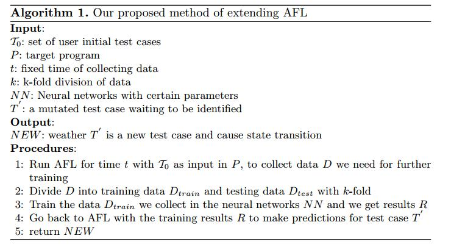

# Abstract

模糊测试是一种有效的测试技术，可以在bug转变为漏洞之前及早发现漏洞。如果没有复杂的程序分析，它可以通过稍微改变输入并发现程序中的潜在错误来生成有趣的测试用例。然而，以前的模糊器要么无法探索更深层次的错误，要么其中一些受到严重时间复杂性的影响，因此我们不能在实际应用中依赖它们。在本文中，我们通过结合实用和轻量级的深度学习方法，专注于减少模糊测试的时间复杂度，从根本上加速识别新测试用例和发现错误的过程。为了实现预期的模糊覆盖，我们通过使用深度学习方法扩展最先进的模糊AFL来实现我们的方法，并在几个广泛使用的开源可执行程序上进行评估。在所有这些计划中，我们可以看到我们方法的效率，并产生明显更好的结果。

关键字：加速，新测试样例，Fuzzing，深度学习安全

| relevant information |                                                              |
| -------------------- | ------------------------------------------------------------ |
| *作者*               | Weiwei Gong(B), Gen Zhang, and Xu Zhou                       |
| *单位*               | School of Computer, National University of Defense Technology, |
| *出处*               | SpaCCS 2017                                                  |
| *原文地址*           | <https://link.springer.com/chapter/10.1007/978-3-319-72389-1_24> |
| *源码地址*           |                                                              |
| *发表时间*           | 2017年                                                       |

# 1. 简介

如今，网络和软件的安全性正在引起越来越多的关注。
尽管努力提高软件抵御安全漏洞的能力，但软件漏洞仍然普遍存在[1]。在过去的几十年中，安全专家和研究人员不遗余力地发现漏洞并修复漏洞。但是，如果不执行一段代码，很难找到许多类漏洞，例如函数正确性漏洞[2]。关于代码执行的问题，关于符号执行的效率与更轻量级的模糊器有很多争论[3]。符号执行工具，如KLEE，EXE和DART，能够自动生成测试，实现对各种复杂和环境密集型程序的高覆盖率[2,4,5]。模糊测试是通过使用修改或模糊输入反复测试解析器来查找输入解析代码中的安全漏洞的过程[6]。

符号执行非常有效，因为每个测试用例通常沿着某个路径执行目标程序[7]。然而，这种有效性是以花费大量时间进行程序分析和约束求解为代价的。它会触发目标程序中的大量路径，并导致路径爆炸[8]。然而，关于模糊测试，今天大多数漏洞都是由特别轻量级的模糊器暴露出来的，这些模糊器不利用任何程序分析[9]。事实证明，如果生成测试用例所花费的时间相对过长，即使是最有效的符号执行也不如模糊测试效率高[10]。基于以上原因，在本文中，我们放弃了经典的符号执行，并专注于扩展一个最先进的模糊器American FuzzingLop （AFL）[11]。

有三种主要类型的模糊测试技术在使用[12]：黑盒随机模糊测试[13]，基于白盒约束的[14]模糊测试和灰盒模糊测试[15]。黑盒模糊测试是一种软件测试技术，不需要了解目标程序的内部架构。它只考察了系统的基本方面，将软件视为黑匣子[16]。白盒模糊测试基于对目标程序内部结构的分析，在验证设计和假设方面非常有效和高效。基于对系统实现方式的了解，执行白盒模糊测试[17]。灰盒模糊测试程序对应用程序结构的了解有限。它提供了黑盒和白盒模糊测试技术的综合优势，测试人员可以设计出色的测试场景[15]。

然而，由于灰盒模糊测试对于现实世界程序及其组合的优点是有效的，因此它广泛应用于软件测试中。在greybox模糊测试的范围内，有几个着名的模糊器，如自动生成[18]，模糊[19]和语义模型[20]。虽然这些方法确实放弃了耗时的程序分析，但它们的测试精度很低：要么将非崩溃点作为崩溃，要么忽略真正的重大崩溃。此外，现有的灰盒模糊器主要用于发现靠近软件表面的表面缺陷，同时与更复杂的模型进行斗争[21,22]。除了所有这些原因，我们专注于扩展最先进的灰盒模糊器AFL，它采用进化算法来操作有效的输入生成和简单的反馈回路来评估输入的好坏[23]。在以前的工作中，AFL被证明具有高精度，能够揭示程序中更深层次的错误[3,23]。

AFL是一种蛮力模糊器，加上极其简单但是坚固的插桩引导的遗传算法。但是，使用AFL工具找到一个独特的崩溃需要数小时和数天。 AFL的主要缺点是它实际运行目标程序一次，输入决定天气状态转换或新状态：换句话说，识别新测试用例的过程。当目标程序很复杂并且包含数百万个解析或条件代码时，运行该程序一次将花费相当长的时间并且AFL的整个过程将花费数小时和数天才能找到一个独特的崩溃（我们将在Sect2 中详细讨论这一点）。为了解决这个问题，在本文中，我们将有效的深度学习方法（如神经网络）集成到AFL中，以加快识别新测试样例和发现bug的过程。在我们的所有实验中，我们看到了方法的效率，并产生了明显更好的结果。

本文的主要贡献如下：（1）采用灰盒模糊测试，效率高，易于实现; （2）我们使用深度学习方法扩展AFL，这显着加快了识别新测试样例和发现bug的过程。

# 2 . 背景

## 2.1 American Fuzzy Lop

American Fuzzy Lop（AFL）是一种蛮力模糊器，配有极其简单但坚如磐石的插桩引导遗传算法。它使用修改后的边缘覆盖形式，轻松地获取程序控制流程的细微局部变化[24]。

整个算法可以总结为：

- （1）将用户提供的初始测试用例加载到队列中，

- （2）从队列中获取下一个输入文件，

- （3）尝试将测试用例修剪为最小的大小改变程序的测量行为，

- （4）使用平衡且经过充分研究的各种传统模糊测试策略反复改变文件。

- （5）如果任何生成的突变导致仪器记录的新状态转换，添加将输出变换为队列中的新条目，

- （6）转到2。

American Fuzzy Lop尽力不专注于任何单一的操作原理，也不是任何特定理论的概念验证。该工具可以被认为是在实践中经过测试的黑客集合，被发现具有惊人的效果，并且已经以人们当时可能想到的最简单，最强大的方式实现[9]。因此，AFL的扩展可以为我们提供一个高水平的平台。

更具体地说，当我们深入研究AFL的运行过程时，我们会发现有几个耗时的过程，我们实际上是为了改进。如上所述，AFL将初始测试用例放入队列，修剪它，进行突变，并实际运行目标程序一次，输入以确定weather ，此测试用例将导致状态转换或新状态。如果此测试用例确实导致状态转换或新状态，我们可以将其识别为新的测试用例。当目标程序很复杂并且包含数百万个解析或条件代码时，运行该程序一次将花费相当长的时间并且AFL的整个过程将花费数小时和数天才能找到唯一的崩溃。因此，我们使用深度学习技术扩展AFL，而不实际运行目标程序，以加速识别新测试用例和发现错误的整个过程，这是AFL原始版本的重大改进。

## 2.2 深度学习

如今，机器学习和深度学习正在受到关注，吸引了成千上万的研究人员努力工作。深度和递归神经网络（分别是DNN和RNN）是强大的模型，可以在视觉和语音中的困难模式识别问题上实现高性能[25]。神经网络中的深度学习（NN）与监督学习（SL），无监督学习（UL）和强化学习（RL）相关[26]。深度学习允许由多个处理层组成的计算模型来学习具有多个抽象级别的数据表示[27]。

深度学习带来了许多全新的特征，软件测试和深度学习的结合是有意义的。在本文中，我们应用深度学习技术来提高AFL的性能，并加速新的测试用例识别和错误发现的过程，这是一个全新而有趣的研究领域（迄今为止我们所知）。

# 3 模型概述

在本节中，我们将详细描述我们提出的模型，并将介绍我们方法的整个过程。

## 3.1使用深度学习方法训练AFL结果

如Sect 2中所述。 当目标程序很复杂并且包含数百万个解析或条件代码时，运行该程序一次将花费相当多的时间并且AFL的整个过程将花费数小时和数天才能找到唯一的崩溃。因此，我们专注于使用深度学习技术消除或减少这些程序。

在AFL中，一个测试用例使用某些模糊技术进行变异，例如翻转某个位，添加某个整数，替换为某个数字等等。 AFL中总共有16种模糊测试技术：flip2，flip4，flip8，flip16，flip32，arith8，arith16，arith32，int8，int16，int32，ext-UO，ext-UI，ext-AO，havoc和拼接。 在通过上述技术之一改变一个测试用例之后，它将被抛入目标程序以运行一次，以查看是否存在新的程序或状态转换状态。如果有新内容，则将变异的测试用例标识为新的测试用例并保存以供以后使用。

更具体地说，一个测试用例的内容总是可以翻译成0和1的序列。同样，模糊测试技术也可以看作是4位二进制序列。例如，“0000”代表“flip2”，“1111”代表“拼接”。突变的位置和值可以用同样的方式翻译。最后，这是否是一个新的测试案例用1和0表示。表1说明了我们如何将AFL问题的原始输入转换为二进制序列。例如，我们有一个字符串测试用例“3”，模糊测试技术是“int8”，它将为测试用例添加一个8位整数。而且，8位整数是4，位置只是0位。这个变异的测试用例将导致AFL中的状态转换，因此它是一个新的测试用例。因此，我们可以将此情况转换为我们定义的二进制序列测试用例为“00 ... 0011”，模糊技术为“1000”，突变位置为“00 ... 000”，突变值为“00 ... 00100”，新的为“1”。

在我们运行AFL一段时间后，我们从AFL过程中收集的数据将按照一定的比例分为训练数据和测试数据，这将在第4节中详细讨论。 将所有训练数据转换为二进制序列后，前一个78位可作为输入，最后一位可视为标记。这个二进制序列可以完美地融入神经网络模型，这是一种广泛使用的深度学习技术。神经网络模型将1和0的序列作为输入，并在网络中计算后简单地输出1或0。我们将使用此过程来预测是否变异测试用例是AFL中的新测试用例。更具体地说，为了训练网络，需要78 + 1比特作为训练数据，对于测试，78比特作为输入，而最后1比特是我们需要网络计算的比特。

## 3.2将学习成果整合到AFL中

如上所述，我们将通过将学习结果整合到AFL中来消除或减少耗时的新测试案例识别AFL程序。
原始版本将使用变异的测试用例运行程序，但是我们的新方法将简单地将已翻译的二进制序列抛入神经网络模型并预测此测试用例是否将导致新状态。更具体地说，当AFL拉出测试用例以对其进行突变时，此时我们手动停止在该测试用例上进一步执行。相反，我们将此测试用例放入表1中定义形式的神经网络中，并进行预测这是否是一个新的测试用例。结果将被发送回AFL以便进一步运行：如果此测试用例是新的并且将导致状态转换，它将被保存以供以后使用;如果没有，丢弃。需要声明的一件事是：虽然训练神经网络模型需要一些时间，但我们只需要为一个目标程序训练一次。在简单的神经网络中预测结果的时间复杂度仅为O（n1 * n2 + n2 * n3 + ...）[28]。因此，当节点数量在一个较小的范围内时，例如在我们的模型中，预测过程所花费的时间比实际运行目标程序一次要少得多。因此，我们的方法可以加快识别新测试用例和查找原始版本AFL的错误的过程。

因此，我们扩展AFL的方法的整个过程如下：

- （1）运行AFL一段时间，以收集我们进一步训练所需的数据。 （有一点必须明确，与运行AFL数小时和数天相比，在此过程中花费的时间要少得多。）

- （2）训练我们在神经网络中收集的数据。

- （3）使用训练结果返回AFL，对每个测试用例进行预测，最后找到程序中的潜在错误。
- 算法1还说明了我们的扩展AFL的过程：

# 4 实验

在本节中，我们将介绍我们的方法的实验结果，并讨论对原始版本的AFL的改进。我们在配备64位4核Intel CPU和32 GB RAM的Ubuntu 14.04 LTS系统上进行了实验。对于我们的实验，我们选择了8个目标程序：bmp2tiff，pal2rgb，tiff2pdf，tiff2ps，gif2png，readelf，nm-new和cxxfix [29-31]，它们都在他们的领域中广泛使用，并且在之前的论文中已经过测试[3,23]

## 4.1神经网络的训练结果

对于我们的每个目标程序，我们使用它运行AFL一段时间并收集超过500K的测试用例以供之后的训练过程使用。所有这些都以二进制顺序存储，如表1所示。我们应用的神经网络是sklearn.neural-network.MLPClassifier [32]，它是一种广泛使用的多层感知器分类器。隐藏图层大小为（5,2），解算器为“adam”。虽然有许多类型的网络算法，考虑到时间和其他因素，但本文中我们只引入一个神经网络来完成我们的实验。我们将训练数据作为神经网络的输入，并在可接受的短时间内计算结果。我们获得了培训结果，如表2所示。

第一列“目标”是我们试验的8个目标程序。下一列“总计”是我们为每个目标程序收集的测试用例数。然后我们将所有收集的测试用例划分为5倍的训练和测试数据，这意味着训练数据是总测试用例的4 /5，测试数据相应地为1/5。在将训练数据拟合到我们的神经网络之后，我们可以预测一个新的测试用例。第三列“错误”是错误预测的数量，最后一列是预测神经网络的准确性。如表2所示，我们的预测准确度在85％至90％之间。由于具有如此高的精度，我们提出的识别新测试用例的方法可以准确地预测变异的测试用例是否将导致状态转换并且在准确度上与原始版本执行几乎相同，并且在速度上表现更好。

## 4.2我们方法的时间性能

如上所述，在用我们收集的数据训练我们的神经网络之后，是时候预测变异的测试用例是否将导致AFL过程中的状态转换。而且我们预测的高精度绝对是之后操作的坚实基础。同样，我们运行8个目标程序一段时间，与原始AFL相比唯一的区别是测试用例不必通过目标程序来决定它是否将被保存或丢弃。唯一需要做的就是将这个测试用例抛给我们已经训练过的神经网络进行预测。表3说明了与原始版本的AFL的比较。

第一列是如上所述的8个目标程序。第二列是崩溃和挂起AFL的数量，我们的方法在一定时间内找到。所以AFL和我们的方法之间的比较是关于找到给定数量的崩溃和挂起的时间。接下来的两列是时间AFL，我们的方法需要分别找到那些崩溃和挂起。 （我们所有的执行时间都与Bohme等人[3]和Rawat等人[23]的工作一致。）如表中所示，我们的方法确实引导了原始AFL的执行时间和开启时间。平均为5％。正如我们在上一节的理论分析中所详述的，我们的方法不必实际运行目标程序，它只依赖于我们的神经网络来预测测试用例是否将导致状态转换。因此，理论分析和实验表明，我们的方法在识别新测试用例和发现错误的过程中确实加速了AFL。

# 5 结论

面对当今严峻的安全问题，在我们提出的方法中，我们首先选择对复杂的符号执行进行模糊测试。此外，在所有的模糊测试实施中，我们专注于最先进的AFL，以扩展其承诺的特性。为了加速AFL的过程并确定新的测试用例，本文通过结合实用和轻量级深度学习方法，着重降低模糊测试的时间复杂度。为了实现预期的模糊覆盖，我们通过使用深度学习方法扩展AFL并在8个广泛使用的开源目标程序上进行评估来实现我们的方法。在所有这些程序中，我们扩展AFL的方法显示出对原始版本的显着改进。但是，我们的方法并不专注于改进代码覆盖率以发现更多错误。因此，在以后的工作中，我们将尝试对这些领域进行研究。此外，虽然有许多类型的网络算法，考虑到时间和其他因素，但本文中我们只引入一个神经网络来完成我们的实验。在未来，我们将在不同情况下使用不同的神经网络来评估不同神经网络的性能