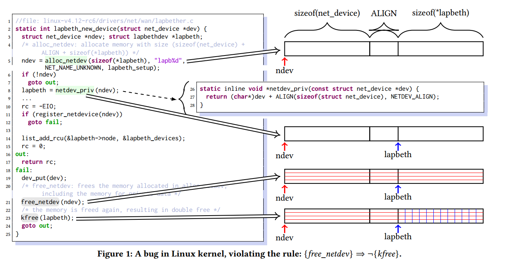
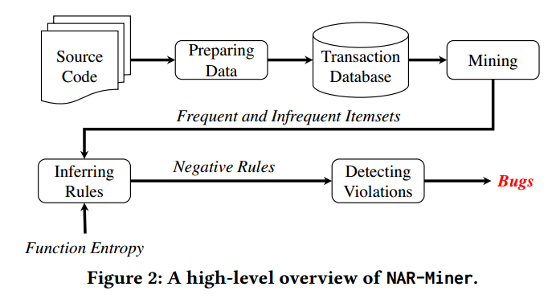
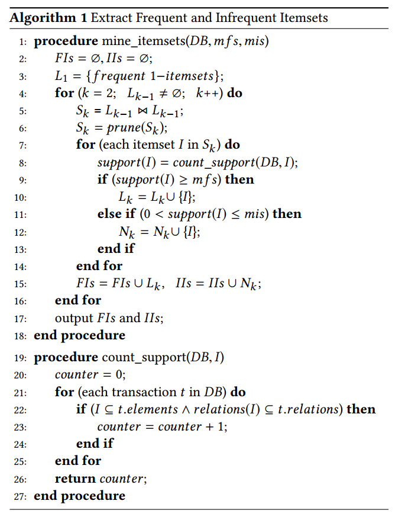
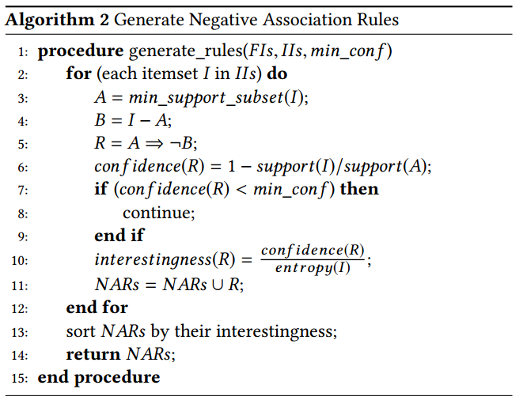
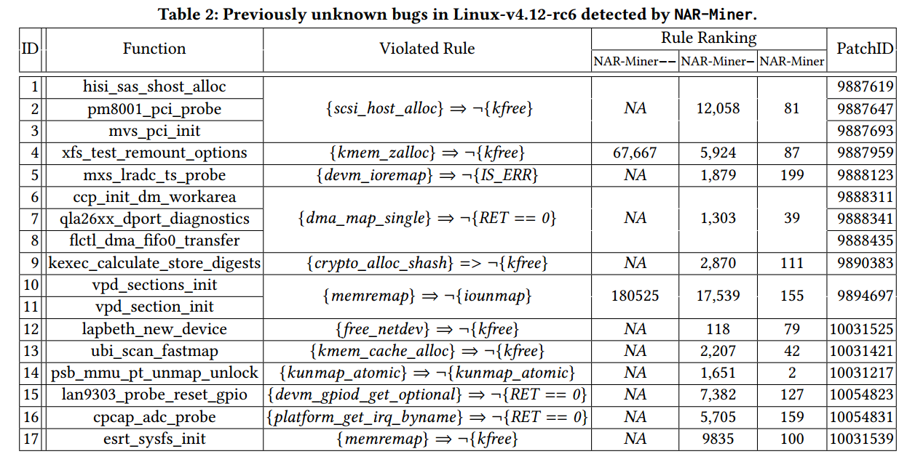
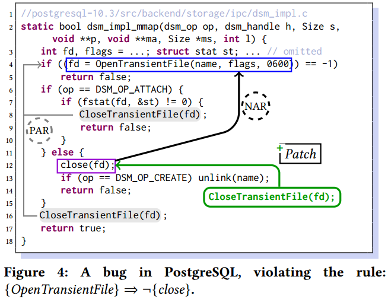

# Abstract

从基于数据挖掘技术的源代码推断编程规则已被证明对检测软件错误是有效的。现有研究侧重于以A⇒B的形式发现积极规则，表明当操作A出现时，操作B也应该在这里。不幸的是，负面规则（A⇒¬B），表明程序元素之间的相互抑制或冲突关系，没有得到应有的重视。事实上，违反这些负面规则也会导致严重的错误。在本文中，我们提出了一种名为NAR-Miner的新方法，可以从大规模系统中自动提取负关联编程规则，并检测它们的违规行为来发现bug。然而，挖掘负面规则面临着比挖掘正面规则更严重的规则爆炸问题。大多数获得的负面规则都是无趣的，并且可能导致不可接受的错误警报。**为了解决这个问题，我们设计了一个语义约束的挖掘算法，将规则挖掘集中在具有强语义关系的元素上。此外，我们引入信息熵来排列候选负面规则并突出有趣的规则**。因此，我们有效地缓解了规则爆炸问题。我们实现NAR-Miner并将其应用于Linux内核（v4.12-rc6）。实验表明，不感兴趣的规则大大减少，检测到的17个违规行为已被确认为真正的错误并被内核社区修补。我们还将NAR-Miner应用于PostgreSQL，OpenSSL和FFmpeg，并发现了六个真正的错误。

| relevant information |                                                              |
| -------------------- | ------------------------------------------------------------ |
| *作者*               | Pan Bian, Bin Liang,/Wenchang Shi,Jianjun Huang,Yan Cai      |
| *单位*               | School of Information, Renmin University of China; Key Laboratory of DEKE, Renmin University of China Beijing, China; State Key Laboratory of Computer Science, Institute of Software, Chinese Academy of Sciences Beijing, China |
| *出处*               |                                                              |
| *原文地址*           | https://github.com/wtwofire/database/blob/master/papers/mine/2018-NAR-Miner%20Discovering%20Negative%20Association%20Rules%20from%20Code.pdf |
| *源码地址*           |                                                              |
| *发表时间*           | 2018年                                                       |
# 1. 引言

静态错误/漏洞检测技术通常需要一些先验知识（即检测规则或漏洞签名）[9,13,17,19]。近年来，已经广泛证明了关于bug /漏洞检测的代码挖掘方法是非常有效的[1,4,6,7,14,20,25-27,29,30,36,38,44,47， 49,51-53,57,60]。这些方法自动从程序源代码中提取隐式编程规则，并进一步检测违反这些规则的错误或漏洞。通常，在代码挖掘期间，程序源代码首先被转换为项集[6,25,26,49]，图[7,34,57]或其他形式。接下来，将数据挖掘算法应用于变换后的格式以提取模式（例如，频繁项目集或子图）并推断编程规则。最后一步是检测违反推断规则的行为。例如，PR-Miner [25]和AntMiner [26]从Linux内核挖掘频繁项目集以提取关联规则（作为检测规则）并检测到许多未知错误。

这些现有研究的基本思想是利用统计数据来编制程序元素，并附带源代码的关系。这种关系表现为积极的编程模式。也就是说，在目标项目中，一些程序元素经常一起出现（达到给定的阈值）或者它们之间存在某种联系。例如，PR-Miner [25]和AntMiner [26]都以A⇒B的形式提取正关联规则，表明在函数内，当程序元素A出现时，元素B也应该出现。因此，如果函数实现违反规则（即，包含A而不包括B），则预期潜在的错误。已经提出了类似的技术来检测潜在的对象滥用错误[53]和控制结构之后缺少的程序元素[7]，已经推断出API的正确使用[60]。所有这些方法都针对一组具有相互支持关系的邻接程序元素，即积极关联。

然而，在实践中我们观察到一些隐式编程模式以A⇒¬B的形式表现为负关联。也就是说，当A出现时，B不应出现，反之亦然。从这个意义上说，否定规则反映了A和B之间的相互抑制或冲突关系。违反负面规则也可能导致严重的错误。通常不可能手动识别项目中的所有否定规则，尤其是像Linux内核这样的大规模规则。但据我们所知，现有方法没有可以自动从源代码中提取负面规则以进行错误检测。最先进的基于挖掘的解决方案只能提取积极的编程规则。与指示频繁模式的积极规则相比，否定规则通常更隐含，相应的错误更隐蔽。例如，图1中的错误已存在于Linux内核中超过10年（即，在Linux-2.6.4或更早版本中提供）。因此，开发一种自动提取隐式否定编程规则以检测相关错误和漏洞的有效方法既具有挑战性又迫切。

在本文中，我们提出NAR-Miner解决上述问题。最重要的想法是通过不频繁的模式挖掘来推断有趣的负关联规则，并进一步将相应的违规行为检测为潜在的程序错误。基本上，由于负面规则的性质[56]，直接挖掘不常见的模式以提取负面规则将产生大量规则。我们称之为规则爆炸问题。这些规则中的大多数对于错误检测都是无趣的，即它们不包含任何真实的应用程序逻辑，并且违反它们不会导致错误或程序质量问题。因此，基于这些不感兴趣的规则的检测结果将产生不可接受的误报。例如，直接将现有的负规则挖掘算法[43,46,61]应用于Linux内核将提取多达数十万条规则和数百万条违规行为。在有限的人力资源下进行人工审计变得不可能。为了解决规则爆炸问题，我们提出了一种语义约束的负关联编程规则挖掘算法，以避免尽可能地产生过多的不感兴趣的规则。此外，我们利用信息熵来识别易于导致不感兴趣的规则的一般函数。这一步有助于进一步遏制可能不感兴趣的规则。因此，NAR-Miner可以有效地缓解规则爆炸问题并获得理想的有趣规则来检测潜在的错误。

我们实现了NAR-Miner的原型，并首先在Linux内核（v4.12-rc6）上进行评估。实验表明，基于语义约束的负规则挖掘和基于信息熵的规则过滤在减少不感兴趣的规则数量方面表现良好。也就是说，它减少了46％的无趣规则（即，在200个排名靠前的负面规则中从198到107）。特别是，它在排名前50位的负面规则中实现了62％的真正正面率。NAR-Miner报告了违反排名最高的200条规则的356条违规行为。我们手动检查结果并发现23个可疑错误和数十个质量问题。我们向Linux内核维护者报告可疑错误。其中17个已被确认为真正的错误，相应的补丁已合并到最新版本（例如，v4.16）。我们进一步将NAR-Miner应用于PostgreSQL v10.3，OpenSSL v1.1.1和FFmpeg v3.4.2。从排名靠前的规则和违规行为中，我们手动识别出六个可疑错误，所有这些错误都由相应的维护人员进行了确认和修复

本文的主要贡献如下：

- 据我们所知，我们的工作是第一个专注于从源代码中提取负面编程规则以检测错误的工作。它扩展了基于挖掘的错误检测技术的能力。

- 我们提出了一种通过在规则挖掘中引入程序语义并使用信息熵来识别一般函数来缓解规则爆炸问题的方法，该方法可以有效地提取用于错误检测的理想的有趣负编程规则。

- 我们针对真实世界的大型软件项目实现了NAR-Miner原型。我们将该工具应用于四个大型系统（即Linux内核，PostgreSQL，OpenSSL和FFmpeg）并引发相当多的错误，其中23个已被确认。

# 2.动机示例

我们使用来自Linux内核（v4.12-rc6）的简化代码片段来激励我们的方法。在图1中，函数lapbeth_new_device在第5行调用alloc_netdev为网络设备分配一块内存。然后在第8行，在内联函数中调用netdev_priv以获取私有数据的起始地址并将其存储到变量lapbeth。如图1所示，lapbeth指向先前分配的内存中的位置。如果设备注册在第11行失败，则将释放设备的内存块。由变量ndev指向的已分配内存在第21行首先释放，然后在第23行释放私有数据。从代码片段突出显示从内存分配到空闲的执行序列中的关键操作，并相应地描述相应的内存状态。我们使用红色水平线来描述通过free_netdev和kfree的蓝色垂直线释放内存。通过图示，可以很容易地看出代码中存在双重错误。

传统的静态检测方法难以在大规模系统（例如Linux内核）中发现此错误和其他类似错误，因为所需的错误模式或规则是特定于应用程序并且难以收集。现有的基于挖掘的方法也无法报告错误。例如，最先进的方法AntMiner [26]提取正关联规则并检查违规。在Linux内核中，我们发现在对alloc_netdev的90次调用中，共有77次出现{alloc_netdev，free_netdev}（85.6％）。并且在533个调用实例中只有一次调用free_netdev后跟kfree（0.2％）。 AntMiner将{alloc_netdev}⇒{free_netdev}视为一个正规则，最小置信度阈值为85％[26]。但是，图1中的代码同时调用alloc_netdev和free_netdev，因此是对规则的支持，而不是违反。因此，上述错误未被发现。此外，由于低信任度（0.2％«85％），AntMiner不会将{free_netdev}⇒{kfree}视为有效规则（即，以最小置信度阈值来消除）。因此，AntMiner无法将“kfree跟随free_netdev”报告为错误。

从上面的分析中，通过分析元素之间的伴随关系来检测图1中的错误是非常困难甚至是不可能的。实质上，与bug密切相关的两个程序元素（即free_netdev和kfree）是负相关的。通过统计分析可以发现这种知识。具体来说，我们发现在大多数情况下（大约99.8％）在Linux内核中，free_netdev后面没有kfree，我们了解到开发人员大多都知道在free_netdev之后调用kfree可能是不必要的或导致严重问题的情况。受此启发，相对少量的配对事件可被视为异常。

我们利用不频繁的项集挖掘算法来推断负关联规则并应用规则来检测它们的违规（例如，图1中的那个）。在挖掘和检测期间，我们还考虑了程序语义（例如，数据流信息）。在我们的示例中，kfree与free_netdev共享数据，并且它们的外观一起被视为不常见的模式。因此，我们推断出一个负面规则{free_netdev}⇒¬{kfree}。将规则应用于我们的示例可发现相应的错误（表2中的错误12＃）

# 3.我们的方法

## 3.1概述

我们提出了NAR-Miner，目标是检测程序包含一些操作（例如两个函数调用）的错误，这些操作被认为不会出现在一起，该方法不需要任何先验知识。NAR-Miner的高层理念是采用数据挖掘技术从源代码中推断出负关联规则并检测其违规行为。

图2显示了NAR-Miner的概述。它首先为挖掘阶段准备数据。与大多数基于挖掘的方法类似[6,25,26,49,60]，我们仅从每个单独的函数中提取编程规则，即在程序内，以避免过于复杂的分析。识别每个函数内的程序元素及其语义关系并将其转换为事务，然后将其存储在数据库（称为事务数据库）中。接下来，它从数据库中挖掘频繁且不频繁的项集，它们表示程序元素集。然后，它从挖掘的项集中推断出负关联规则，并利用函数的置信度和熵自动对规则进行排序。最后，它检测违反推断规则的情况，并将排名最高的规则报告为审计的潜在错误。

## 3.2挑战

以前的研究[43,46,61]表明只有少数表现出负相关关系很有意思的模式。他们通过计算支持和信任来识别有趣规则的技术不能直接用于代码挖掘。构造有趣的负关联规则的程序元素应该在它们的语义中相互压制，而不是偶尔出现在一起。我们的实证研究表明，直接应用Wu等人提出的算法。 [56]从Linux内核中提取的事务数据库生成183,712个负关联规则（参见§4.2.2），而其中99％在采样分析中不感兴趣。报告的违规行为多达309,689起，这使得人工审核变得不可能。我们称之为规则爆炸问题，并将其视为提取负关联规则的主要挑战。我们将以下两个方面归结为规则爆炸的根本原因。

1. 现有的负关联规则挖掘方法[43,45,56,61]主要针对购物篮，医学诊断，蛋白质序列等。对于这类数据，来自挖掘单位的任何两个元素（例如，购物收据）除属于同一单位外，没有任何特定关系。换句话说，挖掘单元的元素是同类的。然而，在程序元素之间，通常存在各种语义关系，例如数据依赖性。忽略这样的关系可能会导致许多不感兴趣的规则由语义上独立的元素组成，这些元素实际上并没有相互抑制，而是偶尔出现在一起。

2. 大型项目通常包含一定数量的通用API，几乎可用于所有编程环境，例如Linux中的printk和isalpha。它们可能巧合地与其他操作配对以形成关联规则。即使考虑到挖掘期间的强语义关系（例如，数据依赖性），这些API仍然可能导致许多负面无趣的规则。实际上，API越普遍，它与其他操作的相互抑制就越少。

基于以上见解，我们如下缓解规则爆炸问题。 （1）考虑到如上所述的程序元素的本质，我们将规则挖掘集中在具有强语义关系（例如，数据依赖性）的程序元素上，以尽可能地减少不感兴趣的规则。 （2）我们使用信息熵来衡量API的普遍性，并用它来排列挖掘的候选负面规则。涉及高普遍性API的不感兴趣规则将被排除在最终审计之外。

## 3.3数据准备

NAR-Miner将程序元素转换为事务并将它们存储到数据库中。在本文中，我们关注两种程序元素：函数调用和条件检查，因为许多错误是由函数或条件错误引起的[1,6,21,26,33,38,47,57]。如前所述，我们的目标是从事务中提取负关联规则，其元素具有强大的语义关系。如果它们之间存在数据关联，我们定义两个元素以具有强大的语义关系，包括数据依赖性和数据共享[7]。详细地说，给定两个语句s1和s2，如果s2使用s1中定义的值（即数据依赖），或者它们都出现在同一个执行路径上并使用相同的非常量值（即数据共享），我们说他们在语义上有很强的相关性。程序元素的语义关系通过数据流分析[3,15]来识别。

NAR-Miner的预处理器建立在GCC（v4.8.2）前端之上，该前端以SSA形式[12]提供控制流图和中间表示，用于数据流分析。图3（a）显示了一段代码，图3（b）显示了相应SSA形式的中间表示。 NAR-Miner可以判断is_valid，foo和bar是依赖于第2行的read2的数据。由于is_valid和foo在同一个执行路径中，因此它们具有数据共享关系。因为foo和bar之间没有路径，所以它们不被认为是语义相关的。

为了简化挖掘阶段，然后将中间表示转换为事务数据库。每个函数定义都映射到一个事务。事务由两部分组成：程序元素和这些元素之间的一组语义关系。在转储到数据库之前，每个程序元素都被规范化。函数调用用不带参数的函数名表示;如果条件语句中的变量保留某些函数的返回值，或者在其他情况下保留其数据类型，则使用“RET”重命名，如许多挖掘方法[6,7,25,26,57,58]中所做的那样。例如，图3中的条件表达式归一化为“RET == 0”。两个程序元素之间的语义关系表示为事务中的元组。例如，元组（foo，is_valid）表示函数foo和is_valid具有一些语义关系。图3（c）显示了代码片段的语义关系，其中节点表示程序元素，边缘表示关系（黑线表示数据依赖性、红线表示数据共享）。

我们将每个程序元素映射到一个唯一的整数，因此挖掘被应用于整数集以提高性能，因为大量的字符串等价比较是耗时的。

## 3.4提取频繁和不频繁的项集

很少调用的程序元素总是很少与其他程序元素一起出现，并且会导致大量的负面模式。然而，这些模式在统计学中毫无意义[56]。因此，我们专注于挖掘负面模式，这些模式的元素经常单独出现但很少发生在一起。对于负关联规则A⇒¬B，其前因（即A）和后续（即B）是频繁的，但它们的组合（即（A∪B））是不频繁的。在本节中，我们将提出我们的算法来提取有趣的频繁和不频繁的项集，并将在下一节中解释如何生成否定规则。

提取频繁和不频繁项集的现有算法仅依赖于事务数据库中项集的出现[43,46,61]。他们都没有考虑元素之间的语义关系。直接将它们应用于§3.3中生成的数据库将导致大量无趣的规则。据我们所知，没有不常见的项集挖掘算法可以直接应用于我们的工作中。为了解决这个问题，我们设计了一个语义约束的挖掘算法，该算法侧重于提取与语义相关的强项集。强语义相关项集中的元素在语义上都彼此相关，例如，具有数据依赖性或数据共享关系。

我们基于众所周知的Apriori算法[2]设计我们的算法，该算法应用自下而上的方法通过将较小的频繁项目集合在一起来生成相对较大的候选项集。自下而上方法背后的原则是Apriori属性：频繁项集的任何子集也是频繁的。在我们的例子中，强语义相关项集的任何子集也与强语义相关，因为子集中的任何两个元素必须在语义上相关。因此，强大的语义相关项集也符合Apriori属性，可以自下而上的方式挖掘。

算法1中显示了我们挖掘频繁和不频繁的强语义相关项集的算法。除了事务数据库，它还要求用户指定两个参数：最小频率支持mfs和最大频率支持mis。如果项集的支持大于或等于mf s，则认为项集是频繁的，如果项集的支持小于或等于mis，则项集是不频繁的。算法的输出是所有频繁项目集（FI）和感兴趣的不频繁项目集（IIs）。

在开始时，算法扫描事务数据库以找出所有频繁的1项集（第3行）。然后它试图从频繁的（k-1）-itemsets（第4~14行）中发现频繁且不频繁的k-项集。 k项目集包含k个项目。首先，它通过连接频繁（k-1）-项来生成感兴趣的候选k项集（参见第5行）。如果它们具有k-2个共同项，则可以连接两个（k-1）-itemsets。假设两个可连接（k-1）-itemsets是{i1，...，ik-2，ik-1}和{i1，...，ik-2，ik}，则连接结果是k-itemset {i1，...，ik-2，ik-1，ik}。其次，该算法利用Apriori属性来修剪具有不频繁子项集的k项集（第6行）。之后，调用函数count_support来计算每个k-itemset的支持（第8行）。如果项目集的支持不小于mfs，则将项目集插入Lk（第10行），即一组频繁的k项目集;否则，如果它的支持不大于mis，则将其插入不频繁的k项集Nk集（第12行）。应该注意，支持为0的项集自然会被忽略。 Lk和Nk分别与FI和IIs（第15行）合并。然后，频繁项目集Lk用于生成更大的项集Lk + 1和Nk + 1。当Lk对于某个k为空时，算法终止，并输出收集的频繁/不频繁项集（第17行）。

函数count_support扫描数据库以计算项集I的支持（第19~27行）。如果事务支持I（第23行），计数器将增加1。当且仅当它包含I中的所有项目以及所包含项目之间的所有可能关系时（表示为关系（I）），事务支持I。例如，图3中的事务支持itemset {foo，is_valid}，因为它不仅包括两个项foo和is_valid，还包括它们之间的语义关系，即元组（foo，is_valid）。但是，事务不支持itemset {foo，bar}，因为它不包含元组（foo，bar）。

为了挖掘像{kfree}⇒¬{kfree}这样的规则，我们还提取了像{g，g}这样的2项集，其中g经常被调用，但是在同一函数中它的两个调用实例在语义上很少相关。这有助于NAR-Miner找到表2中的错误14＃（参见§4.2.3）。

## 3.5生成负关联规则

负关联规则A⇒¬B意味着两个频繁项集A和B很少出现在同一事务中。也就是说，（A∪B）很少见。事实上，规则的前因和后果实际上是不常见的项目集的不相交分区。一种直接的负关联规则生成方法是从不频繁的项集I中找出所有对，如<A，B>，其中A∪B= I且A∩B=∅。它使用规则A⇒¬B的统一来确定其不频繁。这种说法的定义如下：

其中，支持（A∪¬B）是支持A∪¬B，支持A但不支持A∪B的事务数量。因此，我们有支持（A∪¬B）=支持（A）-支持（A∪B）=支持（A）-支持（I），其中I =A∪B。因此，等式1可以改写为：

从具有n个元素（n≥2）的不频繁项集I中，通过直接应用上述方法可以生成最多2个（n-1）个负关联规则。但是，对它们的违反是完全相同的，即支持项目集I的事务。因此，在面向错误检测的应用程序中仅跟踪它们中的一个就足够了。注意，从编程的角度来看，规则A⇒¬B意味着B中的元素不应出现在包含A的上下文中。如果反转规则B⇒¬A不感兴趣，则其违规总是误报，因为存在B并不意味着拒绝A.受此启发，在几乎所有情况下，如果我们期望支持不频繁项集I的事务成为真正的错误，那么从I派生的所有负关联规则应该是有趣的。因此，我们可以选择具有最低置信度的规则来表示这些规则。将置信度作为衡量标准，其他规则如果有趣则会很有趣。

实际编程中的逻辑通常非常复杂。一些挖掘的规则可能不适用于编程实践。根据它们检测到的违规通常是误报。一般方法是对挖掘的规则进行排名，使得有趣的规则排名最高，而无趣的规则排在最低位。现有工作主要根据他们的置信度对规则进行排名（高信任规则排名最高）。然而，这种信任仅反映了几个有限元素之间的（负/正）相关性。实际上，编程规则的有趣性也与其元素是否集中在某些上下文有关。也就是说，如果元素的调用上下文趋向于更加同类，则由它组成的规则更可能是有趣的。否则，如果元素在非常不同的上下文中使用，则它更通用，并且更可能与各种元素一起出现。在本文中，我们使用一般性来表明元素的上下文有多不同。一般而言，规则由具有高一般性的元素组成，更可能是无趣的元素。

我们引入信息熵来定量测量元素的一般性。对于程序元素g的调用实例，我们通过g依赖的元素和依赖于g的元素两个来描述它的上下文。我们在g的所有调用实例中提取这些元素并将它们放入包中。包的信息熵反映了调用实例的不同，可以用来衡量g的一般性。包的信息熵（表示为H（g））可以通过等式3计算:

其中pi是包中第i个元素的频率; N是g的调用实例数。项集的熵是每个元素的熵的总和。

根据每个程序元素的一般性，负关联规则R的兴趣度可以测量为：

其中H（gi）是元素gi的信息熵。

我们在算法2中形成了生成负关联规则的方法。该算法将§3.4中提取的频繁项集FI和不频繁项集II以及用户指定的阈值min_conf作为输入。它返回负关联规则NARs的集合。它首先为具有最低置信度的每个不频繁项集I生成代表性规则（第3~5行）。从等式2可以看出，A的支持越小，A⇒¬B的置信度就越低。因此，我们选择支持最小的I子集来生成代表性规则。然后，计算规则的置信度（第6行）并根据阈值min_conf（第7行）进行检查。信息熵用于衡量潜在有趣规则的兴趣（第10行）。最后，负关联规则按其兴趣的降序排序。

## 3.6检测违规行为

违反负关联规则R：A⇒¬B的是那些支持项集A∪B的事务。直接的方法是直接扫描数据库以找出包含项集A和B的所有事务。但是，这样的枚举方法这非常耗时，特别是对于拥有数十万事务的数据库而言。为了加快检测过程，我们采用了PR-Miner [25]中使用的技巧。在生成频繁且不频繁的项目集时，NAR-Miner还会收集支持它们的事务。我们使用支持者（I）来指示支持项集I的所有事务。然后，违反负关联规则R的集合恰好是支持者（A∪B）。

# 4.评估

## 4.1实验设置

我们将NAR-Miner实现为原型系统，以检测大规模C程序中的错误。我们在众所周知的Linux内核（v4.12-rc6）上评估NAR-Miner。 Linux内核已被广泛用作基于挖掘的错误检测方法的评估目标（TOE）[6,14,20,20,22,24-26,30,42,46-48,57,60]。选择Linux内核作为我们的目标的主要原因是我们想要通过检测以前工作中找不到的一些真正的错误来检查我们方法的有效性。 Linux-v4.12-rc6是实验时的最新版本。它包含24,919个C和19,295个标题文件，包括376,680个函数和15,501,651行代码（LoC）。

为了验证NAR-Miner是否可以应用于其他系统中的错误检测，我们还从不同的域中选择了三种流行的大型C系统：PostgreSQL v10.3，OpenSSL v1.1.1和FFmpeg v3.4.2。 PostgreSQL是一个开源数据库，OpenSSL是一个用于安全通信的库，FFmpeg是一个用于编码/解码多媒体文件的框架。许多错误检测方法选择它们作为评估的目标[19,20,25,35,57]。

NAR-Miner需要指定三个参数：（1）频繁项集的最小支持阈值（即mfs），（2）不频繁项集的最大支持阈值（即mis），以及（3）有趣的负面规则最小置信度阈值（即min_conf）。通常，如果项目集是具有较高支持的频繁项目集或具有较低支持的不频繁项目集，则项目集将更有趣。此外，较高的最低限度可以进一步消除无趣的负面规则。实际上，不同的参数设置可能导致无法报告某些实际错误或产生过多的错误警报。用户可以保守地或积极地根据检测策略调整这些参数。为了确定合理的参数，我们进行了[6,25,26,49,60]中的实证研究。具体而言，通过抽样分析，当排名前10位的负面规则中有一半以上是有趣的规则时，参数设置被认为是可接受的。在这项研究中，我们将mf设置为15，将mis设置为5，将min_conf设置为85％。在我们的实验中，默认参数设置适用于四种不同的TOE（参见§4.2和§4.3）。

## 4.2检测Linux内核中的错误

### 4.2.1预处理源代码

NAR-Miner花了大约77分钟来解析内核源代码并将其转换为事务数据库。在所有函数定义中，有333,248个函数包含一些程序元素（即函数调用或条件检查）。转换后，每个函数定义都映射到数据库中的事务。该数据库包括227,246个不同的元素，其中每个元素对应于函数调用或条件检查。其中，6,203个频繁出现在多个事务中。

### 4.2.2挖掘负面规则的有效性

为了评估包含语义约束规则挖掘和基于信息熵的规则排序的方法的有效性，我们进行了三个实验：NAR-Miner--，NARMiner-，NAR-Miner。每个实验中采用的方法解释如下：

1. NAR-Miner--：挖掘算法不考虑项目之间的语义关系，挖掘的规则根据其对应性进行排序;

2. NAR-Miner-：基于NAR-Miner--，项目之间的语义关系被用作约束来消除弱语义相关项集;

3. NAR-Miner：基于NAR-Miner-，我们引入信息熵来衡量负关联编程规则的趣味性。该实验评估了NAR-Miner的全部功能。

我们在表1中显示了实验结果，包括频繁项目集（#FI），不频繁项目集（#IIs）的数量，推断的负关联规则的数量，检测到的违规数量以及挖掘，排名和检测的时间成本（时间）很快。

比较NAR-Miner--和NAR-Miner-或NAR-Miner的结果，我们观察到采用语义约束的挖掘减少了一个数量级的规则和违规总数（＃All列减少约88％） ）。规则爆炸问题在很大程度上得到了缓解。

由于时间有限，我们在每个实验中手动检查200个排名靠前的负关联规则。这些规则按照他们在NAR-Miner--和NAR-Miner-中的可信度排名，而他们在NAR-Miner中的兴趣则排名靠前。负关联规则如果真的很有意义则标记为“True”，违反它会导致错误或质量问题。例如，{free_netdev}⇒¬{kfree}是一个有趣的（“True”）规则，因为违反它将导致潜在的双重释放错误，例如§2中讨论的错误。在NAR-Miner中，前200条规则中只有2条被认为是有趣的规则。换句话说，其中99％导致违规检测的错误警报。这种有趣规则率低的主要原因是由这些规则组成的程序元素通常在语义上彼此独立。对于下面的例子，虽然在NAR-Miner中排名第一，并且具有99.96％的置信度，但规则{static_key_false}⇒¬{atomic_read}是无趣的，因为这两个函数将完全独立的变量作为包含他们的程序中的实际参数，他们并没有真正压制对方。

引入语义约束的挖掘将NAR-Miner-中的误报率降低到90.5％，然而，这仍然太高而不能在实践中被接受。虽然推断规则具有语义相关的所有程序元素，但是一些元素非常通用，并且可以在违规不会导致错误的各种上下文中使用。例如，函数iowrite32是在它们一起出现时依赖于readl的数据，在Linux内核中只出现一次，并且推断出规则{iowrite32}⇒¬{readl}。该规则在NAR-Miner-中排名第8位，并且在99.64％的情况下排名第一，但仍然无趣，因为这两种功能都以各种方式使用，并且它们的组合不会导致任何错误。

NAR-Miner使用信息熵来测量函数的一般性。 iowrite32和readl分别为5.9和4.6。规则{iowrite32}⇒¬{readl}的有趣性是9.5％，小到足以排名低。以这种方式，大多数不感兴趣的规则被分配低兴趣度值并因此被排在底部，同时潜在有趣的规则被分配具有相对高的兴趣度值并且在顶部排名。在NAR-Miner中，前200个负面规则中有93个标记为“真”，几乎是NAR-Miner-中数字的5倍。特别是，在前50个中有31个“真正的”负规则。真阳性率为62％。也就是说，我们可以在不到两次手动审计中找到一个有趣的规则，这在实际的错误检测中是可以接受的，而不是针对Linux内核等真实的大型系统。

我们还检查了违反前200条推断规则的情况。从表1中的Violations和#Bugs列中，我们观察到更多报告的违规和由于应用基于语义约束的挖掘和基于信息熵的排序而导致的错误，这最终增强了NAR-Miner的能力，使其能够推断出更多有趣的规则（列#True和TP Rate）

4.2.3检测违规行为

针对NAR-Miner提取的21,166个负关联规则，检测到37,453个违规。我们根据规则的排名手动检查报告的负关联规则及其违规。为了从检测中获得最大的收益，我们选择排名靠前的规则进行审核，因为违反这些规则更可能是真正的错误。我们在一个人一天内检查了200个排名靠前的负面关联规则和相应的356个违规行为（参见表1中的最后一行）。

我们发现了23个可疑错误和数十个程序质量问题，例如冗余条件检查和计算。由于Linux内核维护者经常忽略质量问题，我们只向Linux内核维护者提交23个可疑错误的补丁。到目前为止，这些补丁中有17个已经被内核维护者所认可和接受。

表2中列出了确认的bugs，其中包含错误（函数），违反的规则（违规规则）以及三个实验中的规则排名。最后一列显示了这些bug的补丁ID和我们在PatchWork站点上的补丁。在这些发现的bug中，六个（2＃，3＃，8＃，12＃，13＃和14＃）在内核2.6中出现，两个（3＃和12＃）甚至潜伏了10年以上。

这些bug总共违反了12个负关联规则。如果按照排名进行排名，则只有其中一个在前200条规则范围内（NAR-Miner-列中为12＃）。但是使用信息熵对规则进行排名会使所有这些规则都进入前200名（NAR-Miner）。这一观察结果表明，将信息熵引入排名对于突出有趣的规则非常有用。我们还观察到这些规则中只有2个是在NAR-Miner--中提取的（“NA”表示没有命中），其他规则都缺失。例如，缺少规则{free_netdev}⇒¬{kfree}（12＃），因为有106个函数同时调用free_netdev和kfree。在不考虑语义关系的情况下，项集{free_netdev，kfree}的支持是106，这远远高于预定阈值mis = 5。

因此，它不会被视为不常见的项目集，因此无法推断出负关联规则。然而，凭借语义约束的挖掘和信息熵，NAR-Miner成功地推断出规则并发现相应的错误（图1）。因此，我们声称语义约束的挖掘不仅可以帮助减少误报，还可以减少误报。

### 4.2.4与基于正规则挖掘的方法的比较

在实践中，违反负规则的某些错误也可能违反相应的积极规则。因此，应该通过基于负面和正面规则挖掘的方法来检测这样的错误。我们调查是否会发生这种情况。我们选择表2中的17个错误作为基线，进行另一个实验，从§4.2.2中挖掘出的266,449个频繁项目集中使用与NAR-Miner相同的mfs和min_conf设置来推断出正关联规则，然后检测违规规则，如[25]和[26]中所做的那样。手动检查显示检测到17个错误中的3个（表2中的2＃，3＃和15＃），而其他14个错误（约82.4％）丢失。然后，我们使用语义约束的挖掘来增强基于正规则挖掘的方法，即考虑程序元素之间的数据关系。发现了另外两个错误（5＃和14＃），但仍有12个错误（约70.6％）未被发现。因此，我们声称虽然语义约束的挖掘能够帮助基于正规则挖掘的方法检测更多错误，但基于负规则挖掘的方法可以专门发现许多基于正规则挖掘的方法无法实现的错误。

## 4.3检测其他系统中的bug

NAR-Miner进一步应用于PostgreSQL v10.3，OpenSSL v1.1.1和FFmpeg v3.4.2。 NAR-Miner分别从PostgreSQL，OpenSSL和FFmpeg中提取了690,382和335个负面规则。我们在§4.2中手动检查排名靠前的负面规则（不超过50个）及其在每个系统中的违规行为。因此，我们确定了六次违规（每个目标两次），并将其报告给相应的社区。到目前为止，所有六个可疑错误都被相应的系统维护人员修复了。有关详细信息，请参阅邮件列表[41]中PostgreSQL的错误报告，ID为＃15104和＃15105，OpenSSL来自问题列表[40]，ID为＃5567和＃5568，以及来自邮件列表的FFmpeg [39] ID为＃7074和＃7075。实验证明NAR-Miner不限于特定的目标系统（例如，Linux内核），而是可以用于在各种大规模C系统中发现真正的错误。

## 4.4案例研究

在本节中，我们将说明NAR-Miner的能力与基于肯定关联规则（PAR）挖掘的方法在PostgreSQL中的＃15105问题上进行比较。

在PostgreSQL中，函数OpenTransientFile分配一个文件描述符并将其存储到全局维护的已分配文件列表中。返回描述符必须与CloseTransientFile一起释放，它会在关闭之前从列表中删除描述符。直接使用close会使列表保留已发布的描述符，并可能导致释放后使用的错误。从统计上来说，在PostgreSQL v10.3中，OpenTransientFile在28个函数中被调用。在27个函数中，其返回值传递给CloseTransientFile，但在1函数中，其返回值直接传递给close，从而产生负关联规则{OpenTransientFile}⇒¬{close}和正关联规则{OpenTransientFile}⇒{ CloseTransientFile}具有相同的96.4％的置信度。

图4显示了函数dsm_impl_mmap，该函数错误地将在第4行用OpenTransientFile分配的文件名描述符fd传递给沿路径的第12行关闭。它违反了上述负面规则，因此被NAR-Miner报告。但是，从伴随分析的角度来看，因为在某些路径上，fd在第8和第16行正确传递给CloseTransientFile，这符合上述正规则的要求。因此，有缺陷的代码确实是支持而不是违反规则。我们通过用CloseTransientFile（fd）替换第12行来解决这个问题，如图4所示。修补程序已经被维护者接受了

# 5.讨论和限制

**负面规则与正面规则**。在本文中，我们主要基于负关联规则而不是正关联规则来检测错误。但是，这两种方法没有必要的矛盾。由于他们专注于不同类型的编程规则，因此它们可以相互补充。从错误检测的角度来看，我们的方法能够提取负面的编程规则并检测基于挖掘正关联规则的方法无法揭示的错误，反之亦然。理论上，两种方法的组合可以表现出更好的检测性能（更少的漏报率）。

此外，与挖掘积极规则相比，挖掘负面规则通常伴随着产生更多无趣的规则，导致大量的误报。在这种情况下，同一程序的积极规则可以帮助减少它们。例如，如果一段代码违反了否定规则但满足了正规则，则相应的负面规则的违反不太可能成为真正的错误。我们可以降低其排名以避免这种违规行为。类似地，基于正规则的错误检测也可能面临相同的挑战（即，报告误报）。因此，在这种情况下，一个直截了当的问题是，这两种方法是否有助于减少误报？我们将在未来进一步研究。

**规则爆炸**。实质上，负关联规则挖掘中的规则爆炸问题无法完全解决。在本文中，我们采用了一种相对直接的方法。具体来说，我们利用元素之间的语义关系来消除挖掘过程中绝大多数不感兴趣的规则，然后使用信息熵来衡量规则的有趣性，以便进一步突出显示潜在的有趣规则。但是，可能存在多种解决方案。例如，我们可以进一步量化程序元素之间的语义关系的强度，以重新改善挖掘结果。除了数据依赖和数据共享关系之外，还可以利用其他关系，例如控制流关系。这些潜在的改进可以进一步缓解规则爆炸问题，从而降低手动审计效率。这也是我们未来的工作之一。

**挖掘算法**。在本文中，我们采用项集挖掘算法来提取负编程规则。实际上，对于某些类型的编程规则，其他形式的表示和挖掘算法可能更合适。例如，使用序列来表示顺序敏感的编程逻辑[1,29,53,55]比使用项目集更合适。然而，基于序列的算法在发现对顺序不敏感的编程逻辑方面具有较差的鲁棒性。如果我们能够有效地确定编程模式是否对顺序敏感，则可以采用目标算法来挖掘相关规则。这将是我们未来的工作之一。

# 6.相关工作

程序分析已被广泛而成功地用于错误发布。例如，模型检查可以使用目标系统的模型和规范自动验证有限状态系统的正确性属性[10]。由于为目标系统编写模型的成本很高，因此开发实验级模型检查器并在系统代码中发现实际错误[32,59]。研究人员还利用程序分析来检测违反特定规则的行为。通常，向工具提供一组编程规则，其静态地或动态地检查目标系统是否违反给定规则。 Pasareanu和Rungta开发了SPF，通过将符号执行引入到模型检查中来生成Java程序的测试用例[37]。恩格勒等人。提出了使用系统特定编译器扩展[13]静态检查系统规则的技术，而FindBugs作为独立工具运行，以检查Java字节码中错误模式的出现[11]。 Livshits和Lams [28]将用户提供的漏洞规范转换为静态分析器，并使用它们来检测用Java编写的Web应用程序中的漏洞，例如SQL注入和跨站点脚本。此外，Molnar等人。利用动态测试生成来检查二进制程序中的整数错误，检查特定断言的违规情况[31]。尽管它们在解决错误方面取得了成功，但这些方法在很大程度上取决于系统的模型或错误的模式，例如高级API语义[50]，我们称之为先验知识。没有这种知识，他们就无法发现错误。相反，我们的工作会自动发现知识，然后根据收集的知识检测错误。

还提供了可以从目标系统自动提取知识的技术。 Engler等人提出的先驱工作。采用统计分析来推断给定规则模板的时间规则，检测错误而不指定具体规则[14]。 Kremenek等人使用因子图通过结合不同的信息来源推断程序的规范[22]。这两种方法仅限于推断具有预定模板的规则和必须由用户提供的特定知识。一些方法依赖于挖掘规则中的某些领域知识，并且专门用于推断关键API [1,16,36,49,53,55]或安全敏感函数[47,58]的规则。它们还要求用户提供领域知识以促进挖掘过程。但是，NAR-Miner在根据程序中包含的关联规则（隐式）提取规则时不需要用户提供先验知识。

最近，研究人员利用数据挖掘算法从真实的大型系统中提取更多一般规则[4,7,8,21,23-25,27,29,30,33,34,44,54,58]。这些基于挖掘的技术背后的首要思想是：在大多数情况下，程序是正确的，因此任何异常都可能是错误。通常，这些方法首先推断出来自目标系统的频繁出现的模式，并将这些模式视为开发人员在编码时应遵循的（隐式）规则。然后，他们发现任何违反这些规则的行为都是潜在的错误。推断的模式可以是正面的也可以是负面的。例如，PR-Miner [25]和AntMiner [26]提取了强制关联规则，强制配对表面的程序行为。Chang等通过从程序控制流中挖掘频繁关联的子图并检查偶发违规来检测缺失的代码结构[7]。 Yun等。根据不同API之间挖掘的语义正关联规则推断出API的正确用法[60]。与这些方法不同，NAR-Miner专注于从源代码中挖掘负关联规则，并检测违反这些规则的错误。也可以从动态执行跟踪中提取类似的规则。Beschastnikh等开发了Synoptic，从系统执行日志中生成时间系统不变量[5]。

Wang等人开发了Bugram，它使用n-gram语言模型来测量令牌序列的概率，并将低概率序列视为异常，即潜在的错误[52]。Bugram还可以检测由相互抑制的程序元素共同引起的某些错误。但是，由于序列窗口的大小有限，Bugram很难捕获涉及长距离程序元素的错误。

挖掘负关联规则已应用于购物篮，蛋白质序列和金融数据等数据[18]。对于这样的数据，两个元素之间的关系比对关系贡献不同强度的程序元素的关系简单得多。Wu等人提出了算法，以有效和高效地挖掘大型数据库中的负关联规则[56]。Zhou和Yau提出了一种组合算法来挖掘有趣的关联规则，减少了大量的否定规则[61]。NAR-Miner也可以采用这些算法作为基本挖掘算法，但需要处理程序语义以减少不感兴趣的规则。

# 7.结论

数据挖掘技术已广泛用于推断编程规则，然后根据规则检测软件错误。现有方法已经证明，正关联规则（表明相关的程序元素必须一起出现）对于通过检查违规来检测错误是有用的。然而，拒绝所涉及的程序元素的共同出现的负关联规则大多被忽略。我们提出NAR-Miner从源代码中挖掘负关联规则。我们引入程序语义来指导挖掘阶段。我们还利用函数熵对候选规则进行排名并突出显示有趣的规则。通过这种方式，NAR-Miner显着减少了不感兴趣的规则的数量，并在一定程度上缓解了规则爆炸问题。我们在四个流行的大型系统上评估原型，并发现了相当多的错误，其中一些已被维护者所困扰。