# Abstract

Fuzzing已经成为发现软件漏洞的事实上的标准技术。然而，即使是最先进的模糊器也不能很有效地找到难以触发的软件错误。最流行的模糊器使用进化指导来生成可以触发不同错误的输入。这种进化算法虽然快速且易于实现，但常常陷入无效的随机突变序列中。梯度引导优化是进化指导的有前途的替代方案。梯度引导技术已经被证明通过有效利用基础函数的梯度或高阶导数来解决机器学习等领域中的高维结构优化问题，从而显着优于进化算法。然而，梯度引导方法不能直接应用于模糊测试，因为真实世界的程序行为包含许多不连续性，平台和脊，其中基于梯度的方法经常被卡住。我们观察到这个问题可以通过创建一个近似于目标程序的离散分支行为的平滑代理函数来解决。在本文中，我们提出了一种新的程序平滑技术，使用替代神经网络模型，可以逐步学习复杂的，真实世界的程序的分支行为的平滑近似。我们进一步证明，这种神经网络模型可以与梯度引导输入生成方案一起使用，以显着提高模糊测试过程的效率。我们的广泛评估表明，NEUZZ在发现新漏洞和实现更高边缘覆盖率方面，在10个流行的真实世界节目中明显优于10个最先进的灰盒模糊器。 NEUZZ发现31个先前未知的错误（包括两个CVE），其他模糊测试器在10个真实世界的程序中找不到，并且比24小时运行的所有测试的灰盒模糊器实现了3倍的边缘覆盖。此外，NEUZZ在LAVA-M和DARPA CGC bug数据集上也优于现有的模糊器。

| relevant information |                                                              |
| -------------------- | ------------------------------------------------------------ |
| *作者*               | Dongdong She, Kexin Pei, Dave Epstein, Junfeng Yang, Baishakhi Ray, and Suman Jana |
| *单位*               | Columbia University                                          |
| *出处*               | IEEE S&P                                                     |
| *原文地址*           | <https://arxiv.org/abs/1807.05620>                           |
| *源码地址*           | https://github.com/Dongdongshe/neuzz                         |
| *发表时间*           | 2019                                                         |

# 1. 简介

模糊测试已成为发现软件漏洞的事实上的标准技术[88]，[25]。模糊测试过程涉及生成随机测试输入并使用这些输入执行目标程序以触发潜在的安全漏洞[59]。由于其简单性和低性能开销，在许多真实世界的程序中，模糊测试在寻找不同类型的安全漏洞方面非常成功[3]，[1]，[30]，[70]，[11]，[78] 。尽管它们有巨大的希望，但流行的模糊测试器，特别是对于大型程序，往往会在尝试冗余测试输入时遇到困难，并且很难找到隐藏在程序逻辑深处的安全漏洞[82]，[36]，[68]。

从概念上讲，模糊测试是一个优化问题，其目标是找到程序输入，以最大化在给定量的测试时间内发现的漏洞数量[60]。然而，由于安全漏洞往往是稀疏且不规律地分布在程序中，因此大多数模糊测试器旨在通过最大化某种形式的代码覆盖（例如，边缘覆盖）来测试尽可能多的程序代码，以增加其发现安全漏洞的机会。最流行的模糊器使用进化算法来解决潜在的优化问题 - 生成最大化代码覆盖的新输入[88]，[11]，[78]，[45]。进化优化从一组种子输入开始，将随机突变应用于种子以生成新的测试输入，执行这些输入的目标程序，并且仅保留有希望的新输入（例如，那些实现新代码覆盖的输入）作为进一步突变的语料库。然而，随着输入语料库变大，进化过程在到达新代码位置时变得越来越低效。

进化优化算法的主要限制之一是它们不能利用底层优化问题的结构（即梯度或其他高阶导数）。梯度引导优化（例如，梯度下降）是一种很有前途的替代方法，已被证明在解决包括空气动力学计算和机器学习在内的各种领域中的高维结构优化问题时显着优于进化算法[89]，[46]，[ 38。

然而，梯度引导优化算法不能直接应用于模糊现实世界的程序，因为它们通常包含大量不连续行为（不能精确计算梯度的情况），因为不同程序分支的行为差别很大[67]，[ 21]，[43]，[20]，[22]。我们观察到可以通过创建近似于目标程序关于程序输入的分支行为的平滑（即，可微分）代理函数来克服该问题。不幸的是，现有的程序平滑技术[21]，[20]会产生令人望而却步的性能开销，因为它们严重依赖于符号分析，但是由于路径爆炸，不完整的环境建模和符号内存建模的大量开销等几个基本限制而无法扩展到大型程序50]，[77]，[14]，[16]，[15]，[35]，[49]。

在本文中，我们介绍了一种新颖，高效，可扩展的程序平滑技术，该技术使用前馈神经网络（NN），可以逐步学习复杂的，真实世界的程序分支行为的平滑近似，即预测控制流边缘。目标程序由特定的输入执行。我们进一步提出梯度引导搜索策略，其计算并利用平滑近似的梯度（即，NN模型）来识别目标突变位置，其可以最大化目标程序中检测到的错误的数量。我们演示了如何通过在错误预测的程序行为上逐步重新训练模型来改进NN模型。我们发现前馈神经网络是我们任务的自然拟合，因为（i）它们证明了近似复杂非线性函数的能力，如通用逼近定理[33]所暗示的，以及（ii）它们对有效和精确计算梯度/高阶导数[38]。

我们设计并实施了我们的技术，作为NEUZZ的一部分，NEUZZ是一种新的学习型模糊器。我们将NEUZZ与10个最先进的模糊器进行比较，包括6种不同的文件格式（例如，ELF，PDF，XML，ZIP，TTF和JPEG），平均为47.546行代码，LAVA-M bug数据集[28]和CGC数据集[26]。我们的结果表明，NEUZZ在检测到的错误和实现的边缘覆盖方面始终优于所有其他模糊器。 NEUZZ在其他模糊测试仪未能找到的测试程序中发现了31个以前未知的错误（包括CVE-2018-19931和CVE-2018-19932）。我们对DARPA CGC数据集的测试也证实，NEUZZ在发现不同的错误时可以胜过最先进的模糊器，如Driller [82]。

我们在本文中的主要贡献如下：

- 我们是第一个确定程序平滑的重要性，采用有效的梯度引导技术进行模糊测试。
- 我们引入了第一个使用替代神经网络的高效且可扩展的程序平滑技术，以有效地模拟目标程序的分支行为。我们进一步提出了一种增量学习技术，以在更多训练数据可用时迭代地改进替代模型。
- 我们证明了替代神经网络模型的梯度可用于有效地生成程序输入，从而最大化目标程序中发现的错误数量。
- 我们作为NEUZZ的一部分设计，实施和评估我们的技术，并证明它在各种实际程序以及策划的bug数据集上明显优于10个最先进的模糊器。

本文的其余部分安排如下。第二部分总结了有关优化和梯度引导技术的必要背景信息。第三部分概述了我们的技术以及一个激励性的例子。第IV节和第V节详细描述了我们的方法和实施。我们在第VI节中介绍了我们的实验结果，并描述了NEUZZ在第VII节中发现的一些样本错误。第八节总结了相关工作，第九节总结了论文

# II.优化基础

在本节中，我们首先描述优化的基础知识以及梯度引导优化相对于平滑函数的进化指导的益处。最后，我们演示了如何将模糊测试作为优化问题。

优化问题通常由三个不同的组件组成：参数x的向量，要最小化或最大化的目标函数F（x），以及一组约束函数Ci（x），每个约束函数包括必须满足的不等式或相等性。优化过程的目标是找到参数向量x的具体值，其最大化/最小化F（x），同时满足所有约束函数Ci（x），如下所示。

这里R，N和Q分别表示实数集，不等式约束指数和等式约束指数

**函数平滑和优化。**优化算法通常在循环中操作，从对参数向量x的初始猜测开始，并逐渐迭代以找到更好的解。任何优化算法的关键组件是它用于从一个x值移动到下一个值的策略。大多数策略利用目标函数F，约束函数Ci以及梯度/高阶导数（如果可用）的值。

不同优化算法收敛到最优解的能力和效率在很大程度上取决于目标和约束函数F和Ci的性质。通常，可以比具有许多不连续性（例如，脊或平台）的函数更有效地优化更平滑的函数（即，具有明确定义和可计算的导数的函数）。直观地，目标/约束函数越平滑，优化算法就越容易准确地计算梯度或高阶导数，并使用它们系统地搜索整个参数空间。

对于本文的其余部分，我们特别关注不具有任何约束函数的无约束优化问题，即C =φ，因为它们非常模仿模糊化，即我们的目标域。对于无约束平滑优化问题，梯度引导方法在解决高维结构优化问题时可以明显优于进化策略[89]，[46]，[38]。这是因为梯度引导技术有效地利用梯度/高阶导数有效地收敛到最优解，如图1所示。

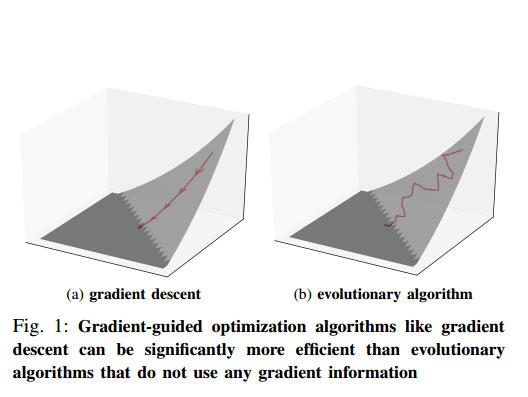

**凸度和梯度引导优化。**对于称为凸函数的常见函数类，梯度引导技术非常高效，并且总能收敛到全局最优解[86]。直观地，如果连接函数图上任意两点的直线完全位于图上方或上方，则函数是凸的。
更正式地，如果在其域中的所有点x和y满足以下属性，则函数f被称为凸函数：f（tx +（1-t）y）≤ tf（x）+（1-t）f （y）,存在 t 属于[0; 1]。

然而，在非凸函数中，梯度引导方法可能会陷入局部最优解，其中目标函数（假设目标是最大化）比所有附近的可行点更大但是在整个其他地方存在其他更大的值可行参数值的范围。然而，即使对于这种情况，简单的启发式方法，例如从新的随机选择的起始点重新启动梯度引导方法，已经证明在实践中非常有效[38]，[86]。

**模糊作为无约束的优化。**模糊测试可以表示为无约束优化问题，其目标是最大化测试程序中针对固定数量的测试输入发现的错误/漏洞的数量。因此，目标函数可以被认为是Fp（x），如果输入x在使用输入x执行目标程序p时触发错误/漏洞，则返回1。然而，这种函数太不正常（即，主要包含平坦的平台和一些非常尖锐的过渡）以便有效地优化。

因此，大多数灰盒模糊器试图最大化测试代码的数量（例如，最大化边缘覆盖）作为替代代理度量[88]，[11]，[73]，[55]，[22]。这样的目标函数可以表示为F’p（x），其中F’返回程序P的输入x所覆盖的新控制流边缘的数量。注意，F比原始函数F相对更容易优化。所有可能的程序输入执行新的控制流边缘往往明显高于触发错误/安全漏洞的输入。

大多数现有的灰盒模糊器使用进化技术[88]，[11]，[73]，[55]，[22]以及其他特定领域的启发式算法作为其主要的优化策略。在梯度引导优化中选择此类算法的关键原因是大多数真实世界的程序由于沿着不同程序路径的显着不同的行为而包含许多不连续性[19]。这种不连续性可能导致梯度引导优化陷入非最优解。在本文中，我们提出了一种新技术，使用神经网络平滑目标程序，使其适用于梯度引导优化，并演示模糊器如何利用这些策略来显着提高其效率。

# III.我们的方法概述

图2展示了我们方法的高级概述。我们将在下面详细介绍关键组件

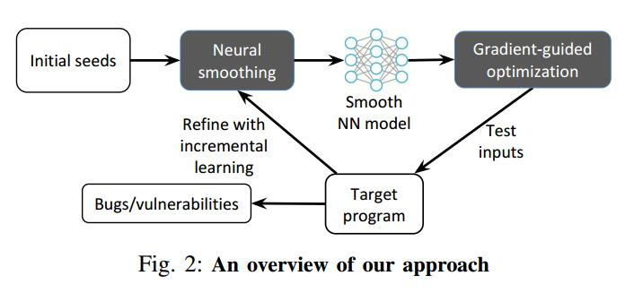

**神经程序平滑。**平滑地逼近程序的不连续分支行为对于精确计算梯度引导优化所必需的梯度或高阶导数至关重要。没有这种平滑，梯度引导的优化过程可能会卡在不同的不连续性/平台上。平滑过程的目标是创建一个平滑的函数，该函数可以模拟程序的分支行为而不会引入大的错误（即，它与原始程序行为的偏差最小）。为此，我们使用前馈神经网络（NN）。
正如通用逼近定理[33]所暗示的那样，NN非常适合近似任意复杂（可能是非线性和非凸）的程序行为。此外，NN在设计上也支持对我们的目的至关重要的有效梯度计算。我们通过使用现有的测试输入或现有的进化模糊器生成的测试输入语料库来训练NN，如图2所示。

**梯度引导优化。**一旦经过训练，平滑NN模型可用于有效地计算梯度和高阶导数，然后可利用这些导数更快地收敛到最优解。梯度下降，牛顿方法或类牛顿方法（如L-BFGS算法）的梯度制导算法的不同变体使用梯度或高阶导数来实现更快的收敛[10]，[13]，[65]。平滑NN使得模糊输入生成过程可以使用所有这些技术。在本文中，我们设计，实现和评估了一种简单的梯度引导输入生成方案，该方案适用于基于覆盖的模糊测试，详见第IV-C节。

**增量学习。**任何类型的现有测试输入（只要它们暴露目标程序中的不同行为）都可以用于训练NN模型并引导模糊输入生成过程。在本文中，我们通过运行像AFL这样的进化模糊器来收集一组测试输入和相应的边缘覆盖信息来训练NN。

然而，由于用于训练NN模型的初始训练数据可能仅涵盖程序空间的一小部分，我们在模糊测试期间观察到新的程序行为时通过增量训练进一步细化模型。增量训练的关键挑战是，如果NN只接受新数据的训练，它可能会完全忘记从旧数据中学到的规则[57]。我们通过设计一种新的基于覆盖的过滤方案来避免这个问题，该方案创建了新旧数据的精简摘要，允许NN在其上进行有效的培训。

**一个激励的例子。**我们在图3中展示了一个简单的激励示例，以展示我们的方法背后的关键洞察力。图3中显示的简单C代码片段演示了许多真实世界程序中常见的类似switch的代码模式。特别地，示例代码计算输入的非线性指数函数（即，pow（3，a + b））。它根据计算函数的输出范围返回不同的值。让我们假设如果函数输出范围在（1,2）中，则执行有缺陷的代码块（标记为红色）。

考虑像AFL这样的进化模糊器已经设法探索第2行和第9行中的分支但是未能在第5行探索分支的情况。这里的关键挑战是找到将在第5行触发分支的a和b的值。进化模糊器通常会遇到这样的代码，因为通过随机变异找到解决方案的可能性非常低。例如，图3a显示了代码段所代表的原始函数。函数表面从a + b = 0到a + b- e = 0（e -> +0）。为了在模糊测试期间最大化边缘覆盖，进化模糊器只能对输入采用随机突变，因为这种技术不考虑函数表面的形状。相比之下，我们的NN平滑和梯度引导突变旨在利用梯度测量的函数表面形状。

我们从其他两个分支 训练NN模型的程序行为。 NN模型平滑地近似于程序行为，如图3b和3c所示。然后，我们使用NN模型执行更有效的梯度引导优化，以找到a和b的期望值，并逐步细化模型，直到找到执行目标错误的所需分支。

# IV.方法

我们在下面详细描述我们方案的不同组成部分。

## A.程序平滑

程序平滑是使梯度引导优化技术适用于模糊具有离散行为的真实世界程序的重要步骤。没有平滑，梯度引导优化技术对于优化非平滑函数不是非常有效，因为它们往往会陷入不同的不连续性[67]。平滑过程使这种不规则性最小化，因此使梯度引导优化在不连续功能上显着更有效。

通常，不连续函数 f 的平滑可以被认为是 f 和平滑掩模函数g之间的卷积运算，以产生如下所示的新的平滑输出函数。流行的平滑掩模的一些示例包括不同的高斯和Sigmoid函数。
$$
f'(x) = \int_{-\infty}^{+\infty}f(a)g(x − a)da
$$
然而，对于许多实际问题，不连续函数f可能不具有闭合形式的表示，因此不可能分析地计算上述积分。在这种情况下，使用离散版本
$$
f'（x）= \sum_a f（a）g（x-a）
$$
并且数值地计算卷积。例如，在图像平滑中，通常使用固定大小的2-D卷积核来执行这种计算。但是，在我们的设置中，f是计算机程序，因此无法通过分析计算相应的卷积。

程序平滑技术可分为两大类：黑盒和白盒平滑。黑盒方法从f的输入空间中选取离散样本，并使用这些样本以数字方式计算卷积。相比之下，白盒方法会查看程序语句/指令，并尝试使用符号分析和抽象解释来总结它们的效果[21]，[20]。黑盒方法可能会引入大的近似误差，而白盒方法会产生令人望而却步的性能开销，这使得它们对于真实世界的程序来说是不可行的。

为了避免这些问题，我们使用NN以灰盒方式学习程序行为的平滑近似（例如，通过收集边缘覆盖数据），如下所述。

## B.神经程序平滑

在本文中，我们对程序平滑提出了一种新的方法，通过使用代理NN模型来基于观察到的程序行为来学习和迭代地改进目标程序的平滑近似。替代神经网络可以平滑地推广到观察到的程序行为，同时还准确地建模潜在的非线性和非凸行为。一旦经过训练，神经网络可用于有效地计算梯度和更高级别的导数，以指导模糊输入生成过程，如图3所示。

**为何选择NN？**正如通用逼近定理[33]所暗示的那样，NN非常适合近似复杂（可能是非线性和非凸）的程序行为。使用NN来学习平滑程序近似的优点如下：（i）NN可以精确地模拟复杂的非线性程序行为并且可以被有效地训练。基于模型的优化的先前工作使用简单的线性和二次模型[24]，[23]，[71]，[52]。然而，这些模型不适合用于建模具有高度非线性和非凸性行为的真实软件; （ii）NN支持有效计算其梯度和高阶导数。因此，梯度引导算法可以在模糊测试期间计算和使用这些信息，而无需任何额外开销; （iii）NN可以概括并学习根据类似输入的行为来预测程序对看不见的输入的行为。因此，NN可以基于其对少量输入样本的行为来潜在地学习整个程序的平滑近似。
**NN训练。**虽然NN可用于模拟程序行为的不同方面，但在本文中，我们专门用它们来建模目标程序的分支行为（即，预测由给定程序输入执行的控制流边缘）。使用神经网络对分支行为进行建模的挑战之一是需要接受可变大小的输入。与现实世界的程序不同，前馈NN通常接受固定大小的输入。因此，我们设置最大输入大小阈值，并在训练期间使用空字节填充任何较小尺寸的输入。请注意，支持更大的输入不是主要问题，因为现代NN可以轻松扩展到数百万个参数。因此，对于较大的程序，我们可以根据需要简单地增加阈值大小。然而，我们凭经验发现相对适度的阈值产生最佳结果，而较大的输入不会显着提高建模精度。

形式上，让f：{0x00，0×01,…, 0xff}^m^ -> {0, 1}^n^ 表示将程序输入作为具有大小为m的字节序列的NN，并输出大小为n的边缘位图。设θ表示 f 的可训练权重参数。给定一组训练样本（X, Y），其中X是一组输入字节，Y代表相应的边缘覆盖位图，参数函数f（x,θ）= y的训练任务是获得参数θ ^ 
$$
 \overlineθ =arg min_θ\sum_{x\in X,y\in Y} L（y, f（x,θ））
$$
其中L（y, f（x,θ））定义NN的输出与训练集中的真实标签y ∈ Y之间的损失函数。训练任务是找到NN f的权重参数θ以最小化损失，其使用距离度量来定义。特别是，我们使用二进制交叉熵来计算预测位图和真实覆盖位图之间的距离。特别是，让 y i 和fi（x,θ）分别表示真实数据和 f 预测的输出位图中的第i位。然后，这两者之间的二元交叉熵定义为：
$$
−\frac{1}{n}\sum_{i=1}^n
[y_i · log(f_i(x, θ) + (1 − y_i) · log(1 − f_i(x, θ)]
$$
在本文中，我们使用前馈完全连接的NN来模拟目标程序的分支行为。前馈架构允许高效计算梯度和快速训练[53]。

我们的平滑技术对于训练数据的来源是不可知的，因此可以对从现有输入语料库收集的任何边缘覆盖数据训练NN。对于我们的原型实现，我们使用现有的进化模糊器（如AFL）生成的输入语料库来训练我们的初始模型。

**训练数据预处理。**由训练数据执行的边缘覆盖通常倾向于偏差，因为它仅包含程序中所有边缘的一小部分的标签。例如，一些边缘可能总是由训练数据中的所有输入一起运用。一组标签之间的这种类型的相关性在机器学习中被称为多重共线性，这通常会阻止模型收敛到一个小的损失值[34]。为了避免这种情况，我们通过将总是一起出现在训练数据中的边缘合并到一个边缘来遵循降维的常见机器学习实践。此外，我们仅考虑在训练数据中至少激活一次的边缘。这些步骤将标签数量平均从大约65536大幅减少到4000左右。请注意，我们在每次增量学习迭代时重新运行数据预处理步骤，因此一些合并标签可能会因为在模糊测试期间发现新边缘数据时相关性降低而分裂。

## C.梯度引导优化

不同的梯度引导优化技术，如梯度下降，牛顿法或准牛顿法，如L-BFGS，可以使用梯度或更高阶导数来实现更快的收敛[10]，[13]，[65] 。平滑NN使得模糊输入生成过程可以通过支持梯度和高阶导数的有效计算来潜在地使用这些技术中的任何一种。在本文中，我们专门设计了一个简单的梯度引导搜索方案，该方案对于较小的预测误差具有鲁棒性，以证明我们的方法的有效性。我们将更复杂的技术探索作为未来的工作。

在描述基于NN梯度的变异策略之前，我们首先提供梯度的形式定义，指示每个输入字节应该改变多少以影响NN f 中最终层神经元的输出（指示改变的边缘覆盖范围在程序中）[80]。这里，每个输出神经元对应于特定边缘，并计算0和1之间的值，总结给定输入字节对特定边缘的影响。 NN f w.r.t.输出神经元的梯度。输入已广泛用于对抗性输入生成[39]，[66]和可视化/理解DNN [87]，[80]，[56]。直观地，在我们的设置中，基于梯度的指导的目标是找到将改变对应于从0到1的不同边缘的最终层神经元的输出的输入。

给定如IV-B部分中定义的参数NN y = f（θ,x），令 yi 表示 f 的最后一层中的第i个神经元的输出，其也可以写为fi（θ,x）。 fi（θ,x）相对于输入x的梯度G可以定义为G = ▽xfi（θ, x）= δyi / δx。注意，可以容易地计算 f 的梯度w.r.t到θ，因为NN训练过程需要迭代地计算该值以更新θ。因此，通过简单地将θ的梯度的计算替换为x的梯度，也可以容易地计算G.注意，梯度G的维数与输入x的维度相同，在我们的例子中，它是一个字节序列。

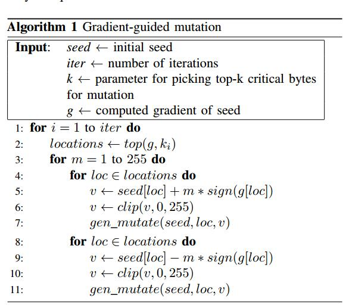

梯度引导优化。算法1显示了梯度引导输入生成过程的概要。关键思想是识别具有最高梯度值的输入字节并对其进行改变，因为它们表明对NN具有更高的重要性，因此具有更高的机会导致程序行为发生重大变化的机会（例如，翻转分支）。

从种子开始，我们迭代地生成新的测试输入。如算法1所示，在每次迭代时，我们首先利用梯度的绝对值来识别输入字节，该输入字节将导致对应于未捕获边缘的输出神经元的最大变化。接下来，我们检查每个字节的梯度符号以确定突变的方向（例如，递增或递减它们的值）以最大化/最小化目标函数。从概念上讲，我们对梯度符号的使用类似于[39]中介绍的对抗性输入生成方法。我们还将每个字节的变异限制在其合法范围内（0-255）。第6行和第10行表示使用剪辑功能来实现这种边界。

我们用一个小的变异目标（算法1中的k）开始输入生成过程，并指数增加要变异的目标字节数，以有效地覆盖大的输入空间。

## D.通过增量学习进行细化

梯度引导输入生成过程的效率在很大程度上取决于代理NN对目标程序的分支行为进行建模的准确程度。为了获得更高的准确度，当在模糊测试过程中观察到不同的程序行为时（即，当目标程序的行为与预测的行为不匹配时），我们逐步细化NN模型。我们使用增量学习技术通过在触发新边缘时学习新数据来更新NN模型。

NN改进背后的主要挑战是阻止NN模型在训练新数据时突然忘记先前从旧数据中学到的信息。这种遗忘是深度学习文献中众所周知的现象，并被认为是稳定性 - 可塑性困境的结果[58]，[8]。为了避免这种遗忘问题，NN必须足够改变权重以学习新任务，但不能过多地使其忘记以前学过的表示。

细化NN的最简单方法是将新训练数据（即程序分支行为）与旧数据一起添加，并再次从头开始训练模型。但是，随着数据点数量的增加，这种再训练变得更难以扩展。先前的研究试图主要使用两种广泛的方法来解决这个问题[44]，[51]，[31]，[75]，[29]，[40]，[76]。第一个尝试为新旧模型保留单独的表示，以最大限度地减少使用分布式模型，正则化或从多个模型中创建集合的遗忘。第二种方法维护旧数据的摘要，并在新数据上重新训练模型以及汇总的旧数据，因此比完全再训练更有效。我们将感兴趣的读者引用到Kemker等人的调查中。 [48]了解更多详情。

在本文中，我们使用基于边缘覆盖的过滤来仅保留触发新分支的旧数据以进行重新训练。随着新的训练数据变得可用，我们确定实现新边缘覆盖的数据，将它们与过滤的旧训练数据放在一起，并重新训练NN。这种方法有效地防止训练数据样本的数量在重新训练迭代次数上急剧增加。我们发现我们的过滤方案可以轻松支持多达50次重新训练，同时仍将训练时间保持在几分钟之内。

# V.实现

在本节中，我们将讨论我们的实现以及如何微调NEUZZ以实现最佳性能。我们已经通过GitHub在http://github.com/dongdongshe/neuzz发布了我们的实现。我们所有的测量都是在运行Arch Linux 4.9.48并使用Nvidia GTX 1080 Ti GPU的系统上进行的。

**NN架构。**我们的NN模型在Keras2.1.3 [5]中实现，Tensorflow-1.4.1 [6]作为后端。 NN模型由三个完全连接的层组成。隐藏层使用ReLU作为其激活功能。我们使用sigmoid作为输出层的激活函数来预测控制流边缘是否被覆盖。 NN模型被训练50个时期（即，整个数据集的50次完整通过）以实现高测试准确度（平均约95％）。由于我们使用简单的前馈网络，所有10个程序的训练时间不到2分钟。即使在运行频率为3.6GHz的Intel i7-7700上进行纯CPU计算，训练时间也不到20分钟。

**训练数据收集。**对于每个测试的程序，我们在单个核心机器上运行AFL-2.5.2 [88]一小时，以收集NN模型的训练数据。为10个项目收集的平均训练输入数量约为2K。得到的语料库进一步分为训练和测试数据，比例为5：1，其中测试数据用于确保模型不会过度拟合。我们使用10KB作为阈值文件大小，用于从AFL输入语料库中选择我们的训练数据（平均90％的AFL生成的文件低于阈值）。

**突变和再培训。**如图2所示，NEUZZ迭代运行以生成1M突变并逐步重新训练NN模型。我们首先使用算法1中描述的变异算法来生成1M突变。我们将参数 i 设置为10，为种子输入生成5,120个突变输入。接下来，我们在目标程序中随机选择代表100个未探测边缘的100个输出神经元，并从两个种子生成10,240个突变输入。最后，我们使用AFL的fork服务器技术[54]执行具有1M突变输入的目标程序，并使用覆盖新边缘的任何输入进行增量重新训练。

**模型参数选择。** NEUZZ的成功取决于训练模型和产生突变的不同参数的选择。在这里，我们通过经验探索确保最佳边缘覆盖四个程序的最佳参数：readelf，libjpeg，libxml和mupdf。结果总结在表I中。

首先，我们评估每个初始种子需要突变的关键字节数（算法1的第1行中的参数ki）。我们选择k = 2，如第IV-C节所述，并显示通过三次迭代（i = 7,10,11算法1第1行中的）实现的覆盖率，每次迭代有1M个突变。对于所有四个程序，较小的突变（每个突变更改的字节更少）可能导致更高的代码覆盖率，如表1a所示。 i = 11的最大值实现了所有四个程序的最小代码覆盖率。这个结果可能是由于算法1中的第4和第8行 - 在单个种子上浪费了太多突变（超出1M突变预算），而没有尝试其他种子。但是，最佳突变字节数在四个程序中有所不同。对于readelf和libxml，i的最佳值为10，而libjpeg和mupdf的最佳值为7。由于在i = 7和i = 10之间实现的代码覆盖率的差异不大，我们选择i = 10用于剩余的实验。

接下来，我们通过改变每个隐藏层中的层数和神经元数来评估NN模型中超参数的选择。特别地，我们将NN架构分别与每层的1和3个隐藏层以及4096和8192个神经元进行比较。对于每个目标计划，我们使用相同的训练数据来训练四种不同的NN模型并生成1M突变以测试所实现的边缘覆盖。对于所有四个程序，我们发现具有1个隐藏层的模型比具有3个隐藏层的模型执行得更好。我们认为这是因为1隐藏层模型足够复杂以模拟目标程序的分支行为，而较大的模型（即具有3个隐藏层）相对较难训练并且还倾向于过度拟合。

# VI.评估

在本节中，我们评估NEUZZ的错误发现性能，并获得与其他最先进的模糊器相关的边缘覆盖率。具体来说，我们回答以下四个研究问题：

- RQ1. NEUZZ可以找到比现有模糊器更多的错误吗？
- RQ2. NEUZZ能否实现比现有模糊器更高的边缘覆盖？
- RQ3. NEUZZ能否比现有的基于RNN的模糊器表现更好？
- RQ4.不同的模型选择如何影响NEUZZ的性能？

我们首先描述我们的研究对象和实验设置。

## A.研究对象

我们在三种不同类型的数据集上评估NEUZZ：（i）10个真实世界的程序，如表IIb所示，（ii）LAVA-M [28]，以及（iii）DARPA CGC数据集[26] 。为了演示NEUZZ的性能，我们将NEUZZ检测到的边缘覆盖范围和缺陷数量与10个最先进的模糊器进行比较，如表IIa所示。

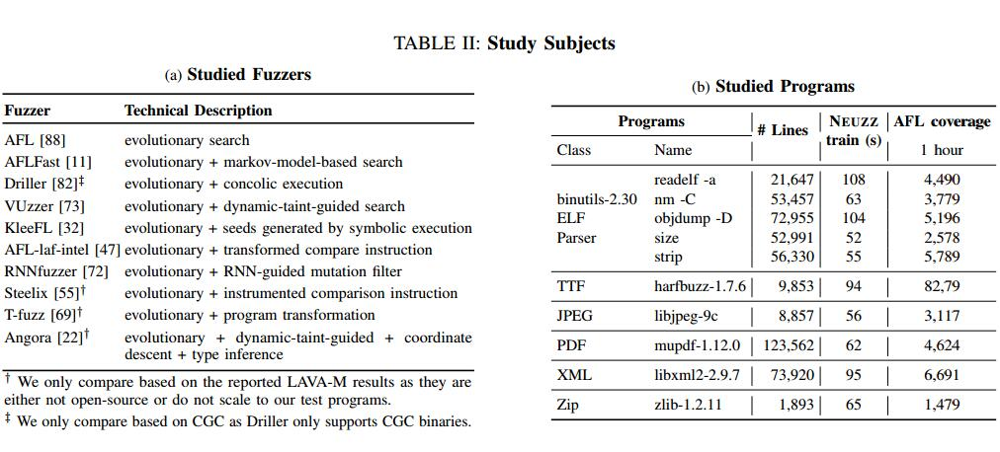

## B.实验设置

我们的实验设置包括以下两个步骤：首先，我们运行AFL一小时以生成初始种子语料库。然后，我们使用相同的初始种子语料库运行每个模糊器一个固定的时间预算，并比较它们实现的边缘覆盖率和发现的错误数量。具体而言，10个真实世界程序，LAVA-M数据集和CGC数据集的时间预算分别为24小时，5小时和6小时。对于进化模糊器，种子语料库用于初始化模糊过程。对于基于学习的模糊器（即，基于NEUZZ和RNN的模糊器），使用相同的种子语料库来生成训练数据集。对于KleeFL，一种由Klee和AFL组成的混合工具，我们运行Klee一小时以生成额外的种子，然后将它们添加到原始种子语料库中，用于随后的24小时模糊测试过程。请注意，我们仅报告每个模糊器的变异输入所涵盖的附加代码，而不包括初始种子语料库中的覆盖信息。

在RQ3中，我们评估和比较NEUZZ与基于RNN的模糊器的性能。基于RNN的模糊器比NEUZZ的训练时间长20倍。然而，为了关注这两种突变算法的功效，我们评估固定数量突变的边缘覆盖率，以排除这些不同的训练时间的影响。我们还进行了独立评估，比较了这两种模型的训练时间成本。在RQ4中，我们还评估了固定数量突变的边缘覆盖率，以排除不同模型中不同训练时间成本的影响。

## C.结果

### RQ1. NEUZZ可以找到比现有模糊器更多的错误吗？

为了回答这个RQ，我们评估了NEUZZ w.r.t.三种设置中的其他模糊器：（i）检测现实世界中的错误。 （ii）检测LAVA-M数据集中注入的错误[28]。 （iii）检测CGC错误。我们详细描述结果。

**（i）检测现实世界的错误。**我们比较了NEUZZ和其他模糊器在24小时运行时发现的错误和崩溃的总数，给出相同的种子语料库。 NEUZZ和其他模糊器发现了五种不同类型的错误：内存不足，内存泄漏，断言崩溃，整数溢出和堆溢出。为了检测不一定会导致崩溃的内存错误，我们使用AddressSanitizer [4]编译程序二进制文件。我们通过比较AddressSanitizer报告的堆栈跟踪来测量发现的唯一内存错误。对于不会导致AddressSanitizer生成错误报告的崩溃，我们会检查执行跟踪。通过手动分析触发无限循环的输入找到整数溢出错误。我们使用未定义的行为清理程序进一步验证整数溢出错误[7]。结果总结在表III中。

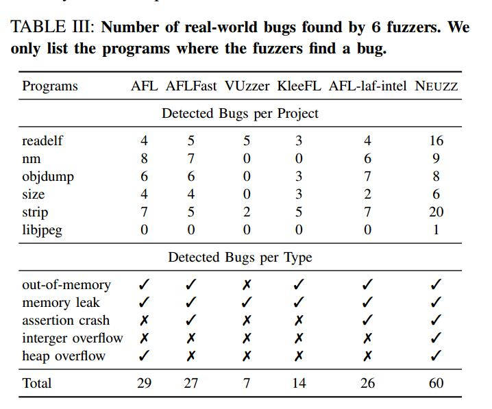

NEUZZ在6个程序中查找所有5种类型的错误。 AFL，AFLFast和AFL-laf-intel发现了3种类型的错误 - 它们没有找到任何整数溢出错误。其他模糊器只发现2种类型的错误（即内存泄漏和断言崩溃）。 AFL可以在程序size上出现堆溢出错误，而NEUZZ可以在程序nm上找到相同的错误和另一个堆溢出错误。总的来说，NEUZZ发现的错误比第二个最好的模糊器多2倍。此外，strip中的整数溢出错误和nm中的堆溢出错误（仅由NEUZZ发现）已经分配了CVE-2018-19932和CVE-2018-19931，后来由开发人员修复。

**（ii）检测LAVA-M数据集中注入的错误。**创建LAVA数据集是为了通过提供一组注入大量错误的真实程序来评估模糊器的有效性[28]。 LAVA-M是LAVA数据集的子集，由4个GNU coreutil程序base64，md5sum，uniq和who分别注入44,57,28和2136个错误组成。所有的错误都受到四字节magic比较的保护。只有满足条件时才会触发错误。我们将NEUZZ在发现这些缺陷方面的性能与其他最先进的模糊器进行比较，如表IV所示。按照传统做法[22]，[28]，我们使用5小时的时间预算来完成模糊器的运行时间。

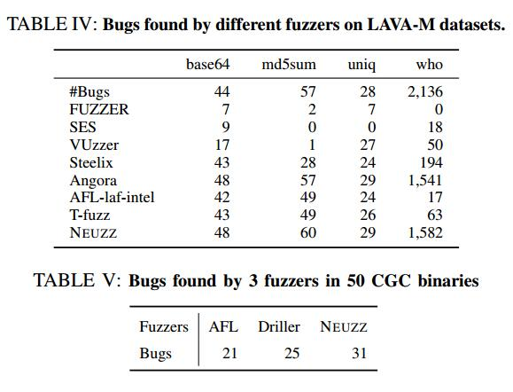

触发LAVA数据集中的magiv条件对于覆盖引导的模糊器来说是一项艰巨的任务，因为模糊器必须在256^4^种可能情况下生成4个连续字节的精确组合。为了解决这个问题，我们使用了一个定制的LLVM传递来检测magic字节检查，如Steelix [55]。但与Steelix不同，我们利用NN的渐变来指导输入生成过程，以找到满足magic检查的输入。我们运行AFL一小时来生成训练数据并用它来训练NN，其梯度识别触发magic字节条件的第一个字节比较的可能关键字节。接下来，我们对与第一个关键字节相邻的每个字节执行局部穷举搜索，以便通过256次尝试解决剩余的三个字节比较中的每一个。因此，我们需要一个NN梯度计算来查找影响魔法检查的字节位置，并且需要4×256 = 1024个试验来触发每个bug。对于程序md5sum，根据LAVA-M作者的最新建议[27]，我们进一步将种子减少到单行，这显着提高了模糊性能。

如表IV所示，NEUZZ查找程序base64，md5sum和uniq中的所有错误，以及程序的错误数量最多。请注意，LAVA-M作者在所有4个程序中都留下了一些未列出的错误，因此NEUZZ发现的错误总数实际上高于列出的错误数，如结果所示。

与其他模糊器相比，NEUZZ具有两个关键优势。首先，NEUZZ将搜索空间分成多个可管理的步骤：NEUZZ在AFL生成的数据上训练底层NN，使用计算的梯度到达第一个关键字节，并在找到的关键区域周围执行本地搜索。其次，与VUzzer相反，VUzzer利用目标二进制中硬编码的magic来构建程序输入，NEUZZ的基于梯度的搜索策略不依赖于任何硬编码的magic。因此，它可以找到程序md5sum中的所有错误，它在magic检查之前对输入字节执行一些计算，导致VUzzer失败。Angora（LAVA-M数据集当前最先进的模糊器）相比，NEUZZ在md5sum中发现了3个更多的错误。与Angora不同，NEUZZ使用NN渐变来更有效地触发复杂的magic条件

**（iii）检测CGC错误。** DARPA CGC数据集[2]由DARPA网络大挑战中使用的易受攻击的程序组成。这些程序实现为执行各种任务的网络服务，旨在镜像具有已知漏洞的实际应用程序。程序中的每个错误都受到输入上的一些健全性检查的保护。 数据集附带一组输入作为漏洞的证据。

我们在50个随机选择的CGC二进制文件中评估NEUZZ，Driller和AFL。由于为每个模糊器运行每个测试二进制文件需要6个小时才能在CPU / GPU上运行，并且我们有限的GPU资源不允许我们并行执行多个实例，我们随机选择50个程序以将总实验时间保持在合理的范围内。与LAVA-M类似，这里我们也运行AFL一小时来生成训练数据并用它来训练NN。我们为所有三个模糊器提供相同的随机种子，让它们运行六个小时。 NEUZZ使用与LAVA-M数据集相同的自定义LLVM传递来检测CGC二进制文件中的magic检查。

结果（表五）显示，NEUZZ在50个二进制文件中发现31个错误的二进制文件，而AFL和Driller分别找到21个和25个。 NEUZZ发现的有缺陷的二进制文件包括Driller和AFL发现的所有文件。 NEUZZ进一步发现6个新的二进制文件中的错误，AFL和Driller都无法检测到这些错误。

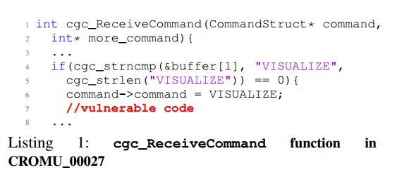

我们分析了一个示例程序CROMU_00027（如清单1所示）。这是一个ASCII内容服务器，它从客户端获取查询并提供相应的ASCII代码。在用户尝试将命令设置为VISUALIZE后，将触发空指针解除引用错误。 AFL未能在6小时的时间预算内检测到这个错误，因为它在猜测magic字符串方面效率低下。虽然Driller试图通过concolic执行来满足这种复杂的魔术字符串检查，但在这种情况下，它无法找到满足检查的输入。相比之下，NEUZZ可以轻松使用NN渐变来定位程序输入中影响magic比较的关键字节，并找到满足magic检查的输入。

**结果1：NEUZZ在6个不同的程序中找到了31个以前未知的错误，其他模糊器找不到。NEUZZ在寻找LAVA-M和CGC漏洞方面也优于最先进的模糊器**

### RQ2. NEUZZ能否实现比现有模糊器更高的边缘覆盖？
为了研究这个问题，我们比较了24小时固定运行时预算的模糊器。此评估不仅显示模糊器发现的新边缘总数，还显示新边缘覆盖的速度与时间的关系。

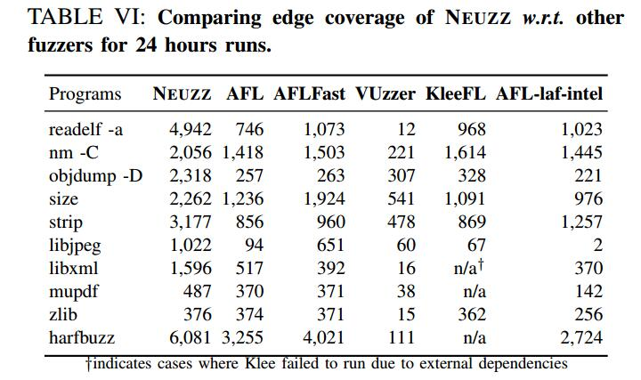

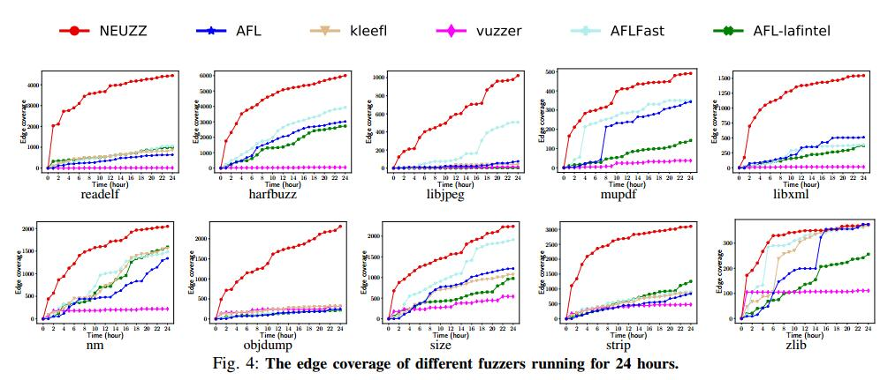

我们从AFL的边缘覆盖率报告中收集边缘覆盖率信息。结果总结在表VI中。对于所有10个真实世界的节目，NEUZZ在边缘覆盖方面明显优于其他模糊器。如图4所示，NEUZZ在第一个小时内可以比其他模糊器获得更多的新边缘覆盖。在程序strip，harfbuz和readelf，NEUZZ在一小时内可以达到1000以上新的边缘覆盖。对于程序readelf和objdump，NEUZZ运行1小时的新边缘覆盖数量甚至超过所有其他模糊器24小时运行的新边缘覆盖数量。这表明NEUZZ具有优越的边缘覆盖能力。对于所有10个节目中的9个，NEUZZ分别实现了比基线AFL 6×，1.5×，9×，1.8×，3.7×，1.9×，10×，1.3×和3×边缘覆盖，以及4.2×，1.3× ，7×，1.2×，2.5×，1.5×，1.5×，1.3×和3×边缘覆盖率均高于所有6个模糊器中的第二高数量。对于代码小于2k的最小程序zlib，NEUZZ与其他模糊器实现了类似的边缘覆盖。我们相信它会在24小时模糊测试后发现这样一个小程序的大部分可能边缘时达到饱和点。显着的优异性能显示了NEUZZ使用渐变覆盖新边缘有效定位和突变关键字节的有效性。 NEUZZ在大型系统中也可以很好地扩展。实际上，对于超过10K行的程序（例如，readelf，harfbuzz，mupdf和libxml），NEUZZ实现了最高的边缘覆盖，其中采用污点辅助的fuzzer（即VUzzer）和符号执行辅助fuzzer（即KleeFL）执行较差或并不能扩展。

梯度引导变异策略允许NEUZZ探索不同的边缘，而其他基于进化的模糊器经常卡住并重复检查相同的分支条件。此外，NN平滑技术的最小执行开销有助于NEUZZ在较大程序中很好地扩展，而其他高级进化模糊器由于使用了重量级程序分析技术（如污点跟踪或符号执行）而导致高执行开销。

在进化模糊器中，AFLFast使用优化的种子选择策略，更多地关注稀有边缘，因此在8个程序中实现比AFL更高的覆盖率，特别是在libjpeg，size和harfbuzz中。另一方面，VUzzer在小程序（例如，zlib，nm，objdump，size和strip）的第一个小时内实现了比AFL，AFLFast和AFL-laf-intel更高的覆盖率，但它的导致很快停止并且最终是超过其他模糊器。同时，VUzzer的性能会因readelf，harfbuzz，libxml和mupdf等大型程序而降低。我们怀疑VUzzer的污点跟踪器引入的不精确会导致它在大型程序上表现不佳。 KleeFL使用符号执行引擎Klee生成的其他种子来指导AFL的探索。与VUzzer类似，对于小程序（nm，objdump和strip），KleeFL在开始时具有良好的性能，但其在Klee的额外种子的优势在几小时后逐渐消失。
此外，KleeFL基于Klee，无法扩展到具有复杂库代码的大型程序，这是众所周知的符号执行限制。因此，KleeFL在程序libxml，mupdf和harfbuzz上没有结果。与VUzzer和KleeFL不同，NEUZZ不依赖任何繁重的程序分析技术; NEUZZ使用从NN计算的梯度来生成有希望的突变，即使对于较大的程序也是如此。有效的NN梯度计算过程允许NEUZZ在识别影响不同看不见的程序分支的关键字节时比VUzzer和KleeFL更好地扩展，从而实现更多的边缘覆盖。

AFL-laf-intel使用LLVM传递将复杂的magic比较转换为嵌套的字节比较，然后在转换的二进制文件上运行AFL。它在程序strip上实现了第二高的新边缘覆盖率。但是，比较转换会为常见的比较操作添加额外的指令，从而导致潜在的边缘爆炸问题。边缘爆炸大大增加了边缘冲突的速度，并且损害了进化模糊的表现。此外，这些附加指令会导致额外的执行开销。
结果，像频繁比较操作的libjpeg这样的程序遭受显着的减速（例如，libjpeg），并且AFL-laf-intel努力触发新的边缘。

**结果2：与其他灰盒式模糊器相比，NEUZZ可以实现更高的边缘覆盖率（比AFL高4倍，比24小时运行的第二好的高出2.5倍）**

### RQ3.NEUZZ能否比现有的基于RNN的模糊器表现更好？

现有的基于递归神经网络（RNN）的模糊器从过去的模糊测试经验中学习突变模式，以指导未来的突变[72]。这些模型首先从AFL生成的大量突变输入中学习突变模式（由关键字节组成）。接下来，他们使用突变模式为AFL构建一个过滤器，它只允许关键字节上的突变通过，否决所有其他非关键字节突变。我们选择了之前研究的4个项目来评估NEUZZ与基于RNN的模糊器相比100万个突变的性能。我们使用相同的训练数据训练两个NN模型，然后让两个基于NN的模糊器运行产生100万个突变，并比较两种方法实现的新代码覆盖率。我们报告了实现的边缘覆盖率和训练时间，如表VII所示。

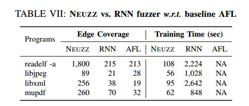

对于所有四个程序，NEUZZ在1M突变方面明显优于基于RNN的模糊器。 NEUZZ比四个程序中基于RNN的模糊器达分别达到8.4×， 4.2×，6.7×和3.7×更多的边缘覆盖。此外，基于RNN的模糊器平均比NEUZZ多20倍的训练开销，因为RNN模型比前馈网络模型复杂得多。

基于RNN的模糊器与AFL的另外比较表明，使用1小时语料库，前者在libxml和mupdf上的平均边缘覆盖率比AFL高2倍。我们还观察到基于RNN的模糊器否决了AFL产生的大约50％的突变。因此，来自基于RNN的模糊器的1M突变的新边缘覆盖可以实现普通AFL中2M突变的边缘覆盖。这就解释了为什么基于RNN的模糊器在一些程序中发现AFL的新边缘增加了2倍左右。如果AFL在2M突变后卡住，基于RNN的模糊器也会在1M过滤突变后卡住。 **NEUZZ相对于基于RNN的模糊器的关键优势在于，NEUZZ使用基于神经网络的梯度引导搜索获得关键位置，而RNN模糊器尝试以端到端方式对任务进行建模。**
我们的模型可以区分RNN模型可能遗漏的关键字节的不同影响因素，如我们的实验结果所示。对于突变生成，我们对由相应的贡献因子确定的关键字节进行穷举搜索，而基于RNN的模糊器仍然依赖于AFL的均匀随机突变。

**结果3：NEUZZ，一个基于简单前馈网络的模糊器，通过在不同项目中实现3.7倍到8.4倍的边缘覆盖率，明显优于基于RNN的模糊器**

### RQ4.不同的型号选择如何影响NEUZZ的性能？

NEUZZ的模糊测试性能在很大程度上取决于训练有素的NN的准确性。如第五部分所述，我们凭经验发现具有1个隐藏层的NN模型足以表达真实世界程序的复杂分支行为。在本节中，我们通过探索1个隐藏层架构的不同模型设置来进行消融研究，即，线性模型，没有细化的NN模型，以及具有渐进细化的NN模型。我们评估这些模型对NEUZZ性能的影响。

为了比较模糊测试性能，我们在4个程序中为每个版本的NEUZZ生成1M突变。我们通过去除隐藏层中使用的非线性激活函数来实现线性模型，从而使整个前馈网络完全线性化。 NN模型由AFL训练相同的种子语料库。接下来，我们从被动学习模型中生成1M突变，并测量这些1M突变所实现的边缘覆盖。最后，我们筛选出突变的输入，这些输入在100万个突变中运行看不见的边缘，并将这些选择的输入添加到原始种子语料库中，以递增地重新训练另一个NN模型并使用它来产生进一步的突变。结果总结在表VIII中。我们可以看到，两个NN模型（有或没有增量学习）都优于所有4个测试程序的线性模型。这表明非线性NN模型可以比简单的线性模型更好地逼近程序行为。我们还观察到增量学习有助于NN实现更高的准确度，从而提高边缘覆盖率。

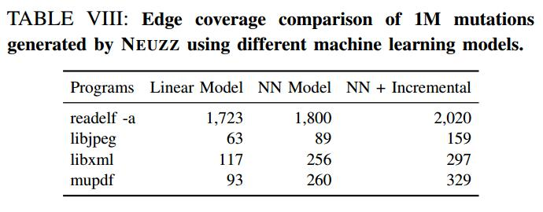

**结果4：NN模型优于线性模型，增量学习使NN随着时间的推移更加准确。**

# VII. BUGS的案例研究

在本节中，我们提供和分析NEUZZ发现的三种不同类型的错误的样本：整数溢出，内存不足和崩溃诱发错误。
我们注意到，由于对极值变量的错误处理导致了大量的程序错误。由于NEUZZ可以枚举从0x00到0xff的所有关键字节（参见算法1第3行），我们设法找到由错误处理的极值引起的大量错误。例如，通过将影响内存分配大小的输入字节设置为极大值，NEUZZ能够在libjpeg，objdump，nm和strip中找到许多内存不足的错误。

**strip的整数溢出。** NEUZZ发现了一个整数溢出错误，可以在strip上产生无限循环。清单2显示了strip程序中的一个函数，它解析输入ELF文件的程序头表中的每个部分，并将所有部分分配给输出ELF文件中的新程序头表。整数溢出发生在清单2的第11行的if条件中，因为NEUZZ将segment_size设置为一个非常大的值。因此，程序陷入无限循环。我们发现在最新版本的Binutils 2.30和旧版本2.26和2.29中都存在此错误。

**libjpeg的内存不足。**在JPEG压缩过程中，每个颜色空间的数据通过相应的采样因子进行下采样，以减小文件大小。
根据JPEG标准，采样因子必须是1到4之间的整数。在解压缩过程中使用此值来确定需要分配多少内存，如清单4所示.NEUZZ设置一个较大的值，导致过多要为图像数据分配的内存，导致内存不足错误。利用libjpeg显示图像，可能会利用此类错误在服务器上启动拒绝服务攻击。

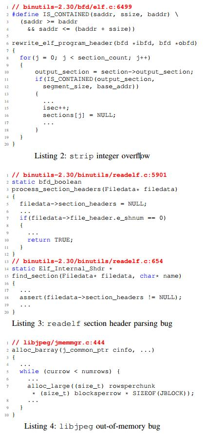

**readelf的崩溃。** ELF文件由文件头，程序头，节头和节数据组成。根据ELF规范，ELF头包含位于第60个字节的字段e_shnum，用于64位二进制，它指定ELF文件中的节数。 NEUZZ将输入文件的节数设置为0.如清单3所示，如果节的数量等于0，则实现返回一个NULL指针，该指针被后续代码取消引用，触发崩溃

# VIII .相关工作

**程序平滑。** Parnas等 [67]观察到不连续性是开发安全可靠软件背后的基本挑战之一。 Chaudhury等人 [21]，[18]，[19]提出了程序平滑的想法，以促进程序分析，并使用抽象解释和符号执行提出了严格的平滑算法。不幸的是，这种算法会产生过高的性能开销，特别是对于大型程序。相比之下，我们的平滑技术利用NN的学习能力来实现更好的可扩展性。

**基于学习的模糊测试。**最近，人们越来越关注使用机器学习技术来改进模糊器[37]，[72]，[84]，[9]，[81]，[12]，[64]。然而，现有的基于学习的模糊器将模糊测试模型化为端到端ML问题，即，他们学习ML模型以直接预测可以实现更高代码覆盖的输入模式。相比之下，我们首先使用NN平滑地逼近程序分支行为，然后利用梯度引导输入生成技术来实现更高的覆盖范围。因此，我们的方法比ML模型更容忍学习错误而不是端到端方法。在本文中，我们凭经验证明我们的策略在发现错误和实现更高边缘覆盖方面优于端到端建模[72]。

**基于污点的模糊测试。**几个进化模糊器试图使用污点信息来识别有希望的变异位置[85]，[42]，[63]，[73]，[55]，[22]。例如，TaintScope [85]旨在识别影响系统/库调用的输入字节，并专注于改变这些字节。同样，Dowser [42]和BORG [63]专门使用污点信息来分别检测缓冲区边界违规和缓冲区过度读取漏洞。相比之下，Vuzzer [73]通过静态分析捕获magic常数，并将现有值变为这些常数。 Steelix [55]使用二进制文件来收集有关比较指令的其他污点信息。最后，Angora [22]使用动态污点跟踪来识别有希望的突变位置并执行坐标下降以指导这些位置上的突变。

然而，所有这些基于污点追踪的方法基本上受限于动态污点分析导致非常高的开销而静态污点分析遭受高误报率的事实。我们的实验结果表明，NEUZZ通过使用神经网络识别有希望的突变位置，轻松胜过现有的基于污点的现有模糊器。

一些模糊测试器和测试输入发生器[43]，[83]，[22]试图直接在目标程序上使用不同形式的梯度引导优化算法。然而，如果没有程序平滑，这种技术往往会挣扎并陷入不连续性。

**符号/执行的执行。**符号和执行执行[50]，[14]，[77]，[61]，[36]使用可满足模数理论（SMT）求解器来解决路径约束并找到有趣的测试输入。一些项目也尝试将模糊测试与这些方法相结合[17]，[32]，[82]。不幸的是，由于符号分析的几个基本限制，包括路径爆炸，不完整的环境建模，符号记忆建模的大量开销等，这些方法在实践中难以扩展[16]。

与我们的工作同时，NEUEX [79]通过使用NN学习程序的中间变量之间的依赖关系以及使用梯度引导神经约束求解在结合传统的SMT求解器，使符号执行更有效。相比之下，在本文中，我们专注于使用NN来提高模糊效率，因为它是迄今为止在大型真实世界程序中发现安全关键错误的最流行的技术。

**神经程序。**神经程序本质上是一个神经网络，它学习目标程序逻辑的潜在表示。最近的一些工作已经从程序的输入输出样本中合成了这样的神经程序，以准确地预测程序的新输入输出[41]，[74]，[62]。相比之下，我们使用NN来学习程序分支行为的平滑近似。

# IX 结论

我们提出了NEUZZ，一种有效的学习型模糊器，它使用代理神经网络来平滑地逼近目标程序的分支行为。我们进一步演示了梯度引导技术如何用于生成新的测试输入，可以发现目标程序中的不同错误。我们的广泛评估表明，NEUZZ在检测到的错误数量和边缘覆盖率方面明显优于其他10个最先进的模糊器。我们的研究结果表明，利用不同的梯度引导输入生成技术和神经平滑技术可以显着提高模糊过程的有效性。

