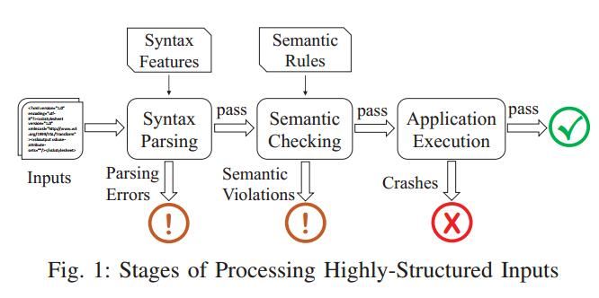
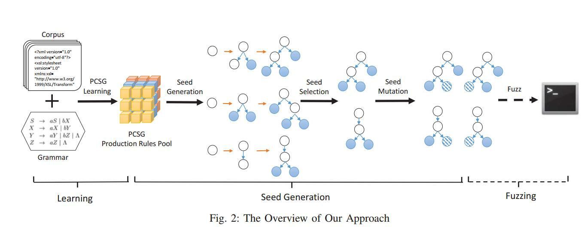
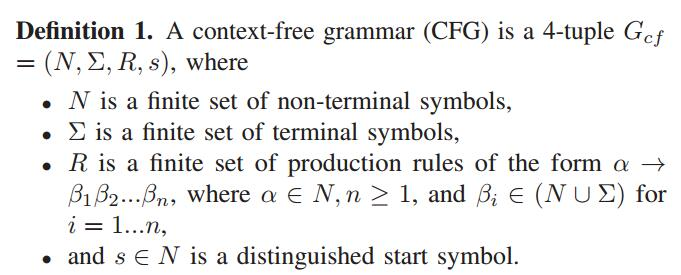
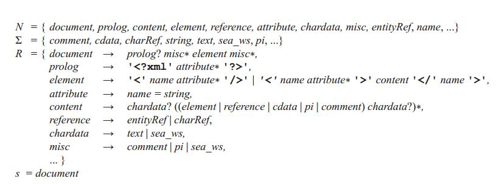
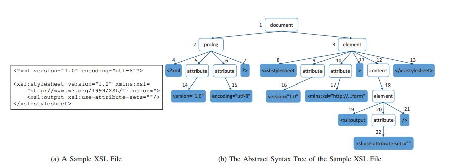
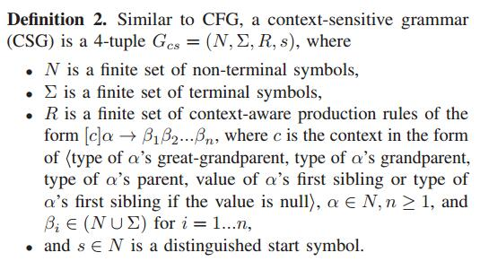
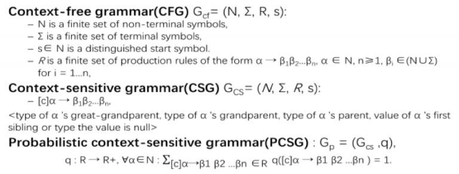
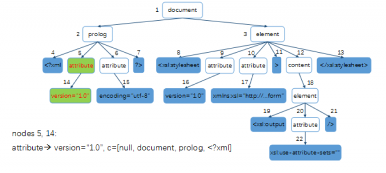
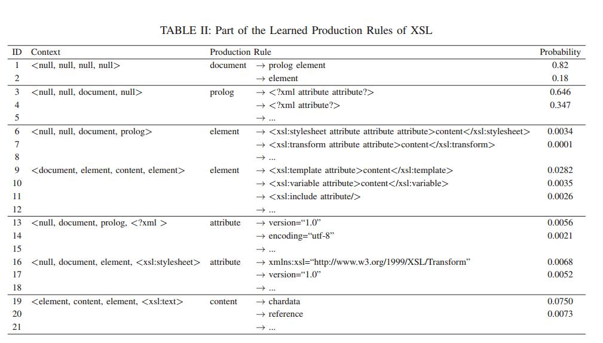
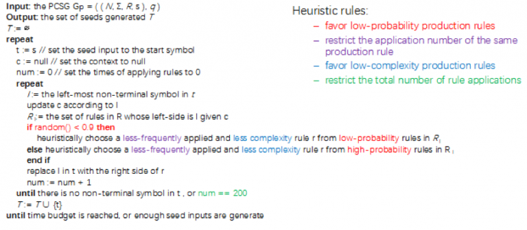

# Abstract

对于输入格式是高度结构化文件的程序来说，其处理流程一般是：语法解析–语义检查–程序执行。程序深层次的漏洞一般隐藏在程序执行阶段，而对于自动化的模糊测试（Fuzzing）来说很难触发该类漏洞。该论文提出了一种数据驱动的种子生成方法，叫做Skyfire。Skyfire通过从大量的已知样本中学习而生成覆盖良好的种子作为Fuzzing的输入对处理高度结构化输入的程序进行测试。Skyfire接收输入样本集合和文法，通过自动化学习PCSG（Probabilistic context-sensitive grammar，一种带概率的上下文有关文法，包含语义规则和语法特征），并利用其生成种子文件。本文利用收集的样本和Skyfire生成的种子作为AFL的seed对开源的XSLT、XML等引擎进行测试，证明skyfire生成的种子文件分布（提高了20%行覆 盖率和%15的函数覆盖率）和发现漏洞能力。同时也对闭源的IE11的JavaScript引擎测试。其发现了19个新的内存破坏型bug（其中16个新的漏洞）和32个拒绝服务bug。

| relevant information |                                                         |
| -------------------- | ------------------------------------------------------- |
| *作者*               | Junjie Wang, Bihuan Chen†, Lei Wei, and Yang Liu        |
| *单位*               | Nanyang Technological University, Singapore             |
| *出处*               | IEEE S&P 2017                                           |
| *原文地址*           | <https://www.ieee-security.org/TC/SP2017/papers/42.pdf> |
| *源码地址*           | <https://github.com/zhunki/skyfire>                     |
| *发表时间*           | 2017年                                                  |

# 1. 背景介绍

Fuzzing是一种自动化的随机测试技术，其通过变异或者生成的方法生成大量的测试样本，并利用生成的测试样本对目标程序进行测试和监控，以发现程序异常和缺陷。

模糊测试的输入种子文件的质量是对测试效果的重要影响因素。如图1所示，基于变异的方法是通过随机或者启发式的方法对合法的输入种子文件进行变异生成测试用例，大部分的生成用例在早期的语法检查阶段就被拒绝而导致程序退出。然而，基于生成的方法是利用格式描述或文法描述来生成测试用例，可以快速的通过语法检查阶段，但是大部分程序在语义检查阶段也难以通过，这都限制了这些方法难以挖掘程序的深层次漏洞。一个高效的Fuzzer需要实现大部分的生成样本可以到达处理执行阶段（execution stage)。

基于生成的方法能够实现对语法规则的描述和生成，但是想要通过语义规则的检查却是非常困难的。一方面，对于不同的程序有不同的语义规则，编写的生成规则难以复用；另一方面，这样的手动描述方法是非常耗时费力的，而且有时候甚至是难以实现的。

本文使用一种扩展的上下文敏感的文法（包含语义信息和概率信息）来生成测试用例，并将其作为Fuzzer的输入进行测试。Skyfire面向的目标程序是接收高度结构化输入的程序，目的是生成覆盖良好的测试用例。

# 2 方法概述

## 2.1 生成目标

（1）生成正确的种子：能够通过程序的语法和语义检测；

（2）生成多样性种子：能够多样化地覆盖语法和语义规则；

（3）生成不常见种子：能够生成一般Fuzzer生成不了的种子。

## 2.2 处理过程

Skyfire通过学习PCSG，可以生成覆盖良好的种子，供后续fuzzing，总体架构如图2所示。

**输入**：爬取的样本集合+程序的语法规则（github上ANTLR社区开源）；

**输出**：覆盖良好的种子。

包含以下主要步骤：

-  **(1) PCSG学习**

根据输入自动化抽取带概率的上下文有关文法规则；

- **（2）种子生成**

**初始种子生成**：根据抽取的规则采用左推导方法进行初始种子生成；

**种子选取**：采用覆盖率作为衡量标准进行样本去重选取；

**种子变异**：利用随机替换原则对同种类型的叶子节点进行变异；

下面详细介绍下这些主要步骤：

### 2.2.1 PCSG学习

这里是Skyfire的很重要的一点，为了更好理解这个过程，先介绍下CFG（Context-free grammar，上下文无关文法）、CSG（Context-sensitive grammar，上下文有关文法）。CFG的定义如图3，它是一个四元组，由一组有限的α→β1β2…βn形式的产生式规则组成。其中α∈N是有限的非终端符号集，βi属于一组有限的非终端符号和终端符号的并集。这套文法可以用来表示一个语言的语法规则。图4是XSL语言的上下文无关文法部分内容。

图3 CFG的定义

图4 XSL语言的上下文无关文法部分内容

根据上下文无关文法，可以将一个XSL文件解析为抽象语法树，图5就是一个XSL文件及其抽象语法树。上下文无关文法能很好地表达语法信息，但因为上下文无关，不能表达上下文相关的语义信息。

图5 一个XSL示例文件及其抽象语法树

因此，可以用上下文有关文法来加入语义信息。图6是作者定义的一种上下文有关文法，给产生式中增加了上下文信息。上下文包含四项信息，顺序依次为α的曾祖父母类型、祖父母类型、父类类型、第一兄弟姐妹的值或第一兄弟姐妹的类型（如果值为空的话）。

图6 CSG的定义

为了生成分布良好的种子，作者还将概率附加到每个产生规则的上下文中，来定义在一个上下文下，每种产生式规则的概率。这样，就有了本文的核心和一大创新点：带概率的上下文有关文法PCSG，可以将CFG、CSG和PCSG结合起来看，如图7所示。

图7 从CFG、CSG到PCSG的演进

PCSG的学习过程分为以下几步：

- （1）自动从样本解析出AST；

- （2）计算每种parent-children对（即产生式规则）在相应上下文下的次数；

- （3）计算在一种上下文下的每种产生式规则的概率，等于在上下文c下这个产生式规则“α→β1β2…βn”的次数除以所有树中“α”的次数，公式如下：

$$
q([c]α→β1β2…βn) = count([c]α→β1β2…βn)/count(α)
$$

例如图8所示，绿色的节点5和节点14是父子对，对应的是上下文<null, document, prolog, <?xml>下的产生规则attribute Version=“1.0”，它对应的上下文为曾祖父为空，祖父母为文档，父为PROLOG，第一个兄弟为<？xml。图9是XSL语言学习的产生规则的一部分，在上下文<NULL、NULL、NULL、NULL>下只有两个产生规则的左边是document，这与document是XSL语言的开始符号这一事实是一致的。

图8 PCSG学习过程示例

图9 XSL语言学习的产生规则的一部分

### 2.2.2 种子生成

整个种子生成过程可以分为三步：初始种子生成、种子选择、种子变异。

- **（1）始种子生成**

**初始种子生成的算法**

初始种子是根据学习出的PCGS，利用左推导方法生成种子输入产生的，算法也很清晰易懂，如图10所示。首先设置语法的起始符号t0，然后从 t 中获取最左边的非终结符 l 和上下文信息 c，再从Rl中随机选取产生式规则r，再在 t 中对 l 进行 r 推导替换，重复这个过程直到没有剩余的非终端符号。

这里使用了四个启发式规则来生成分布良好的样本，我用不同颜色在算法中标示了出来。第一条红色代表优先选取低概率的产生规则，这样可以生成网上爬取的样本很难覆盖的功能；第二条是限制相同一产生规则的使用次数，优先应用频率低的规则；第三条是优先使用低复杂度的产生规则；第四条是限制所有规则的应用次数。

图10 从PCSG中产生初始种子的算法

- **（2）种子选取**

上面的步骤可以生成很多的初始种子，但并不是所有种子都是唯一和重要的，作者以覆盖率作为标准进行种子去冗余筛选，对于开源程序使用gcov获取代码和函数覆盖率，对于闭源程序使用PIN获取基本块覆盖率。

- **（3）种子变异**

上面的步骤可以产生语法结构多样的种子，为了进一步确保语义的多样性，SkyFire会对生成的种子进行Big-Step变异。这种Big-step的变异可以产生一般Fuzzer的small-step变异难以生成的种子。方法是从AST中选取叶子节点，并利用同种类型的叶子节点对其进行随机替换，只用右边是终结符的推导规则。

# 3 实验

实验利用爬取的种子文件对libxslt、libxml2、Sabotron进行测试，测试能够有效发现漏洞，并且漏洞持续发现能力比直接用爬取的种子文件进行测试效果更好。

此外，测试的覆盖率等得到明显的提升效果。目前该方法对JavaScript语言的测试效果不是特别理想，需要进一步的改进。

# 4 总结

本文实现的数据驱动的种子生成方法利用文法和样本自动抽取语义信息，并利用语义信息和语法规则进行种子生成，能够保证生成种子文件通过语法解析和语义检查，能够执行到目标程序的更深的路径，从而更有效的发现深层次的漏洞。

Skyfire目前对于XML、XSL语言的应用效果很好，能够保证漏洞发现能力和覆盖率，但是对于JS这种较为复杂的语言应用不够理想。

**5** **未来工作**

作者将继续应用和扩展这种种子生成方法，以便更好地支持更多不同的语言，如javascript、SQL、C和java。除了查找安全漏洞之外，作者还希望使用生成的种子输入来查找编译器错误。

