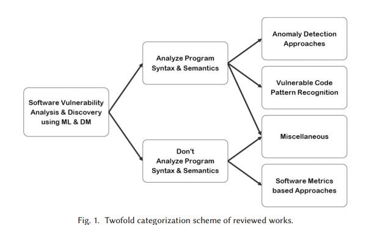
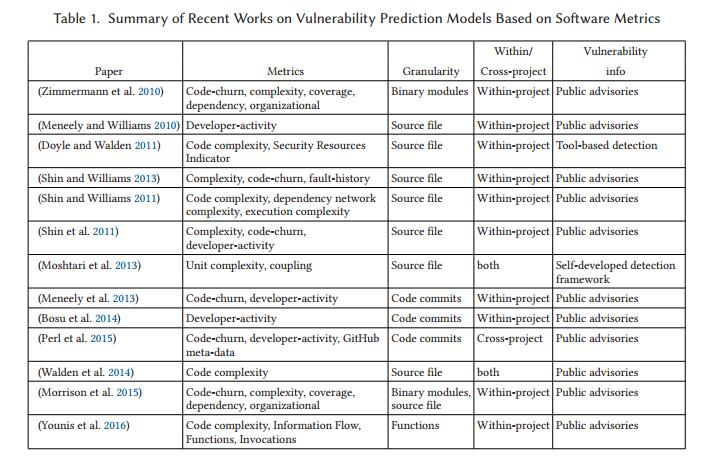
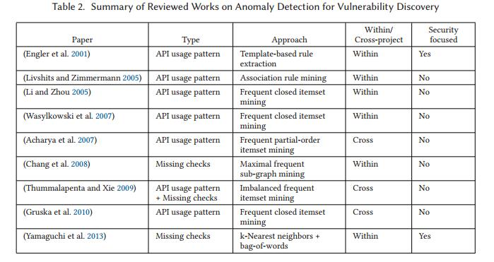

**由于其中主要内容都是关于数据挖掘技术在源代码漏洞和分析中的使用总结，涉及到使用机器学习方法的较少，所以未翻译阅读完，后续再继续翻译。**

# Abstract

软件安全漏洞是计算机安全领域的关键问题之一。由于其潜在的高严重性影响，在过去几十年中已经提出了许多不同的方法来减轻软件漏洞的损害。机器学习和数据挖掘技术也是解决该问题的众多方法之一。在本文中，我们对利用机器学习和数据挖掘技术的软件漏洞分析和发现的许多不同工作进行了广泛的回顾。我们回顾了这个领域中不同类别的工作，讨论了优点和缺点，并指出了挑战和一些未知的领域。

| relevant information |                                                 |
| -------------------- | ----------------------------------------------- |
| *作者*               | SEYED MOHAMMAD GHAFFARIAN；HAMID REZA SHAHRIARI |
| *单位*               | Amirkabir University of Technology              |
| *出处*               | ACM Comput. Surv                                |
| *原文地址*           | <https://dl.acm.org/citation.cfm?id=3092566>    |
| *源码地址*           |                                                 |
| *发表时间*           | 2017年                                          |

# 1. 简介

如今，计算机软件无处不在，现代人类生活在很大程度上依赖于各种各样的软件。在不同的平台上运行不同形式的计算机软件，从手持移动设备上的简单应用程序到复杂的分布式企业软件系统。这些软件采用多种不同的方法生成，基于各种各样的技术，每种技术都有自己的优点和局限。这个庞大的关键行业以及计算机安全领域的一个重要问题是软件安全漏洞问题。在这个问题上引用行业专家的话：

> “In the context of software security, vulnerabilities are specifc flaws or oversights
> in a piece of software that allow attackers to do something malicious: expose or alter
> sensitive information, disrupt or destroy a system, or take control of a computer system
> or program.” Dowd et al. (2007) 

软件漏洞所带来的威胁的严重程度不同取决于开发复杂性和攻击面等因素（Nayak等人，2014）。在过去的二十年中，存在大量的例子和事件，其中软件漏洞给公司和个人带来了重大损害。为了强调这个问题的重要性，我们近年来提到了一些例子。一个突出的例子是流行浏览器插件中的漏洞情况，这些漏洞威胁到数百万互联网用户的安全和隐私（例如，Adobe Flash Player（US-CERT 2015; Adobe Security Bulletin 2015）和Oracle Java（US-CERT 2013） ）。此外，流行和基础开源软件中的漏洞也威胁到全球数千家公司及其客户的安全（例如Heartbleed（Codenomicon 2014）ShellShock（赛门铁克安全响应2014）和Apache Commons（Breen 2015） ）。

上述示例只是每年报告的大量漏洞中的一小部分。由于这个问题的重要性，学术界和软件行业的研究人员已经研究了许多不同的缓解方法。 Shahriar和Zulkernine（2012）提出了一项针对缓解计划安全漏洞的不同方法的广泛调查，包括测试，静态分析和混合分析，以及1994年至2010年期间发布的安全编程，程序转换和修补方法。

除了在Shahriar和Zulkernine（2012）中审查的众所周知且经过深入研究的方法之外，还存在一种不同的方法，这些方法利用来自数据科学和人工智能（AI）的技术来解决软件漏洞分析和发现。 Shahriar和Zulkernine（2012）忽略了这类有趣的方法，但在接下来的几年中（从2011年开始），研究界越来越关注这一方法。

在本文中，我们针对利用数据挖掘和机器学习技术的软件漏洞分析和发现的这类方法提出了分类评论。首先，我们确定了软件漏洞分析和发现的问题，并简要介绍了在这个领域的传统方法。我们还简要介绍了机器学习和数据挖掘技术以及它们使用背后的动机。之后，我们将分别回顾利用机器学习和数据挖掘技术解决软件漏洞分析和发现问题的许多不同工作。我们为这类作品提出了不同的类别，并讨论了它们的优点和局限性。最后，我们在结束本文时讨论了在这个领域的挑战，并指出了一些未知的领域，以激发这一新兴研究领域的未来工作。

# 2.背景：软件漏洞分析和发现

## 2.1 定义

我们首先说明软件安全漏洞的定义。在他关于软件漏洞分析问题的博士论文中，Ivan Krsul将软件漏洞定义为：

> “an instance of an error in the specifcation, development, or confguration of software
> such that its execution can violate the security policy.” (Krsul 1998) 

差不多十年之后，Ozment承认Krsul的定义，但建议稍作修改：

> “A software vulnerability is an instance of a mistake in the specifcation, development,
> or confguration of software such that its execution can violate the explicit or implicit
> security policy.” Ozment (2007) 

Ozment将单词error更改为mistake，并引用IEEE标准术语软件工程术语（IEEE Standards 1990）来证明这一点。如前所述，行业专家提供了类似的定义：

> “In the context of software security, vulnerabilities are specifc flaws or oversights
> in a piece of software that allow attackers to do something malicious: expose or alter
> sensitive information, disrupt or destroy a system, or take control of a computer system
> or program.” Dowd et al. (2007) 

从上述定义可以看出，不同的关键术语用于定义软件漏洞。为了澄清这些术语并选择最合适的术语，我们参考IEEE标准软件工程术语表（IEEE标准1990）。我们查找四个关键术语的定义：“error”，“fault”，“failure”和"mistake"根据IEEE标准（1990），**error**的定义是：“计算的，观察的或测量的值或条件与真实的，规定的或理论上正确的值或条件之间的差异”（IEEE标准1990）。**fault**是：“计算机程序中的步骤，过程或数据定义不正确”（IEEE标准1990）。**faults**也称为flaws或bugs。**failure**是：“系统或组件无法在规定的性能要求下执行其所需的功能”（IEEE标准1990）。最后，**mistake**是：“产生错误结果的人为行为”（IEEE标准1990）。这些术语的关系的总结和澄清是“区分人类行为（mistake），其表现（硬件或软件faults），故障结果（failure）以及结果的数量不正确（error）“（IEEE标准1990）。

从这些定义可以清楚地看出，用于定义软件漏洞的合适关键术语是“fault”（也是flaw或bug）。更确切地说：

> A software vulnerability is an instance of a flaw, caused by a mistake in the design, development, or configuration of software such that it can be exploited to violate some explicit or implicit security policy.

软件漏洞的原因是人为错误，其表现形式是flaw（fault或bug）。执行faulty 状态的软件不一定违反安全策略;直到某些特制数据（漏洞利用代码）或某些具有某些条件的随机数据到达有缺陷的语句，此时，其执行可能违反某些安全策略（利用导致安全性失败）。

其他人已经承认将软件漏洞定义为faults，并将mistake定义为其原因。 Ozment指出“由于开发错误导致的漏洞是一个fault”（Ozment 2007），但他区分了开发错误导致的漏洞，以及设计或配置错误导致的漏洞;但没有提供这种差异的解释。 Dowd等人。还说：

> “In general, software vulnerabilities can be thought of as a subset of the larger phenomenon of software bugs. Security vulnerabilities are bugs that pack an extra hidden surprise: A malicious user can leverage them to launch attacks against the software and supporting systems.” Dowd et al. (2007)

## 2.2 健全性，完整性和不可判定性

程序漏洞分析是确定给定程序是否包含已知安全漏洞（根据安全策略）的问题。基于图灵停止问题和赖斯定理的不可判定性，可以证明许多程序分析问题在一般情况下也是不可判定的（Landi 1992; Reps 2000）。对于从业者来说，不可判断性意味着不存在对问题的完整解决方案。

在数学逻辑中，如果系统不能批准无效参数，则证明系统是合理的。如果所有有效参数都可以被系统批准，则证明系统是完整的。通过推论，一个完整的证据系统是一个可以批准所有有效论证并反驳所有无效论证的系统（Xie et al.2005）。

在软件安全的背景下，如果漏洞分析系统从未批准易受攻击的程序（没有漏掉漏洞），那么它就是健全的。如果可以批准所有安全程序（没有虚假漏洞），则漏洞分析系统是完整的。根据推论，健全且完整的漏洞分析系统可以批准所有安全程序并拒绝所有易受攻击的程序（没有错过漏洞且没有漏洞）（Xie et al.2005）。如前所述，已知这种完善和完整的系统是不存在的（Jhala和Majumdar，2009）。

除了漏洞分析之外，更实用的系统是程序漏洞发现（或漏洞报告）系统。与批准或不批准给定程序的安全性（即二进制输出）的漏洞分析系统相比，程序漏洞发现系统报告给定的每个漏洞的更详细信息（例如类型，位置等）程序。这是软件行业更有用和理想的系统，它可以帮助开发人员和工程师更轻松地检测和修复漏洞。同样，众所周知，一个完善的软件漏洞发现系统（一个不报告漏洞，报告所有实际漏洞的系统）是不存在的。

## 2.3传统方法

尽管软件漏洞分析和发现问题具有不可判定的性质，但由于该问题的重要性，学术界和软件行业的从业者已经研究和提出了大量的方法。提出的方法都不可避免地是近似解;他们都缺乏健全性或完整性，或两者兼而有之。因此，与以前的工作相比，所有研究工作都试图提出一种改进的方法，涉及软件漏洞分析和发现过程的特定方面;例如，漏洞覆盖率，发现精度，运行时效率等。

Shahriar和Zulkernine（2012）提出了对缓解程序安全漏洞的不同方法的广泛审查，包括在1994年至2010年期间的程序漏洞分析和发现方法。所有程序分析方法可分为三大类：

 - **静态分析**：根据源代码分析给定程序，无需执行。这些方法利用广义抽象来分析程序的属性，因此静态分析方法最健全的（即没有错过的漏洞，但可能会报告错误的漏洞）。泛化越准确，报告的漏洞就越少。在实践中，必须在分析精度和计算效率之间进行交易。
 - **动态分析**：通过使用特定的输入数据执行并监视其运行时行为来分析给定程序。在这种方法中，一组输入测试用例用于分析程序的属性，并且由于通常存在无限可能的输入和运行时状态，因此动态分析系统无法分析整个程序的行为。因此，动态分析系统是最完整性的（即，批准所有安全程序而不报告虚假漏洞），但它们不可能是健全的，因为它可能会遗漏一些隐藏在看不见的程序状态中的漏洞。动态分析方法存在实际缺点，即对给定程序的工作运行时的环境要求，以及在分析大型复杂软件时处理所有输入测试用例所需的长时间和高成本。然而，动态分析方法在软件行业中得到了极大的应用。
- **混合分析**：使用静态分析和动态分析技术的混合分析给定程序。基于先前关于静态和动态分析方法的讨论可能存在误解，混合分析方法可能是完整的和健全的（因此，违反了问题的不可判定性）。不幸的是，事实并非如此，虽然混合分析方法可以从静态和动态分析的优势中获益，但它们也受到两种方法的局限性的影响。混合分析方法可以是利用动态分析来识别错误漏洞的静态分析系统，也可以是利用静态分析技术来指导测试用例选择和分析过程的动态分析方法。

但应注意，并非所有静态分析系统都是健全的，并非所有动态分析系统都是完整的。在众多不同的漏洞发现方法中，有些在软件行业中更为成熟;亦即

- Software Penetration Testing: a manual software security testing approach, carried out  by a team of security experts (also referred to as white-hat hackers) (Arkin et al. 2005; Bishop 
 2007).                                                       
- Fuzz-Testing: also known as random-testing, where well-formed input data are randomly  mutated and fed to the program under test at large, while monitoring for failures (Godefroid   2007; Godefroid et al. 2012).                                
- Static Data-Flow Analysis: also known as “Tainted Data-flow Analysis,” it is a static program analysis approach where untrusted data from input sources is marked as tainted and  its flow to sensitive program statements known as sinks is tracked as a potential indicator  of vulnerability (Evans and Larochelle 2002; Larus et al. 2004; Ayewah et al. 2008; Bessey  et al. 2010).                                                

# 3.使用机器学习和数据挖掘技术

除了上述方法之外，还有一类不同的工作利用数据科学和人工智能（AI）的技术来解决软件漏洞分析和发现的问题。在Shahriar和Zulkernine（2012）的评论中忽略了这一类有趣的方法，而在接下来的几年（从2011年起），研究界越来越关注这一方法。
人工智能技术中的机器学习技术在许多不同的应用领域都被证明是有效的（Russell和Norvig 2009）。对于计算机安全和隐私领域也是如此，许多不同的应用程序已经使用这些技术解决（例如，垃圾邮件过滤（Guzella和Caminhas 2009; Caruana和Li 2012）和入侵检测系统（Garcia-Teodoro等。 2009; Zhou et al.2010），仅举几例）。

正如Arthur Samuel在他的开创性工作中所定义的那样，机器学习是开发计算技术和算法的研究，使计算机系统能够在没有明确编程的情况下获得新的能力（Samuel，1959）。数据挖掘是从大量数据中提取知识的计算过程，包括以下几个步骤：数据提取和收集，数据清理和集成，数据选择和转换，知识挖掘以及最终可视化和通信（Han et al.2011） 。机器学习算法和技术经常用于数据挖掘的过程中，用于预处理，模式识别和生成预测模型。

机器学习技术可大致分为三种主要方法：（1）监督学习：学习系统基于一组标记的训练样例推断出所需的功能/模型，其中每个例子由输入数据（通常是矢量）和所需的相应输出值（标签）。 （2）无监督学习：在没有标记训练数据的情况下，学习系统的目标是识别给定数据集中的模式和结构。 （3）强化学习：学习系统通过与动态环境的交互来接受奖励和惩罚，通过训练来达到某个目标。

## 3.1希望和恐惧

尽管机器学习技术在安全应用中的应用可以追溯到几十年，但近年来机器学习和数据挖掘技术的进步和能力以及它们解决许多困难应用问题的成功案例促使研究人员更加彻底调查这些技术的有效利用，以解决计算机安全和隐私领域的难题。例如，Carl Landwehr分享了他对此事的看法如下：

> “在他们的早期，计算机安全和人工智能似乎没有太多可说的对...安全研究人员的目的是解决他们认为防漏的计算基础设施或设计基础设施的漏洞......但是多年来，这两个地方的距离越来越近，特别是在攻击旨在模拟合法行为的地方......我们可能会想象系统会对他们处理的数据有一定程度的自我意识。反射系统（可以参考和修改自己的行为的系统）的概念起源于AI社区......想象一下，一个管道系统包含一个可以检测初期泄漏的智能管道系统。包含智能管道模拟的网络基础设施将引起极大兴趣。“Landwehr（2008）

其他研究人员强调了人工智能技术在计算机安全和隐私领域获得解决复杂问题的重要作用。例如，Tyugu（2011）指出：“很明显，只有在使用人工智能方法时才能成功解决许多网络防御问题。”Heinl（2014）提出了类似的观点。

另一方面，安全社区也担心使用人工智能技术。例如，尽管在基于异常的入侵检测系统的研究中发表了大量研究，但是之前的一些研究表明这些系统很少部署在入侵检测行业（Sommer和Paxson 2010）。其他研究也对网络入侵检测的异常检测范例提出了挑战（Gates和Taylor 2006）。这些研究的结果强调了这样一个事实，即在计算机安全和隐私领域有效使用AI技术并非易事，需要对这些技术的特性有充分的了解（Sommer和Paxson 2010）。为了获得最佳结果，应该定制机器学习和数据挖掘技术以适应安全问题的特征。在这件事上，莫瑞尔说：

> “尽管过去已经完成了一些工作，但AI并没有在当今的网络安全中发挥核心作用，网络安全并不像人工智能那样强烈追求人工智能的发展领域，而其他人...... AI技术是围绕应用程序开发的。网络安全从未成为人工智能集中的一个领域......人工智能已经取得了很多成就，并且有许多与网络安全相关的知识，许多适合网络安全的新技术可以从人工智能中的现有技术中获得启发。“Morel（ 2011）

为此，应该研究针对计算机安全问题量身定制的机器学习技术。

## 3.2 以前工作的分类

在软件漏洞分析和发现的过程中，许多研究在前几年发表研究机器学习和数据挖掘技术的使用，我们在本文中对此进行了广泛的综述。我们将审查的工作分为四大类，总结如下，并将其区分如下：

- （1）基于软件度量的漏洞预测模型：大量研究利用（主要是监督的）机器学习方法构建基于众所周知的软件度量作为特征集的预测模型，然后使用该模型根据测量的软件工程指标评估软件工件的漏洞状态。

- （2）异常检测方法：这类工作利用无监督学习方法从软件源代码中自动提取正常模型或挖掘规则，并将漏洞检测为多数正常和规则的异常行为。

- （3）漏洞代码模式识别：这类工作利用（主要是监督的）机器学习方法从许多漏洞代码示例中提取漏洞代码段的模式，然后使用模式匹配技术来检测和定位软件中的漏洞源代码。

- （4）杂项方法：一些值得注意的近期着作，利用AI和数据科学的技术进行软件漏洞分析和发现，这些技术不属于任何上述类别，也不构成一个连贯的类别。

提议分类背后的基本原理是双重的：首先，我们区分分析程序语法和语义的工作，而不区分程序语法和语义。大多数不分析程序语法和语义的工作使用软件工程指标进行漏洞预测。另一方面，在基于分析程序语法和语义的大量研究中，我们观察到两种主要方法：漏洞代码模式识别和异常检测方法。图1直观地总结了分类方案。

虽然其他标准也可用于分类目的（例如：监督与非监督学习范式，不同的学习和挖掘技术，特征表示方案等），但它们不能创建先前作品的语义连贯类别。我们认为，拟议的分类结果会产生更有意义的研究家族，从而可以更好地比较各种方法，因此我们认为这是对有史以来研究的有组织调查的合适选择。

# 4基于软件度量的漏洞预测

我们在本文中讨论的第一类方法是“漏洞预测模型”，它利用数据挖掘，机器学习和统计分析技术来预测易受攻击的软件工件（源代码文件，面向对象的类，二进制组件，等）基于通用软件工程指标。这些方法的主要思想来自于软件工程领域的软件质量和可靠性保证，其中软件测试和验证的有限资源需要一个指导模型来实现更有效的软件测试计划。为此，已经研究并在工业中使用“故障预测模型”（或“缺陷预测模型”）（Khoshgoftaar等人1997）。故障预测模型是基于从软件项目收集的历史数据训练的计算模型，并提供更可能包含故障的软件工件列表以优先考虑软件测试。历史数据基于不同的软件工程指标，例如源代码大小，复杂性，代码流失和开发人员活动指标（Kaner和Bond 2004）。根据IEEE标准软件工程术语表，术语“度量”被定义为“系统，组件或过程拥有给定属性的程度的定量度量”（1990）。在调查文章中回顾的软件工程领域的故障预测模型的主题上进行了广泛的研究和发表（Catal和Diri 2009; Malhotra 2015）。

基于与故障预测模型类似的动机，在软件工程领域中提出了漏洞预测模型。检测和缓解安全漏洞需要经过安全思维培训的专家进行人工分析（Heelan 2011）;然而，软件质量和可靠性保证团队的资源有限，需要引导他们进行更有效，更有效的安全审计和测试。基于漏洞是一种特定类型的故障这一事实，已经在业界和学术界提出并研究了漏洞预测模型。与故障预测模型类似，脆弱性预测模型也基于各种软件度量建立，并且不包含程序分析方法（即，分析某些属性的程序源代码）。在下文中，我们将回顾一下这个领域的一些最新作品。

## 4.1最近工作总结

Zimmermann 等人（2010）研究了基于先前用于缺陷预测的研究中使用的经典度量来预测专有商业产品（Microsoft Windows Vista）的二进制模块中存在漏洞的可能性。作为第一个分析，他们使用Spearman的秩相关性计算度量与每个二进制的漏洞数量之间的相关性。结果表明，经典度量与漏洞数量具有统计上的显着相关性;但是，效果很小。另一项分析是评估这些指标的预测能力。作者使用二元Logistic回归分析了经典指标（流失，复杂性，覆盖，依赖和组织）的五组。模型评估采用十倍交叉验证和计算精度以及召回值。作者报告说，大多数指标预测的漏洞具有平均精度（低误报率）;然而，召回率非常低（错误的假阴性或错过的漏洞）并且覆盖率指标未能产生任何有意义的结果。结果包括精度低于67％，召回率低于21％。

Meneely和Williams（2010）研究了开发者活动指标和软件漏洞之间的关系。正在研究的开发人员活动指标包括：更改源文件的不同开发人员数量，向文件提交的提交数量，以及在贡献网络中包含文件的测序路径数量。作者对三个开源软件项目进行了研究。每个研究中收集的数据集包括一个标签，表明源代码文件是否已修补，以及版本控制日志中的开发人员活动指标。使用统计相关性分析，作者报告发现每个指标与漏洞数量存在显着的显着相关性;但相关性各不相同，并不是很强。作者使用贝叶斯网络作为预测模型，通过十倍交叉验证生成训练和验证集。据作者说，分析表明开发人员活动可以用来预测脆弱的人群;然而，精确度和召回率值令人失望（精确度在12％-29％之间，召回率在32％-56％之间）。

Doyle和Walden（2011）分析了2006年至2008年间14个最广泛使用的开源Web应用程序中的软件度量和漏洞之间的关系，例如WordPress和Mediawiki。作者使用静态分析工具（例如，Fortify源代码分析器，PHP CodeSni等等）来测量这些应用程序的源代码库中的各种度量，包括静态分析漏洞密度（SAVD），源代码大小，圈复杂度，嵌套复杂性，以及作者提出的另一个名为安全资源指标（SRI）的指标。为了预测，Spearman的等级相关性是在SAVD和其他指标之间计算的。结果表明，没有一个度量标准适用于区分高漏洞Web应用程序和低漏洞Web应用程序;然而，每个函数的平均圈复杂度是几个应用程序的有效预测器，特别是当与SRI分数结合使用时，将应用程序分类为高安全性和低安全性焦点应用程序。由于静态分析工具可能会产生很高的误报，作者手动审查了两个选定的Web应用程序的一个工具（Fortify SCA）的报告，其误报率为18％;得出结论认为假阳性率是可以接受的，对有效性没有威胁。

Shin和Williams（2013）研究了基于复杂性和代码流失度量的传统故障预测模型是否可用于漏洞预测。为此，作者使用18个复杂度指标，5个代码流失度量标准和故障历史度量标准对Mozilla Firefox进行了实证研究。测试了几种分类技术来预测故障和脆弱的人群;作者声称所有技术的结果都相似。虽然故障源代码的数量是脆弱源数量的7倍，但故障预测模型和漏洞预测模型在漏洞预测方面表现相似;召回率约为83％，精确度约为11％。基于这些结果，作者得出结论，基于传统度量的故障预测模型也可用于脆弱性预测;然而，未来的研究需要提高精确度（减少误报），同时保持高召回率

在同一作者的另一个工作中，Shin和Williams（2011）研究了使用执行复杂度指标作为软件漏洞的指标。这组作者说，这项研究背后的动机是基于安全专家的直觉，安全专家经常假设“软件复杂性是软件安全的敌人。”为此，作者对两个开源项目进行了实证案例研究，比较执行复杂性和静态复杂性指标对漏洞检测的有效性。总共，本研究收集了23个复杂度指标。作者对指标进行了判别和预测分析。对于判别分析，作者使用Welch的t检验来比较弱势文件与中性文件的度量值的均值。结果显示，其中一个项目的23个指标中有20个表现出统计上显着的判别力;但是，这仅适用于其他项目的大约一半指标，包括没有执行复杂性指标。为了评估指标的预测能力，作者使用Logistic回归进行了二元分类，并进行了十倍的交叉验证。为了解释许多指标中的冗余信息，作者基于信息增益排名执行了特征空间缩减。另一个问题是大多数（中立的人）和少数群体（弱势群体）之间的严重失衡，作者通过随机抽样多数阶层来解决这个问题。最终结果是，对于所有三组指标（代码，依赖关系，所有组合），召回率是公平的（67％-81％），但精确度令人失望（8％-12％）。总之，结果表明这些指标没有静态显着的判别力，预测能力不可靠。

Shin等人（2011）对复杂性，代码流失和开发人员活动（CCD）指标是否可用于漏洞预测进行了更广泛的研究。为此，作者对两个开源项目进行了实证案例研究。本研究共分析了28个CCD软件指标，包括14个复杂度指标，3个代码流失指标和11个开发人员活动指标。为了评估指标的判别能力，作者使用了Welch的t检验，其中两个项目的28个指标中至少有24个支持检验假设。为了评估指标的预测能力，作者测试了几种分类技术，但它们只呈现了一种分类结果，因为所有技术都提供了类似的性能。为了验证模型的预测能力，作者进行了下一次发布验证，其中有几个版本可供使用，交叉验证只有一个版本可用。评估了单变量和多变量预测假设。基于从故障预测文献中找到的平均值，作者选择阈值至少为70％用于回忆，并且最多25％用于假阳性率以支持预测假设。 28个单变量模型中只有2个，以及使用基于发展历史的指标的4个多变量模型中的3个预测了两个项目的高召回率和低误报率的脆弱性。作者得出结论，与本研究中收集的代码复杂度指标相比，开发历史指标是更强的漏洞指标。

Moshtari等人（2013）提到了先前关于脆弱性预测模型的研究的三个主要局限性，因此他们提出了一种新方法，通过解决先前研究的局限性，基于复杂性度量来预测软件中的脆弱位置。作者提出了一种半自动分析框架来检测软件漏洞，并将其输出用作漏洞信息，而不是报告的漏洞，作者声称这些漏洞提供了有关软件漏洞的更完整信息。与之前仅研究项目内漏洞预测的研究不同，本研究基于从开源项目收集的数据调查了项目内和项目间的漏洞预测。各种分类技术用于实验。在fle级别粒度下测量了一组11个单元复杂度度量和4个耦合度量。在Mozilla Firefox上进行的项目内预测的报告结果对于各种分类技术而言令人印象深刻（召回率高于90％，误报率低于10％）。作者声称，更完整的漏洞信息有助于这种改进，并通过将提出的方法与Shin等人之前的工作的复制进行比较来证明其声称的合理性。 （2011年）。在随机选择的五个项目版本上进行跨项目实验，其中一个项目被视为测试数据，模型在另外四个项目上进行了培训。根据报告的F2测量，跨项目预测的最佳模型实现了约70％的检测率，约26％的误报。

Moshtari等人。 （2013）提到了先前关于脆弱性预测模型的研究的三个主要局限性，因此他们提出了一种新方法，通过解决先前研究的局限性，基于复杂性度量来预测软件中的脆弱位置。作者提出了一种半自动分析框架来检测软件漏洞，并将其输出用作漏洞信息，而不是报告的漏洞，作者声称这些漏洞提供了有关软件漏洞的更完整信息。与之前仅研究项目内漏洞预测的研究不同，本研究基于从开源项目收集的数据调查了项目内和项目间的漏洞预测。各种分类技术用于实验。在fle级别粒度下测量了一组11个单元复杂度度量和4个耦合度量。在Mozilla Firefox上进行的项目内预测的报告结果对于各种分类技术而言令人印象深刻（召回率高于90％，误报率低于10％）。作者声称，更完整的漏洞信息有助于这种改进，并通过将提出的方法与Shin等人之前的工作的复制进行比较来证明其声称的合理性。 （2011年）。在随机选择的五个项目版本上进行跨项目实验，其中一个项目被视为测试数据，模型在另外四个项目上进行了培训。根据报告的F2测量，跨项目预测的最佳模型实现了约70％的检测率，约26％的误报。 

Meneely等人（2013）通过将Apache HTTPD Web服务器中的65个以上漏洞追溯到最初贡献易受攻击代码的版本控制提交，探讨了漏洞贡献提交（VCC）的属性。作者手动发现了124个VCC，跨越17年，他们使用统计分析技术根据代码流失和开发人员活动指标进行分析。根据这项探索性研究的结果，他们提出了几个方面：（1）代码流失度量标准与VCC在经验上相关，其方式是更大的提交可能会引入漏洞; （2）承诺更多的开发人员更有可能成为VCC; （3）由新开发商提交给来源，更有可能是VCC。

Bosu等人（2014）进行了类似的实证研究，他们分析了来自10个开源项目的260,000多个代码审查请求，使用三阶段半自动化流程识别了400多个易受攻击的代码更改。他们的目标是确定漏洞代码更改的特征，并确定可能引入漏洞的开发人员的特征。一些关键的因素包括：（1）经验不足的贡献者的变化显然更有可能引入漏洞; （2）漏洞可能性随着变化的大小而增加（更多行改变）; （3）与修改后的文件相比，新文件不太可能包含漏洞。

Perl等人（2015）研究了使用代码存储库中包含的元数据以及代码度量来识别漏洞贡献提交的效果。作者声称软件逐渐增长，大多数开源项目都使用版本控制系统，因此，提交是检查漏洞的自然单位。有了这个动机，作者编译了一个包含来自66个C / C ++ GitHub项目的170,860个提交的数据集，其中包括映射到相关CVE ID的640个漏洞贡献提交（VCC）。作者选择了一组代码流失和开发人员活动指标，以及来自不同范围（项目，作者，提交和文件夹）的GitHub元数据，并为收集的数据集提取这些功能。基于该数据集，作者评估了他们提出的名为VCCFinder的系统，该系统使用支持向量机（SVM）分类器来识别来自中立提交的VCC。为了评估，该系统在2010年底之前接受了数据培训，并根据2011年至2014年报告的CVE进行了测试。作者将他们提出的系统的结果与FlawFinder静态分析工具的结果进行了比较。在相同的召回水平（召回率= 24％），FlawFinder的精度仅达到1％，而VCCFinder达到60％的精度，产生的误报率要低得多。上述数据集由作者公开发表，作为对研究界的贡献。

Walden等人（2014）进行了一项研究，以比较基于软件度量与文本挖掘技术预测漏洞软件组件的性能。为此，作者首先构建了一个手工策划的漏洞数据集，这些数据集来自三个大型流行的开源PHP Web应用程序（Drupal，Moodle，PhpMyAdmin），包含223个漏洞。该数据集作为贡献提供给研究界。对于基于软件度量的漏洞预测，为该研究选择了一组12个代码复杂度度量。对于文本挖掘，每个PHP源文件都是第一个标记化的，不必要的标记被删除或转换（注释，标点符号，字符串和数字文字等），并计算最终标记的频率。众所周知的“词袋”技术用于从每个PHP源文本的文本标记构造数字特征向量。基于先前的漏洞预测研究经验，作者选择随机森林模型作为主要分类算法。对于模型评估，作者使用分层三重交叉验证。作者还通过对多数类（非易受攻击代码）执行随机欠采样来解决不平衡类数据的问题。根据作者的各种实验，基于文本挖掘的预测技术平均表现更好（即，更高的召回率和精确度），并且差异在统计上是显着的。作者还测试了跨项目漏洞预测，但两种方法的跨项目预测性能普遍较差。由于作者没有考虑应用程序之间数据的不均等分布，因此预计跨项目预测表现不佳。

Morrison等人（2015）指出，虽然微软团队采用了缺陷预测模型，但漏洞预测模型（VPM）并非如此。为了解释这种差异，作者尝试复制Zimmermann等人提出的VPM。 （2010）有两个较新版本的Microsoft Windows操作系统。作者将二进制水平预测精度提高了约75％，并且召回率约为20％;然而，二进制文件通常对于实际检查来说非常大，并且工程师首选源级别预测。因此，作者为源流水平粒度建立了相同的模型，其精度低于50％，召回率低于20％。基于这些结果，作者得出结论：“必须通过安全特定指标来”重新调整VPM以实现可操作的性能。“

Younis等人。 （2016）尝试识别包含更可能被利用的漏洞的代码的属性。为此，作者收集了来自Linux内核和Apache HTTPD Web服务器项目的183个漏洞，其中包括82个可利用的漏洞。作者从四个不同的类别中选择八个软件度量来表征这些漏洞，并使用Welch的t检验来检验每个度量的判别力。指标的判别力的结果是混合的;一些指标在统计上具有显着的判别力，而其他指标则没有。作者还研究了是否存在可用作可利用漏洞预测因子的指标组合，其中测试了三种不同的特征选择方法和四种不同的分类算法。表现最佳的模型是具有包装子集选择方法的随机森林分类，其实现了84％的F-度量。

## 4.2讨论

在前一小节中，我们回顾了基于软件度量的脆弱性预测模型的最新研究。表1列出了本节所述所有文章的摘要，其中我们指定了每项工作的主要差异因素。

人们可能会质疑基于软件工程指标来预测软件漏洞存在的基本决策，作为混淆症状和原因的一个例子（Zeller etal. 2011 ）。一些研究（例如，Walden等人（2014）强调了这种批评，这些研究表明，与基于某些软件度量的脆弱性预测模型相比，软件源代码的基本文本挖掘可以在预测性能方面产生更好的结果;尽管如此，这种实证研究不能推广到所有软件项目和所有软件指标。另一方面，Tang等人最近的一项研究（2015）批评了Walden等人的结论（2014），因为他们没有考虑影响代码检查的单个组件的大小;因此，他们比较了这两种预测模型在易受影响的漏洞预测背景下的预测能力，并得出结论，这两种指标的表现相似。

使用软件度量进行漏洞预测的一个理由是，这些度量标准通常很容易获得，或者很容易在软件工程项目中获得。此外，软件故障/缺陷预测模型已经在一些软件项目中使用，而构建漏洞预测模型不需要额外的专业知识。另一方面，这些系统的目的是仅作为更好地规划和分配软件工程团队资源的指导模型。因此，基于软件度量的漏洞预测模型是工业界和学术界的一系列研究。

基于上面回顾的上述工作，很明显，基于软件指标的漏洞预测模型尚未成熟。从以往研究的回顾中可以得出一些结论，包括挑战和可能的未来工作： 

-    脆弱性预测模型的统计挑战是由数据集中的漏洞很少而且稀疏的事实引入的。在数据挖掘和机器学习的过程中，这个问题被称为不平衡类数据，它可以极大地阻碍机器学习算法的性能，并且有解决该问题的实践（Domingos 2012）。本节中回顾的一些先前的工作已经解决了不平衡类数据问题，并且对大多数类进行了随机欠采样。这是一个重要的问题，任何利用机器学习和数据挖掘技术的研究都不应忽视这一问题。

 - 与之前的大多数研究相比，Moshtari等人（2013）使用半自动化框架进行漏洞检测，他们使用这种框架代替通过公共咨询和漏洞数据库（例如NVD）提供的信息。与之前的作品相比，他们获得了显着更高的召回率和精确度值（即使在跨项目设置中）。这可能是一种很有前景的方法，未来的研究也可以用来收集更完整的漏洞信息并获得更好的结果。
 - 漏洞预测模型领域中的跨项目研究很少，因此是未来工作的一个领域。特别是与缺陷预测模型相比，跨项目漏洞预测的研究非常不足。跨项目预测引入了额外的挑战，这些挑战源于训练和测试集中的数据分布可能显着变化并且阻碍传统机器学习和统计分析技术的性能。这一挑战在机器学习研究中被称为“归纳转移”（或“转移学习”）技术（Pan and Yang 2010），它们的使用已经在软件缺陷预测研究中得到了研究（Ma et al.2012 ; Nam et al.2013）。这些研究可以成为未来跨项目脆弱性预测模型研究的基础。
 - 基于软件指标的漏洞预测研究中的大多数研究报告结果不佳。一个可能的结论是传统的软件度量标准不适合软件漏洞。 Morrison等人明确讨论了这一结论（2015年）。从此以后，确定安全特定指标，例如Doyle和Walden（2011）提出的安全资源指标（SRI）是未来研究的另一个领域。
 - 这个领域的未知领域正在使用深度学习方法进行漏洞预测。深度学习是机器学习研究中新出现的一个主题，它在几个应用领域取得了巨大成就，并且越来越受到研究人员和从业者的关注（LeCun等人，2015）。Yang等人（2015）提出了一项关于应用深度学习方法进行即时软件缺陷预测的研究。这是脆弱性预测模型的未来研究的另一个有希望的领域。

# 5异常检测方法

在本节中，我们将回顾一类使用机器学习和数据挖掘技术进行软件漏洞分析和发现的异常检测方法。异常检测是指数据中的模式不符合正常和预期行为的问题;通常被称为anomalies或outliers（Chandola等，2009）。在许多不同的研究领域和应用领域中已经广泛研究了这个问题;包括软件缺陷和漏洞发现领域。

在软件质量保证的背景下，异常检测方法旨在通过使源代码中的位置不符合应用程序编程接口（API）的通常或预期代码模式来识别软件缺陷。这种API使用模式的简单示例是malloc和free的函数调用对，或者lock和unlock。除了这些简单的众所周知的模式之外，每个API都有自己的规则和模式份额，这些规则和模式也很复杂，而且记录不完善。不符合API的预期规则和使用模式可能导致软件缺陷，也可能导致软件漏洞。

异常检测方法应用于软件质量保证的另一个领域是检测被忽视的条件或缺少检查。缺少检查是许多软件缺陷和漏洞的根源。这些检查可大致分为两类：（1）正确使用API所需的检查; （2）检查实现程序逻辑。这两种类型都可能导致软件缺陷或软件漏洞。第一种类型的示例是检查用作API函数调用的参数的输入数据的正确类型或值。缺少这样的检查可能导致软件崩溃，未定义或不期望的行为（例如，除以零）。失败也可能产生安全后果（例如，流量溢出，SQL注入等）。在访问资源对象时，缺少第二种类型的示例来检查主题的权限或权限。同样，这些逻辑缺陷可能具有安全性后果，从而导致安全逻辑漏洞（例如，机密性和完整性访问控制）。

已经提出异常检测方法用于检测不正确的API使用模式和丢失检查。这些方法的一个重要方面是自动提取正常行为，换句话说，自动提取规范，规则和模式，然后将其用作检测异常行为的基础。自动提取正常行为对于这些方法的适用性和成功性至关重要，而如果人类用户提供正常行为或规范，则会极大地妨碍该方法的效率，因为：（1）编写规范是艰巨而乏味的任务; （2）人为错误可导致不准确的指定，导致不正确的结果。

在下文中，我们按时间顺序回顾和总结以前的工作，从过去十年的早期工作开始，到近年来在软件缺陷和漏洞检测的异常检测方法中的最新工作。请注意，一些经过审核的工作侧重于安全漏洞，而其他漏洞则没有;但我们仍在审查这些工作，因为所提出的方法并非专门针对非安全性缺陷。

## 5.1 最近工作总结

已经提出异常检测方法用于检测不正确的API使用模式和丢失检查。这些方法的一个重要方面是自动提取正常行为，换句话说，自动提取规范，规则和模式，然后将其用作检测异常行为的基础。自动提取正常行为对于这些方法的适用性和成功性至关重要，而如果人类用户提供正常行为或规范，则会极大地妨碍该方法的效率，因为：（1）编写规范是艰巨而乏味的任务; （2）人为错误可导致不准确的指定，导致不正确的结果。

在下文中，我们按时间顺序回顾和总结以前的工作，从过去十年的早期工作开始，到近年来在软件缺陷和漏洞检测的异常检测方法中的最新工作。请注意，一些经过审核的工作侧重于安全漏洞，而其他漏洞则没有;但我们仍在审查这些工作，因为所提出的方法并非专门针对非安全性缺陷。

Engler 等人（2001）指出，解决程序错误的一个主要障碍是知道系统必须遵守的正确性规则，这些规则通常是无证的或以临时方式指定的。为了解决这个问题，他们演示了一种自动提取程序源代码隐含的程序员beliefs的技术。为此，他们讨论了错误作为异常行为的概念，并提出了一种方法，通过为源代码定制“规则模板”来提取程序员的beliefs（例如，规则模板“<a>必须与之配对的函数调用 <b>“）。提取了两种类型的规则：（1）Must-beliefs 和（2）May-beliefs。Must-beliefs 是某些众所周知的编程规则（例如，“指针解引用意味着程序员必须相信指针是非空的”）。 May-belief是一些代码特征表明beliefs的情况，但可能是巧合。为了区分有效的May-beliefs 和巧合，使用称为Z-排名的统计分析技术来发现这些beliefs的违规（或错误），以对错误进行排序和分类。为了评估，作者检查了复杂软件系统上的各种规则模板，例如Linux和OpenBSD项目。结果显示不同情景下的假阳性率不同，从4％到57％不等。作者还使用众所周知的安全漏洞规则测试安全检查程序，导致Linux和OpenBSD中出现35个安全漏洞。

Livshits和Zimmermann（2005）提出了一个名为DynaMine的工具，它根据高度相关的方法调用分析修订历史中的源代码校验，以自动提取特定于应用程序的编码模式。 DynaMine分析增量变化，这有助于实现更精确的结果。所提出的方法首先预处理已插入的方法调用的软件修订历史，并将该信息存储在要挖掘的数据库中。挖掘方法基于经典先验算法的修改版本，其使用一组项目作为其输入并且在项目之间产生频繁的项目集和强关联规则。这些修改改进了算法的运行时间，并允许该方法进行扩展以分析大型软件系统。此外，作者将几种排名策略应用于算法挖掘的模式。提取的模式被呈现给用户以进行评估。在用户选择模式之后，使用动态分析工具进一步验证所选模式并检测违规。该方法在两个大型Java项目上进行了评估。据作者称，拟议的挖掘方法发现了56种以前未知的，高度应用程序特定的模式。根据实验结果，56个（57％）模式中有32个在运行时被击中，其中32个（66％）模式中的21个被认为是非常有效的模式。此外，发现超过260种模式违规，但作者没有评估假阳性率。

Li和Zhou（2005）断言程序通常遵循许多隐式和未记录的编程规则，这些规则违反了这些规则，不知情的程序员很容易引入缺陷。作者提出了一种名为PR-Miner的方法，用于从大型源代码中提取隐式编程规则，而无需事先了解软件，也不需要程序员的大量工作。 PRMiner旨在以一般形式（没有fxed模板）提取编程规则，包含不同类型的多个元素，如函数，变量和数据类型。总之，PR-Miner首先解析和预处理程序源代码，删除不必要的元素，如关键字，常量数据值等，并根据数据将结构中的函数和数据中的局部变量重命名为相似的名称类型。在预处理之后，所有程序元素被散列为数字，并且函数定义被映射到函数内的所有元素的一组数字散列值，作为行插入到项集数据库中。使用频繁项集挖掘算法（即FPclose）挖掘该数据库，以找出一起出现的频繁程序元素。这些频繁的程序元素集称为编程模式。有效的规则生成算法用于从频繁的编程模式中提取编程规则。编程规则用于检测违规，这是基于在大多数情况下通常遵循编程规则并且很少发生违规的想法。对三个大型开源项目进行评估。结果表明，PR-Miner在这些软件项目中发现了数以千计的规则，作者无法对所有这些规则进行验证，只讨论了一些样本。 PR-Miner还报告了许多违规行为，作者设法仅手动评估前60位报告，揭示假阳性率很高（73％-90％之间）。

Wasylkowski等（2007）重申这样一个事实，即与对象交互通常需要遵循模型或协议，这些模型或协议并不总是记录在案，并且违规可能导致缺陷。为了自动提取典型的对象使用模型，作者提出了在程序源代码中挖掘方法调用的序列，然后将其用作偏差作为缺陷候选者。首先，从Java字节码中提取对象使用模型，Java字节码是具有匿名状态的fnite状态自动机，以及作为状态转换的可行方法调用。使用每个单一方法的过程内静态分析来提取该模型。然后，使用对封闭模式的频繁项集挖掘，从使用模型中挖掘方法调用的时间属性（例如，“方法next（）可以在hasNext（）之前”）。这些频繁的模式表示正常的对象使用，并用于训练分类器以识别对这些模式的违反，这些模式被视为可能的缺陷位置。此外，作者还引入了一个缺陷指标，该指标根据几个因素对异常进行排序。提出的方法是作为一个名为JADET（用于Java异常检测器）的工具实现的。评估是在fve流行的开源Java程序上进行的。根据报告的结果，在所有5个项目中JADET检测到的前77个异常中，有40个（52％）误报，5个缺陷，5个代码smells和27个提示。

Acharya等（2007）指出以前的方法无法在API使用模式中捕获一些有用的排序信息，特别是当跨不同的进程涉及多个API时。作者提出了一种从API客户端代码中提取“频繁部分规则”的自动方法。该方法包括四个主要步骤，并基于一些名为MAPO的作者的先前工作（Xie和Pei 2006）。在第一步中，采用下推模型检查（PDMC）过程来提取与API相关的进程间控制流敏感的静态迹线。在第二步中，在给定的跟踪上使用算法来分离不同的使用场景，因此可以单独挖掘每个场景。在第三步中，名为FRECPO的方法用于从每个静态执行跟踪中提取的一组场景中挖掘“频繁闭合的部分规则”（FCPO）。 FCPO可能不是通用模式，只能针对分析的客户端代码进行指定。为了解决这个问题，引入了一个名为Mine-Verify的算法，该算法使用两个随机拆分的不相交的客户端集来验证模式。为了评估，该框架应用于X11 UNIX窗口系统的72个客户端程序。对于每个实验，随机选择36个客户作为挖掘客户端，其余36个客户端用作验证客户端。作者没有对他们的实验结果进行评估，而是仅对一个例子进行评估;为此，通过该方法成功检测到6种已知模式中的5种，并且仅报告了一种错误模式。

Chang等 （2008）通过对Firefox项目的版本1.0和1.5中的bug fxes进行初步研究，强调忽略条件作为一种难以解决的缺陷类别的重要性，该项目显示167个选定的错误中有109个（65％）涉及一个或多个被忽视的条件。为此，作者提出了一种方法，将数据挖掘技术与静态程序分析相结合，以提取代码库中的隐式条件规则，并将被忽视的条件作为规则违规进行检测。因此，程序由“系统依赖图（SDG）”表示，作为修改的“过程依赖图（PDG）”的集合，称为“增强PDG”（EPDG）。 EPDG增加了所谓的“共享数据依赖边缘”（SDDE），它链接在控制流路径中使用相同变量定义的程序元素。潜在规则由EPDG minors代表，可以将其视为EPDG的子图，其中一些路径已经收缩到边缘。 “启发式最大频繁子图挖掘（HMFSM）”算法用于在EPDG子图的“近传递闭包（NTC）”的数据库中找到重复的图minors。在提取和确认有效规则之后，使用启发式图匹配算法搜索NTC图数据库的规则违反（忽略条件）。为了评估，作者通过在四个开源项目中应用该方法进行了实验。在所有四个项目中，该方法检测到超过1200个候选规则，平均不到25％的检测规则无效（没有语义意义）。启发式图匹配算法在fnding规则实例中完全成功，具有100％的精度，但违规检测的结果并不令人印象深刻，其中所有四个项目中79％的报告违规都是误报。作者声称“大约一半的误报是由语义上等同的陈述给出了不同的标签”，并提出了改善未来工作情况的一些建议。

Thummalapenta和Xie（2009）提出了一种新方法来降低自动挖掘编程规则的误报率。为此，他们引入了“替代模式”的概念，其中API调用的各种频繁模式被一起考虑。例如，替代模式可以是P1或P2形式，其中P1和P2都是频繁的，P2是P1的语义替代。误报的另一个原因是不平衡的替代模式，其中P1和P2是语义上有效的替代方案，但P1是高频率的，而P2在整个代码库中并不常见。这些不平衡的替代方案表示为“P1或P2”，使用传统的挖掘技术更具挑战性。提出了一种称为“Alattin”的方法，其包括称为“ImMiner”的新挖掘算法，其使用迭代挖掘策略来挖掘平衡和不平衡模式以及用于检测被忽略条件的技术。首先，Alattin在源代码中提取重用的API，并将它们提供给代码搜索引擎以收集其他相关的代码示例。在收集的数据库上执行频繁的项集挖掘以提取频繁的模式。然后，对于每个频繁模式，输入数据库被分成两个负数据库和正数据库，其中否定数据库包括不符合模式的所有模式候选者，而肯定数据库包括所有符合候选者。频繁的项目集挖掘再次应用于否定数据库以构建不平衡的替代模式。然后使用这些挖掘的模式来检测方法调用站点处的违规。为了检测被忽略的条件，Alattin提取围绕API调用站点的所有条件检查。由于每个挖掘模式都包含多个备选方案，因此只有在呼叫站点不满足任何备选方案时，Alattin才会报告违规行为。出于评估的目的，对6个Java库执行了经验实验，其中总共144个模式被挖掘，运行时间约为1小时。作者手动评估了144种模式中的90种，其中75种（83％）是真实规则，7种是部分规则，8种（9％）是错误规则。与类似方法相比，对相同文库进行违规检测的实验导致假阳性减少28％。

Gruska等（2010）研究了跨项目异常检测的可能性。为此，作者引入了一种轻量级，与语言无关的解析器，适用于分析用几种语言编写的程序，语法类似（包括C，C ++，Java和PHP）。由于所提出的方法基于程序结构和函数调用，因此可以忽略源代码中存在的许多细节，并且解析器仅解析源代码的选定部分;这就是使解析器轻量级和语言无关的原因。解析过程包括几个步骤，包括创建令牌，识别结构和提取函数调用。类似于抽象语法树（AST）的专门设计的通用抽象表示用于存储由解析器提取的信息。抽象表示用于创建函数模型，这些函数模型是有限状态机，其中状态表示代码中的位置，转换是函数调用。此模型用于在特定函数中提取所有可能的函数调用序列以及其他相关信息，例如被调用函数的名称，参数数量，参数，返回值和目标。然后，将每个函数模型转换为一组时间属性，表示函数调用之间的值的流动。这是通过使用作者之前的工作中的JADET工具来实现的（Wasylkowski等人，2007）。扩展JADET工具以支持上述模型，并用于从功能模型中挖掘频繁的时间属性。概念分析方法用于异常检测，类似于JADET工具中使用的方法。最后，在呈现给用户之前对检测到的异常进行排序和过滤。为了进行评估，开发了6000多个开源Linux项目，以提取1600万个临时属性，反映正常的API使用情况。作者从分布中随机选择了20个项目，并应用了异常检测。从总共138个检测到的异常中，只有前25％是由作者手动评估的，这导致仅4个缺陷，7个代码异味和39个（78％）误报。作者还将其分析系统作为基于网络的服务提供给checkmycode.org，该服务目前已停止服务，截至2011年底。

Yamaguchi等人 （2013）提出了一个名为Chucky的系统，用于自动检测源代码中的缺失检查，旨在协助手动代码审计。 Chucky将机器学习技术与静态程序分析相结合，以确定缺失的检查。作者在源代码中区分了两种类型的安全检查：（1）检查实现安全逻辑（例如，访问控制）; （2）检查确保安全的API使用（例如，检查大小）。 Chucky采用了一个五步程序，为审核员选择的每个源和接收器执行。分析从基于岛语法的强大解析开始，其中为每个函数定义提取条件，赋值和API符号。其次，基于函数中API符号的相似性，使用最近邻和词袋技术来执行邻域发现。第三，执行轻量污染以仅确定与目标源或接收器相关联的那些检查。第四，基于受污染的条件将所有函数及其邻居嵌入向量空间中。最后，通过首先计算所有嵌入相邻向量的质心作为正态性模型来执行异常检测，然后基于其向量与其邻域的正常模型的距离计算每个函数的异常分数。基于异常分数对最终结果进行排序并呈现给用户。进行定性和定量评估以证明该方法的有效性，他们分析了几个开源项目代码中缺失的检查。作者报告说，Chucky在所有项目中都发现了几张丢失的支票，其中几乎所有前10名都报告了每项功能的异常，其中包含缺陷或安全漏洞。此外，在本研究过程中还使用Chucky发现了12个先前未知的漏洞（即0-day）。

## 5.2 讨论

在上一小节中，我们回顾并总结了异常检测领域的一些研究，以发现软件缺陷和漏洞为异常行为。表2中还列出了本节中所有文章的概览，其中我们指定了每项工作的主要差异因素。

如前所述，异常检测方法可用于解决由于API使用不当导致的技术软件漏洞，以及由于忽略条件或缺少检查而导致的逻辑漏洞。需要注意的一个重要事实是，此过程可以由工具自动执行，而无需指定安全策略或安全性规范。我们认为，这是异常检测方法最有希望的方面。但是，软件缺陷和漏洞发现的异常检测方法存在局限性：

 - 异常检测方法仅适用于成熟的软件系统。此限制是因为基本假设缺少检查或不正确的API使用是罕见事件，并且应用于安全对象的大多数条件以及软件项目中的API使用都是正确的。这种假设在成熟的软件项目中主要适用。
 - 在代码库中必须经常进行条件检查或API使用，以便通过挖掘算法将其检测为模式。罕见的检查或API使用不太可能作为模式被挖掘，因此无法检测到偏差。所有利用频繁项集挖掘方法的工作都受此限制（例如，Li和Zhou（2005），Wasylkowski等（2007年），和Gruska等人（2010））。
 - 有时，异常检测方法无法指定缺陷或漏洞的类型，因为这些方法只能说明给定代码不符合任何正常规则或模式，并且可能违反任何规则或模式。当然，可能存在实例明显违反单个规则或模式而不是任何其他实例的情况，在这种情况下，系统可以指定缺陷的类型甚至修复。

 - 先前方法的高假阳性率表明这些系统尚不可靠，输出需要仔细的人工审核，这限制了异常检测系统的可用性。从高假阳性率中得到的一些值得注意的工作包括（Li和Zhou 2005; Wasylkowski等人2007; Chang等人2008）。

异常检测方法的局限性并不仅限于软件缺陷和漏洞发现领域，许多其他应用领域也存在这些缺点。异常检测范式在网络入侵检测领域受到挑战;例如盖茨和泰勒（Gates and Taylor，2006）提出了一个具有挑衅性的讨论，他们质疑研究人员通常做出的一些假设。Sommer和Paxson（2010）还提供了关于采用异常检测方法进行网络入侵检测的挑战的讨论。 Chandola等人提供了关于不同应用领域中异常检测系统的挑战和不同方面的更一般性讨论（2009年）。

很明显，在使用异常检测的漏洞发现方面仍有进一步发展的空间。从先前研究的回顾中得出的一些可能的未来工作如下： 

- 先前关于缺陷和脆弱性发现的异常检测的工作中的普遍问题是高假阳性率。分析工具输出中的高误报率使其用户压倒无效。通过降低假阳性率来提高准确性对于未来的工作非常重要。 Thummalapenta和Xie（2009）的工作是这方面研究的一个例子，它提供了有趣的贡献。

 - 像Chucky（Yamaguchi等人，2013）这样以安全为重点的方法存在的一个问题是无法区分安全相关的异常（漏洞异常）和非漏洞的异常。这些方法可以成功地解决缺少检查和不正确的API使用缺陷，但并非所有这些缺陷都是安全漏洞。未来的工作可以提出新方法来帮助区分缺陷和安全漏洞，使结果与安全分析师更相关并提高可用性。
 - Graphs是丰富的表示，广泛用于程序分析，软件测试和软件漏洞发现领域。 Chang等（2008）研究了使用图挖掘和图匹配技术来发现软件中的缺失检查缺陷。如前所述，这项工作在提取规则和匹配实例方面取得了可喜的成果，但却产生了很高的误报率。最近的一项调查由Akoglu等人发表（2015），回顾了基于图的异常检测和描述的最新进展。在未来的工作中可以进一步研究用于漏洞发现的基于图的异常检测领域。

# 6漏洞代码模式识别

## 6.1最近工作总结

## 6.2讨论

# 7其他方法

# 8应用技术分析

## 8.1特征工程和表示

## 8.2模型构建

## 8.3模型评估

# 9结论和未来工作