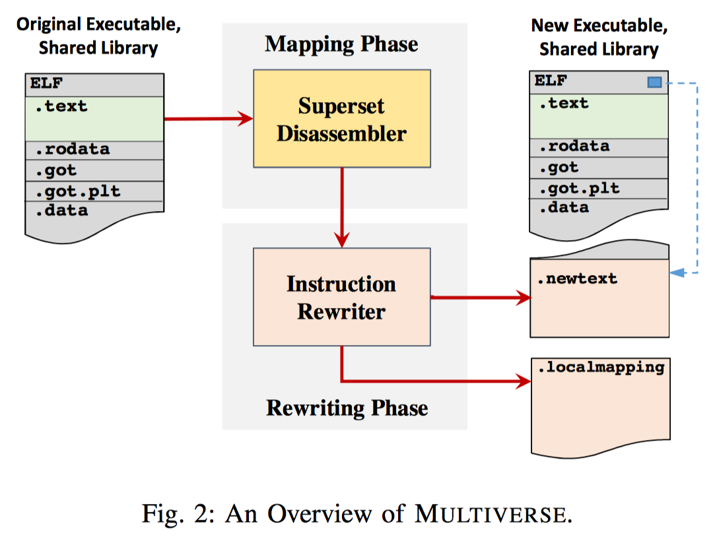
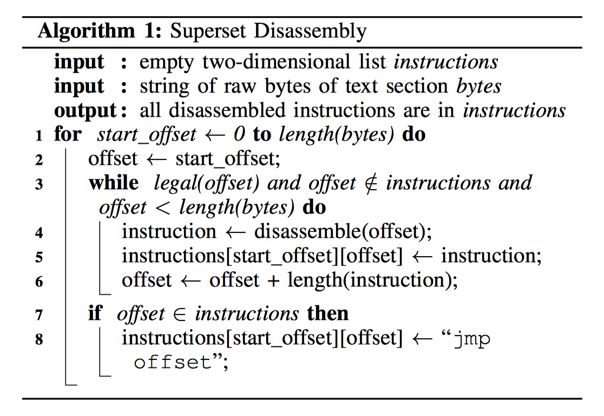
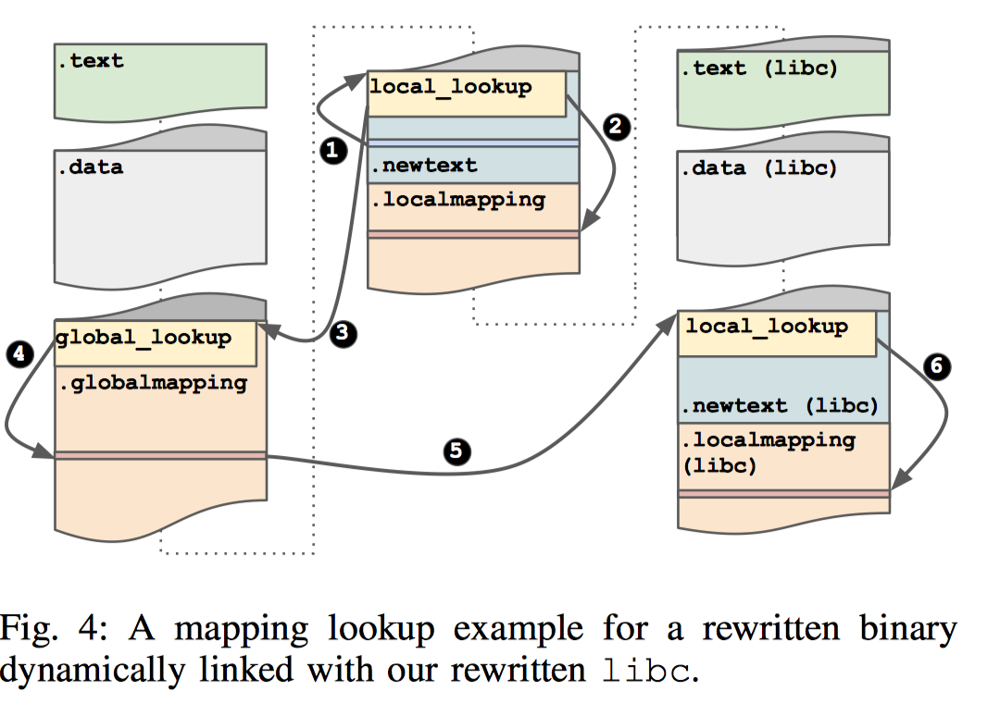
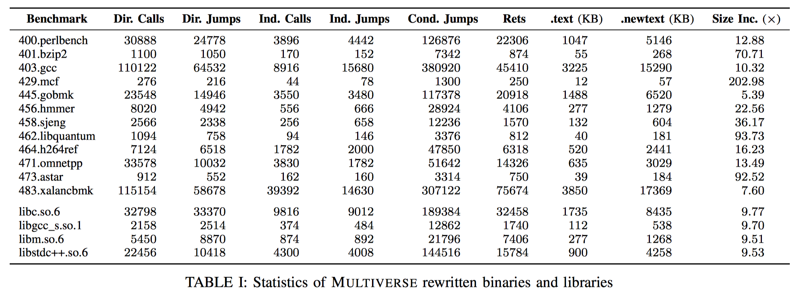
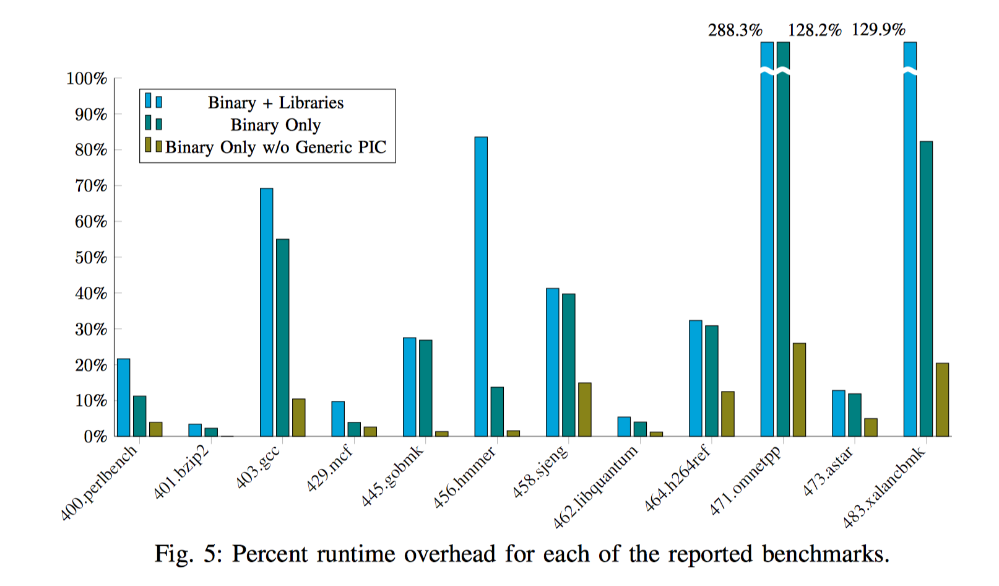
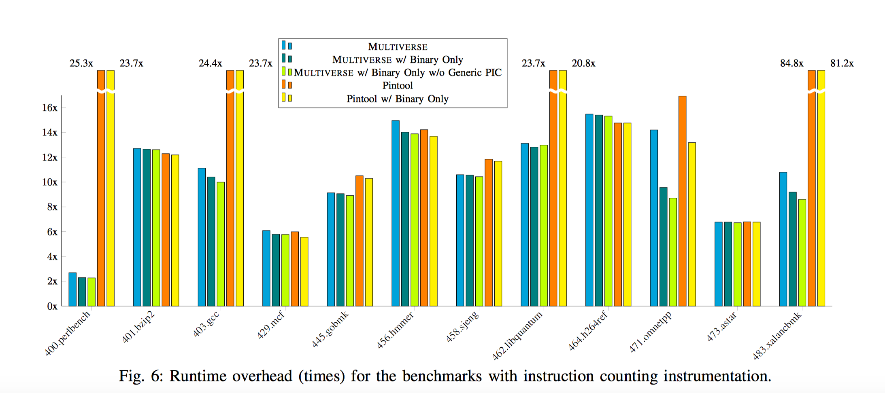
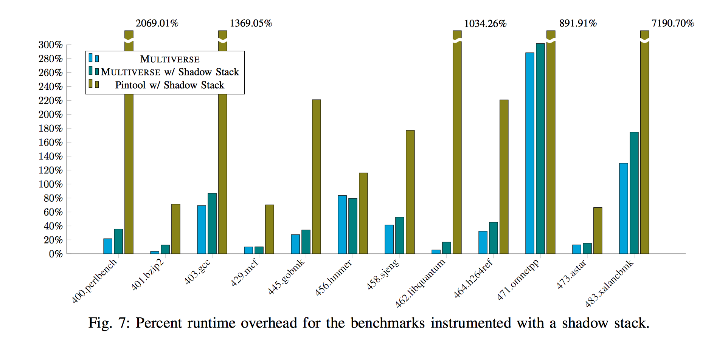

# Abstract

静态代码重写是系统安全应用的一项核心技术，它的使用场景包括性能分析，优化和软件错误定位等。之前的许多静态二进制程序重写方法，例如CCFIR, PITTSFIELD, Google’s Native Client, BinCFI, UROBOROS等，在保证重写正确时，提出了有关二进制程序的许多假定，例如完全正确的反汇编，编译器要求，调试符号等等，给实际应用在Commercial off-the-shelf（COTS）二进制程序上制造了困难。作者提供了`multiverse`，一个新的二进制程序重写器，它不基于上述的任何假定并能够重写intel x86 COTS程序。在COTS二进制程序重写中，存在着两大挑战： （1）如何反汇编二进制代码并包含所有合法指令 （2）如何重新汇编重写后的指令并保留原程序的语义。**`multiverse`使用了两种技术分别解决这两大挑战：（1）superset disassembly：通过对所有offset起始的地址进行反汇编获得合法代码的superset。 （2）instruction rewriter：通过替换控制流转移指令，中转到一个映射表，能够将原程序中所有的指令重定位到任意其他位置。**

| relevant information |                                                              |
| -------------------- | ------------------------------------------------------------ |
| *作者*               | Erick Bauman，Zhiqiang Lin，Kevin W. Hamlen 单位：University of Texas at Dallas. |
| *单位*               | University of Texas at Dallas                                |
| *出处*               | NDSS’18                                                      |
| *原文地址*           | https://github.com/wtwofire/database/blob/master/papers/reverse/2018-Superset%20Disassembly%EF%BC%9AStatically%20Rewriting%20x86%20Binaries%20Without%20Heuristics.pdf |
| *源码地址*           | https://github.com/utds3lab/multiverse                       |
| *发表时间*           | 2018年                                                       |

# 背景与概述

作者的目的是为了发展一种二进制转化方法，改善现有二进制程序转化方法的实用性和通用性。为了表达简洁，也因为x86的程序更少开源。同时之前的许多代码转化方法也以x86程序为目标，作者的方法集中与主流编译器编译的linux 32位x86程序，同时不适用dlopen等动态载入库和自修改代码。

## 挑战

在编写一个通用的二进制程序重写器时存在着许多挑战：

**C1**：识别和重定位静态内存地址 编译后的二进制程序代码包含许多固定地址，很多指向全局变量。代码重写在移动这些目标时，必须同时更新它们的引用。在反汇编代码中和地址段中识别这些地址常量是非常困难的，因为整数值和这些地址常量在语法上并没有明显的区别。

**C2**：处理动态计算的内存地址
在程序中还存在许多动态计算的内存地址。由于地址计算方式比较复杂，生成间接控制流转换表(iCFT)非常困难。重映射iCFT对于二进制程序重写是一个核心挑战。

**C3**：区分代码和数据
代码和数据在二进制文件中没有语法上的区别，在现代处理器中，为了优化性能，许多数据被放在代码段中。这给反汇编带来一些困难。

**C4**：作为参数的函数指针
作为函数指针的参数如果在目标函数中没有正确识别并且更新到改写后的地址，那么重写后的程序在执行时很可能会调用已经被之前的函数地址，令执行失败。同时，识别函数地址也非常困难。

**C5**：处理位置无关代码
主流编译器生成了许多位置无关代码。这些代码会根据自身地址和相对位置寻找其他的执行代码。如果改变了它们的相对位置，那么在执行时就有可能失败。

## 核心想法

基于之前的二进制重写方法，作者系统化了下面的这些想法来针对性地解决上面的挑战

**S1**：保持原有数据空间的完好无损
保持程序中数据段原有的位置和内容，这个方法之前也被用在许多二进制重写器中，例如SECONDWRITE和BINCFI

**S2**：创建一个从原有代码空间到新的重写代码空间的映射
作者在这个映射中忽略常用的地址计算中 基址+偏移 的方法，只考虑最后获得的最终地址，并将这个地址与重写后的代码地址进行对应。作者对于原有地址空间中的每个代码段地址都找到了一个映射，这样就简单的解决了动态计算的内存地址问题。

**S3**：暴力反汇编所有可能的代码 
为了解决反汇编可能存在缺失的问题，作者对于从代码段开始的每个偏移，都进行了反汇编直到遇上非法指令，或者已经反汇编过的地址。原程序中执行的所有代码必定是暴力反汇编获得的代码的子集。

**S4**：重写所有用户级别的代码 
通过重写所有用户级别的代码，可以在函数指针被调用处利用原程序与重写程序之间的地址映射，将指向原程序地址空间的函数指针映射到重写后的地址空间。

**S5**：重写所有call指令以解决pic代码 在查看了x86指令集后，所有的pic代码计算方式在32位x86指令集中，都使用call指令来获得当前地址，作者改写了所有call指令，令其push一个未重写时的地址在栈上，被利用于计算地址时，即可以获得原有计算应得的地址，再由iCFT进行统一处理。

## 系统Overview

基于上面的想法，作者实现了`multiverse`，正如下面的图片中显示，`multiverse`系统包含两个分开的步骤，映射和重写：

在映射阶段，superset disassembler是用下面所示的算法对代码段开始的每个offset进行反汇编，删除重复的代码并在尾部设置一个跳转指令。可以注意的是，在反汇编中，作者删除了从非法指令向前到最后一条控制转移指令的代码内容：

`multiverse`修改了反汇编获得的代码中占位符长度过短的jcc，jmp指令，因为它们原来的指令很可能长度不够填充新的跳转地址。在这之后，即可以确定所有重写后的指令长度和位置，此时所有的跳转指令依旧包含着占位符地址。

在重写阶段，`multiverse`根据重写后的地址位置和原程序地址创建一个本地代码的映射表。映射表的键值是原程序中的内存地址，值则对应着新的代码空间中的地址。 对于重写程序中的直接跳转，`multiverse`根据映射表将其修改为新的地址。 对于间接跳转，`multiverse`将其中转到一个搜索映射表的函数中。函数的输入，跳转目标处于原程序的代码空间中。这个函数通过对应映射表找到新代码空间中的对应地址，并执行跳转。 对于外部函数或地址的跳转。由于这些地址在本地映射表中对应。如下图所示，映射函数将在全局映射表中寻找它所处的代码文件并在其对应的映射表中寻找对应地址。

为了处理位置无关代码和函数指针，`multiverse`对于所有的call和ret指令都进行了修改。 通过这样的方式，重写后的代码可以任意的安排指令和基本块位置。 最终`multiverse`利用重写后的代码生成一个新的elf文件。

# 实现

作者基于许多python库，包括python-capstone，pyelftools,pwntools实现了`multiverse`，包含超过3000行python代码和超过150行汇编代码。同时，基于重写所处的Linux环境，作者对于动态加载器和VDSO进行了特殊处理。

# 测试

作者使用了所有的SPECint 2006 benchmark程序，共12个，作为测试程序集。测试的机器使用一台ubuntu 14.04.1 lts，Intel i7-2600 cpu，4GB RAM。

## 有效性

作者执行了`multiverse`重写后的所有程序，并和未重写的版本进行对应，所有重写后的程序都正确的执行完毕，输出和未重写的版本同样的结果。

下表描述了重写后的程序的详细信息：

有趣的是，对于代码段，所有重写后的程序的代码段长度大约都是原程序的4-5倍，这很可能与x86指令的平均长度有关。同时，表中所有的.newtext段长度都没有包括大约4MB的全局映射表大小，对于代码段长度较小的case，例如429.mcf，这导致了较大的size overhead。

## 开销

作者在原来的benchmark程序和重写后的程序上运行了10遍，以对程序重写后的性能进行一个衡量，结果如下表所示：

对于大部分的测试程序来说，时间overhead不超过100%，平均的性能overhead为60.42%。对于471.omnetpp 和 483.xalancbmk，性能损耗较高，这两个程序使用c++语言编写，对类函数和库函数的频繁调用在重写时带来了大量的性能损耗。

接着作者比较了不同优化措施对性能带来的影响，例如只不重写外部函数库，或者对回调函数进行特殊处理，对位置无关代码进行特殊处理。结果如下图所示：

可以发现，通过对位置无关代码进行特殊处理（假设程序只使用get_pc_thunk函数），可以获得巨大的性能提升。

作者测试了使用`multiverse`进行插桩带来的性能开销，并和常用的工具pin进行了比较，两者都执行对于指令数统计的插桩。

在大部分情况下，使用`multiverse`在程序重写中静态进行插桩带来的性能消耗比使用pin来的低，在以下情况下，由于pin对于插桩内部代码进行分析，使用pin的插桩性能损耗稍微好一些。

最后，作者测试了使用`multiverse`作为安全应用工具的性能，作者使用`multiverse`编写了一个shadow stack，并与用pin编写的工具相比较。使用`multiverse`编写的具有巨大的性能优势。

# 总结

作者通过使用了superset disassemble和 instruction rewriter两项技术，开发了`multiverse`系统，提供了一个不依赖启发式分析的二进制软件重写工具，并且通过对比，证明这个工具在安全应用的性能上，和当前主流的二进制插桩框架PIN相比更有优势。

---

*论文翻译内容转载至GoSSIP.*