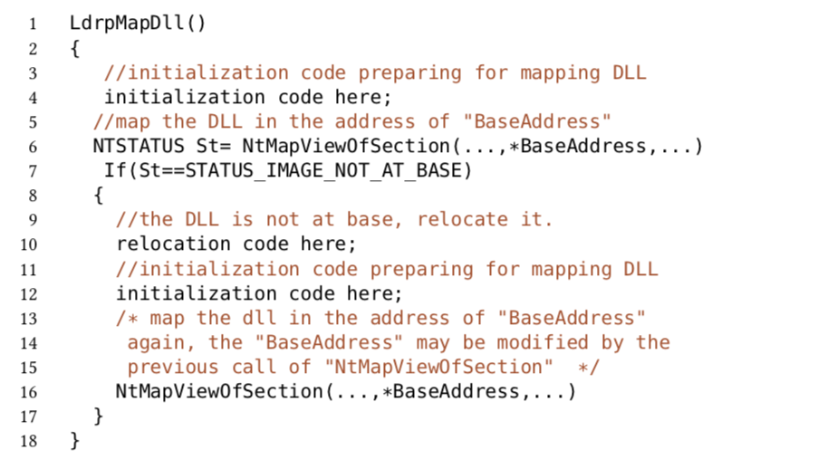
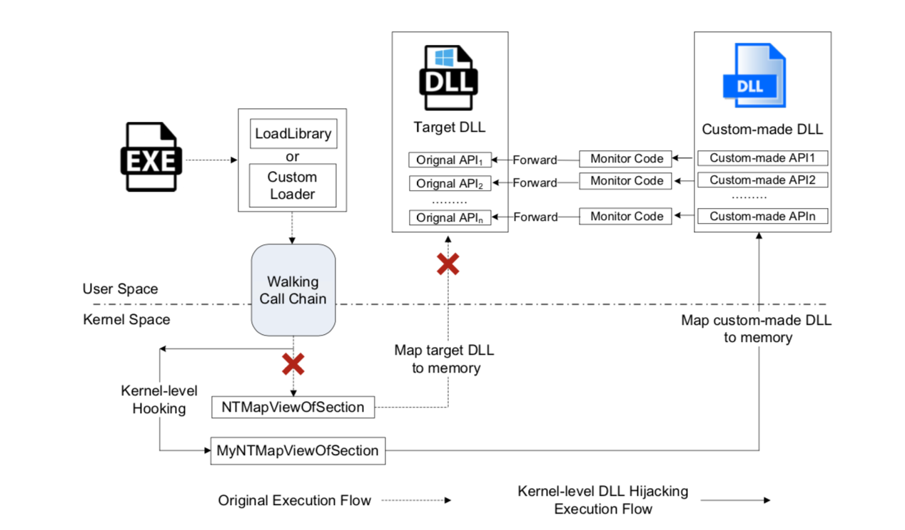
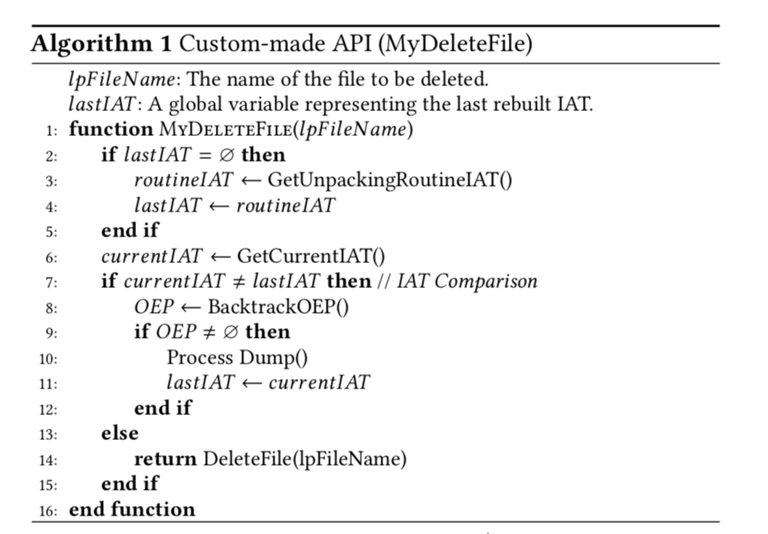
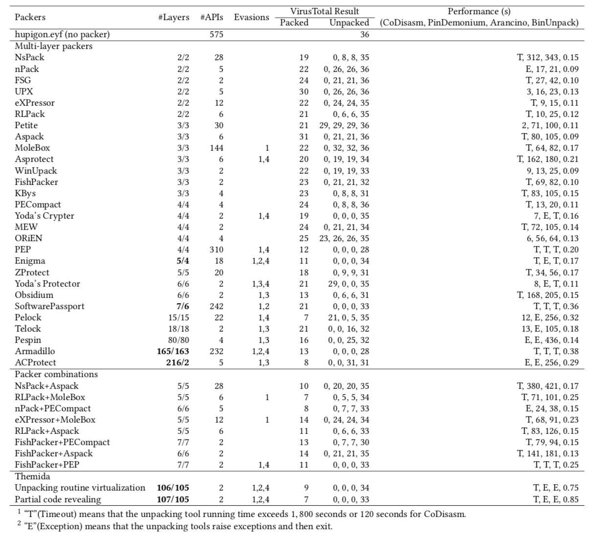

# Abstract

windows的软件脱壳本来已经在多年前已经被讨论得非常多了，目前安全学术会议上关于脱壳的论文非常少，然而这篇关于脱壳的论文还能在2018年被CCS所录取，足见他的方法之高效。此前关于脱壳的方法大多是跟踪脱壳时期的内存代码写入执行的变化，从而跟踪被加密代码的解密流程从而追溯到OEP。这也是对于分析脱壳的一个最为直观的方法，***在这篇论文里作者提出来通过跟踪IAT(函数导入表)被恢复和引用的情况来追溯OEP，并且达到很理想的效果。作者将这款工具称为BinUnpack。***

| relevant information |                                                              |
| -------------------- | ------------------------------------------------------------ |
| *作者*               | Binlin Cheng , Jiang Ming, Jianming Fu, Guojun Peng, Ting Chen, Xiaosong Zhang , Jean-Yves Marion |
| *单位*               | Wuhan University , Hubei Normal University, University of Texas at Arlington, University of Electronic Science and Technology of China, LORIA |
| *出处*               | ACM CCS’18                                                   |
| *原文地址*           | https://github.com/wtwofire/database/blob/master/papers/reverse/2018-Towards%20Paving%20the%20Way%20for%20Large-Scale%20Windows%20Malware%20Analysis%20Generic%20Binary%20Unpacking%20With%20Orders-of-Magnitude%20Performance%20Boost.pdf |
| *源码地址*           |                                                              |
| *发表时间*           | 2018年                                                       |

# IAT在脱壳中角色

IAT即为PE文件中的函数地址导入表，加壳软件会在对一个软件进行加壳时将IAT抹去，然后在运行解密时通过LoadLibrary和GetProcess两函数或者功能相同的函数再恢复，最后将控制权移交OEP。解密代码为了满足自身需要，通常也有一个自己的IAT，但是与原IAT位置并不在同一内存区域中，通常这个IAT的导入函数个数也要小得多，甚至只有一两个。作者的思路是，一旦某个函数调用是通过原IAT进行的，那么就表明这个时候，原代码已经完成了解密，这个时候往前回溯，即可找到OEP。

# Anti-Hook

为了跟踪函数的调用情况，hook是必不可少的，然而现在的加壳软件大多会检测函数hook并且存在许多反hook机制，这里记录一下加壳软件中用到的anti-hook方法。

首先Hook分为内核hook与用户层Hook,由于现在恶意软件想要加载内核模块越发困难，所以作者并没有考虑内核hook情况，这篇论文里，作者假设内核是安全的，未被加壳软件所修改。

用户层Hook分为以下几种：

1. Stolen code. 即将所需要调用的函数代码从内存或者直接从文件系统中复制出来单独执行，这样.inlinehooke,iat,eat类型的Hook全部失效。
2. Child process,process hollowing.将脱壳行为分解到两个进程中进行，这样由于进程地址空间隔离，父进程hook全部失效。
3. Crash hooking module. 给api函数故意传入错误的参数，如果函数被Hook,则不能正确处理错误而程序崩溃 ，没有被Hook则能正确处理异常。以此可以检测是否被hook。
4. Integrity check. 使用哈希校验所调用模块的完整性。

# Anti-anti-hook

作者设计了一个内核用户态混合的dll劫持系统来完成对函数的hook。作者通过逆向Loadlibrary发现，在内核中它最终需要将dll映射到进程的地址空间，而使用的内核函数是LdrMapDll。函数流程如下：

作者修改内核使得NtMapViewOfSection加载定制的Hook版本dll，同时使得返回值变为STATUS_IMAGE_NOT_AT_BASE。这样第16行的NtMapViewOfSection也会被执行，这样定制的dll被加载进内存。另外有些加壳作者并不使用内存映射进行加载dll，而是使用读取文件如readfile读取dll，复制到内存，这样作者同样修改内存中这部分代码，使得加载的dll为定制的dll。

这样做能防住上述的提到的几种方法的anti-hook：

1. Stolen code. 由于被加载时已经是被定制的dll，或者从文件系统读时都是被定制的dll，所以stolen code复制的代码依然是改变后的hook代码。
2. Child process,process hollowing. 同理，修改内核对于每个进程都生效。
3. Crash hooking module。这点作者认为正确处理了异常，存疑。
4. Integrity check。作者说借鉴使用了一种别人的方法，使得读取dll时读到的内容为原dll，执行时执行的是定制的dll，具体方法待研究。

# Find OEP

在结合了IAT与dll hijacking之后，寻找OEP的过程可以用上图来进行表示，首先进程加载时，加载的dll，包括系统dll，如Kernel32.dll,user32.dll等都被换成了作者定制的带hook版本。脱壳时一旦检测到某个函数调用来自原IAT，则进行回溯查找OEP及内存dump。由于可能存在加多个壳情况，即可能会更换IAT，但是这个IAT并不属于最开始被加壳的程序而是属于内层壳，这里作者的作法是，当切换IAT时则进行dump和回溯操作。

# 评估

实验环境：laptop with an Intel Core i3-36100 processor (Quad Core,3.70GHz) and 8GB memory, running Windows 7.

作者使用VirusTotal检测结果来作为脱壳效果的检测结果。即对于一个不加壳的恶意软件，VirusTotal检测结果为n，被脱壳的检测结果越接近n则说明脱壳效果越好。

作者利用一款未被加壳的恶意软件hupigon.eyf，并用不同的壳对他进行加密，然后使用CoDisasm, PinDemonium, Arancino, BinUnpack四款脱壳工具进行脱壳。结果送VirusTotal进行检测，并记录脱壳所用到的时间。

从图中可以看到，BinUpack的检测结果要远远高于其他三种脱壳工具。另外脱壳所用的到时间也缩短了一两个数量级。对于同一个软件加多个不同的壳，BinUpack的表现依然很出色，脱壳时间始终小于1s。而面对商业强壳Themida时，BinUnpack表现依然良好，VirusTotal检测结果能达到33，34这个级别，而其他三种壳都没有脱壳成功。

最后作者收集了271095个恶意软件进行测试，依然表现不俗。

# 评价

这篇论文对于脱壳来说实在是一篇不可多得好的好文。我觉得他的主要贡献在于出发点十分新颖，就在大家都认为脱壳方向已经被讨论得差不多的时候，能够另辟蹊径从IAT出发，合理的运用各种已知的成果。最终达到非常好的效果，这是非常难得的。另外关于这篇论文里面所提到的各种关于脱壳方面的知识，对于逆向人员来说也是一个非常不错的参考。对于文章里唯一有点不解的地方在于内核的hook，具体为如何去做这个Hook，要不要载原dll，参数怎么改，能写得更清楚就好了。另外有一点疑惑在于，如果一个壳故意的通过原IAT进行伪造的函数调用，那么，在检测到这种IAT调用时，可能原代码并未解密，那么这种情况我觉得论文里面没有很好的阐述，只是提到只要需要多次检测，但是检测只是发生在IAT切换的时候，伪造调用时发现IAT切换，但是代码并未解密，而后IAT不会切换，那么，何时进行检测呢？

​																			***转载于GoSSIP***

